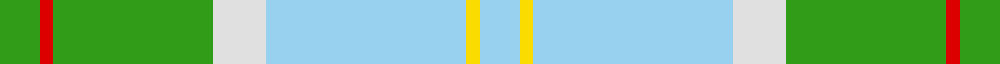
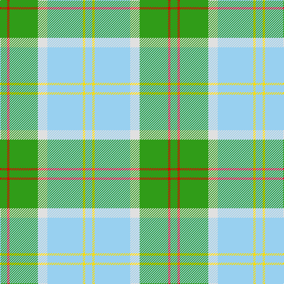

In pattern [GRGWWYW](/stripes/grgwwyw/).

This was sourced from register-of-tartans.  It is a [7 stripe tartan](/stripes/stripes7/).

Original link https://www.tartanregister.gov.uk/tartanDetails.aspx?ref=5988

## Register references

External register numbers recorded for this tartan.

- Scottish Register of Tartans: [5988](https://www.tartanregister.gov.uk/tartanDetails.aspx?ref=5988)
- Scottish Tartans World Register: 3274

## Thread count
G/12 R4 G48 LN16 LB60 Y4 LB/12

## Palette
Each colour and the base-6 reference it is a variant of.

| Colour | Shade | Base |
|---|---|---|
| G | <code style="background-color:#309C18;">#309C18</code> `oklch(60.8% 0.188 140.8)` <small>#309C18</small> | G <code style="background-color:#006100;">#006100</code> |
| LB | <code style="background-color:#98D0F0;">#98D0F0</code> `oklch(83.0% 0.073 233.9)` <small>#98D0F0</small> | W <code style="background-color:#F7F7F7;">#F7F7F7</code> |
| LN | <code style="background-color:#E0E0E0;">#E0E0E0</code> `oklch(90.7% 0.000 89.9)` <small>#E0E0E0</small> | W <code style="background-color:#F7F7F7;">#F7F7F7</code> |
| R | <code style="background-color:#DC0000;">#DC0000</code> `oklch(56.2% 0.230 29.2)` <small>#DC0000</small> | R <code style="background-color:#CC0000;">#CC0000</code> |
| Y | <code style="background-color:#FADC00;">#FADC00</code> `oklch(89.2% 0.185 99.2)` <small>#FADC00</small> | Y <code style="background-color:#F2BF00;">#F2BF00</code> |

# Sample pattern

## Nearest tartans

The nearest existing variants by ΔTartan distance.

1. [Gift of Life Michigan](/setts/s7/r2lt1r1lt11lg16g1w1~x2/) — ΔT 1.15
1. [Gift of Life Michigan (Corporate)](/setts/s7/r2t1r1t11g16dg1w1~x2/) — ΔT 1.50
1. [South Aiken Presby Church (Corporate](/setts/s6/ly30g3t2lb2t30lo4~x2/) — ΔT 1.55
1. [Boucherville](/setts/s9/g20ly2o5w4g2o2g2o2b6~x2/) — ΔT 1.57
1. [Exabyte](/setts/s5/m3lb35db4g47w3~x2/) — ΔT 1.59
1. [Los Angeles (District)](/setts/s8/t4t24ly5g2t3db5ly33db2~x2/) — ΔT 1.68
1. [Boucherville (Tartan de..)](/setts/s9/g20ly2y5w4g2y2g2y2b6~x2/) — ΔT 1.68
1. [Snodgrass (Clan)](/setts/s8/k3r1ly1t11g13t5r1ly1~x4/) — ΔT 1.74
1. [Kildare Irish County Tartan Tartan Number: 2262. Earliest known date: 1996 One of a series of Irish District tartans designed by Polly Wittering of the House of Edgar, with colours reminiscent of the Country with soft warm colours dominating. See products available Copyright © Blair Urquhart, Comrie, 2015](/setts/s8/lg8do2lg13r4lg12t22lg5lo3~x2/) — ΔT 1.76
1. [Presley of Lonmay](/setts/s7/k2lb25k2b8k2g28ly2~x2/) — ΔT 1.77

## Neighbour map

Every grey dot is one of 14299 variants placed by the first two principal components of the ΔTartan feature space (44% of its variance). Red is this tartan; blue dots are its nearest — click one to open its page.

<svg viewBox="0 0 640 380" role="img" style="max-width:100%;height:auto;border:1px solid #e0e0e0;border-radius:4px;display:block" xmlns="http://www.w3.org/2000/svg"><image href="/nn/cloud.v1.png" width="640" height="380"/><a href="/setts/s7/r2lt1r1lt11lg16g1w1~x2/"><circle cx="307.6" cy="154.4" r="4" fill="#3465a4"><title>Gift of Life Michigan</title></circle></a><a href="/setts/s7/r2t1r1t11g16dg1w1~x2/"><circle cx="289.6" cy="156.6" r="4" fill="#3465a4"><title>Gift of Life Michigan (Corporate)</title></circle></a><a href="/setts/s6/ly30g3t2lb2t30lo4~x2/"><circle cx="305.2" cy="176.8" r="4" fill="#3465a4"><title>South Aiken Presby Church (Corporate</title></circle></a><a href="/setts/s9/g20ly2o5w4g2o2g2o2b6~x2/"><circle cx="271.9" cy="170.5" r="4" fill="#3465a4"><title>Boucherville</title></circle></a><a href="/setts/s5/m3lb35db4g47w3~x2/"><circle cx="290.8" cy="172.2" r="4" fill="#3465a4"><title>Exabyte</title></circle></a><a href="/setts/s8/t4t24ly5g2t3db5ly33db2~x2/"><circle cx="255.4" cy="119.4" r="4" fill="#3465a4"><title>Los Angeles (District)</title></circle></a><a href="/setts/s9/g20ly2y5w4g2y2g2y2b6~x2/"><circle cx="247.2" cy="157.1" r="4" fill="#3465a4"><title>Boucherville (Tartan de..)</title></circle></a><a href="/setts/s8/k3r1ly1t11g13t5r1ly1~x4/"><circle cx="226.4" cy="163.2" r="4" fill="#3465a4"><title>Snodgrass (Clan)</title></circle></a><a href="/setts/s8/lg8do2lg13r4lg12t22lg5lo3~x2/"><circle cx="260.9" cy="183.1" r="4" fill="#3465a4"><title>Kildare Irish County Tartan Tartan Number: 2262. Earliest known date: 1996 One of a series of Irish District tartans designed by Polly Wittering of the House of Edgar, with colours reminiscent of the Country with soft warm colours dominating. See products available Copyright © Blair Urquhart, Comrie, 2015</title></circle></a><a href="/setts/s7/k2lb25k2b8k2g28ly2~x2/"><circle cx="217.9" cy="154.0" r="4" fill="#3465a4"><title>Presley of Lonmay</title></circle></a><circle cx="258.9" cy="169.8" r="5" fill="#c00000"/></svg>

ID: /setts/s7/g3r1g12w4lb15ly1lb3~x4/
