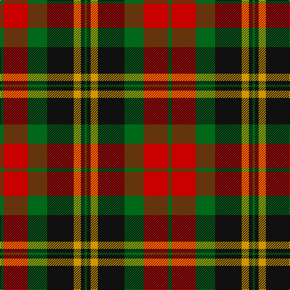

In pattern [GKYKGRG](/stripes/gkykgrg/).

This was sourced from register-of-tartans.  It is a [7 stripe tartan](/stripes/stripes7/).

Original link https://www.tartanregister.gov.uk/tartanDetails.aspx?ref=4508

## Register references

External register numbers recorded for this tartan.

- Scottish Register of Tartans: [4508](https://www.tartanregister.gov.uk/tartanDetails.aspx?ref=4508)
- Scottish Tartans Authority (ITI): 4322

## Thread count
G/6 R40 G32 K44 DY12 K6 G/4

## Palette
Each colour and the base-6 reference it is a variant of.

| Colour | Shade | Base |
|---|---|---|
| DY | <code style="background-color:#D09800;">#D09800</code> `oklch(71.4% 0.147 82.1)` <small>#D09800</small> | Y <code style="background-color:#F2BF00;">#F2BF00</code> |
| G | <code style="background-color:#006818;">#006818</code> `oklch(45.0% 0.142 145.0)` <small>#006818</small> | G <code style="background-color:#006100;">#006100</code> |
| K | <code style="background-color:#101010;">#101010</code> `oklch(17.3% 0.000 89.9)` <small>#101010</small> | K <code style="background-color:#000000;">#000000</code> |
| R | <code style="background-color:#C80000;">#C80000</code> `oklch(52.3% 0.215 29.2)` <small>#C80000</small> | R <code style="background-color:#CC0000;">#CC0000</code> |

# Sample pattern

## Nearest tartans

The nearest existing variants by ΔTartan distance, with this tartan at the top so the swatches line up against it.

ΔTartan

Tartan

Sett

—

<a href="/ttd/edit/#slug=g3r20g16k22lo6k3g2~x2">Wcwm 1062</a> <a class="nn-out" href="/setts/s7/g3r20g16k22lo6k3g2~x2/" title="open its dictionary page">↗</a>

0.71

<a href="/ttd/edit/#slug=g8r2g12k6g3db6r24k4~x2">Dickie</a> <a class="nn-out" href="/setts/s8/g8r2g12k6g3db6r24k4~x2/" title="open its dictionary page">↗</a>

0.84

<a href="/ttd/edit/#slug=g1r9g3k3g3r1k9w1~x2">Manson Family Tartan Tartan Number: 987. Earliest known date: 1983 The official recording of the sett shows the letter G for the dark green stripe. In heraldic terms this means 'Gules' - red. The designer, Hugh Kirkwood Rankine, clearly intended dark green and this is reproduced here. See products available Copyright © Blair Urquhart, Comrie, 2015</a> <a class="nn-out" href="/setts/s8/g1r9g3k3g3r1k9w1~x2/" title="open its dictionary page">↗</a>

0.85

<a href="/ttd/edit/#slug=db3k5r2g2r3g12r6k1r3~x4">Fulton (1999) (Name)</a> <a class="nn-out" href="/setts/s9/db3k5r2g2r3g12r6k1r3~x4/" title="open its dictionary page">↗</a>

0.88

<a href="/ttd/edit/#slug=k3lo18dg6r17k31dg3~x2">MacMillan - 2002 (Black - Unofficial</a> <a class="nn-out" href="/setts/s6/k3lo18dg6r17k31dg3~x2/" title="open its dictionary page">↗</a>

0.89

<a href="/ttd/edit/#slug=w2k1dg16k12r12k1w2~x2">Prince Edward Island #2</a> <a class="nn-out" href="/setts/s7/w2k1dg16k12r12k1w2~x2/" title="open its dictionary page">↗</a>

0.92

<a href="/ttd/edit/#slug=o2dr14o1k14o14ly2~x2">United Distillers</a> <a class="nn-out" href="/setts/s6/o2dr14o1k14o14ly2~x2/" title="open its dictionary page">↗</a>

0.94

<a href="/ttd/edit/#slug=k9lr4k1lr4dg15r4k1~x4">Logan - 1797 (Dark)</a> <a class="nn-out" href="/setts/s7/k9lr4k1lr4dg15r4k1~x4/" title="open its dictionary page">↗</a>

0.96

<a href="/ttd/edit/#slug=k2r7k6g12ly1g1k2~x4">Blackstock Hunting</a> <a class="nn-out" href="/setts/s7/k2r7k6g12ly1g1k2~x4/" title="open its dictionary page">↗</a>

0.97

<a href="/ttd/edit/#slug=ly2dg7k6r11k1r1ly2~x4">Blackstock Red (Dress)</a> <a class="nn-out" href="/setts/s7/ly2dg7k6r11k1r1ly2~x4/" title="open its dictionary page">↗</a>

1.03

<a href="/ttd/edit/#slug=k2o20k8dg18o3w2~x2">Celtic Combat</a> <a class="nn-out" href="/setts/s6/k2o20k8dg18o3w2~x2/" title="open its dictionary page">↗</a>

## Neighbour map

Every grey dot is one of 14299 variants placed by the first two principal components of the ΔTartan feature space (44% of its variance). Red is this tartan; blue dots are its nearest — click one to open its page.

<svg viewBox="0 0 640 380" role="img" style="max-width:100%;height:auto;border:1px solid #e0e0e0;border-radius:4px;display:block" xmlns="http://www.w3.org/2000/svg"><image href="/nn/cloud.v1.png" width="640" height="380"/><a href="/setts/s8/g8r2g12k6g3db6r24k4~x2/"><circle cx="200.7" cy="180.3" r="4" fill="#3465a4"><title>Dickie</title></circle></a><a href="/setts/s8/g1r9g3k3g3r1k9w1~x2/"><circle cx="203.3" cy="192.3" r="4" fill="#3465a4"><title>Manson Family Tartan Tartan Number: 987. Earliest known date: 1983 The official recording of the sett shows the letter G for the dark green stripe. In heraldic terms this means 'Gules' - red. The designer, Hugh Kirkwood Rankine, clearly intended dark green and this is reproduced here. See products available Copyright © Blair Urquhart, Comrie, 2015</title></circle></a><a href="/setts/s9/db3k5r2g2r3g12r6k1r3~x4/"><circle cx="209.9" cy="190.3" r="4" fill="#3465a4"><title>Fulton (1999) (Name)</title></circle></a><a href="/setts/s6/k3lo18dg6r17k31dg3~x2/"><circle cx="218.1" cy="210.6" r="4" fill="#3465a4"><title>MacMillan - 2002 (Black - Unofficial</title></circle></a><a href="/setts/s7/w2k1dg16k12r12k1w2~x2/"><circle cx="191.5" cy="167.4" r="4" fill="#3465a4"><title>Prince Edward Island #2</title></circle></a><a href="/setts/s6/o2dr14o1k14o14ly2~x2/"><circle cx="204.5" cy="193.2" r="4" fill="#3465a4"><title>United Distillers</title></circle></a><a href="/setts/s7/k9lr4k1lr4dg15r4k1~x4/"><circle cx="215.3" cy="185.3" r="4" fill="#3465a4"><title>Logan - 1797 (Dark)</title></circle></a><a href="/setts/s7/k2r7k6g12ly1g1k2~x4/"><circle cx="229.5" cy="195.1" r="4" fill="#3465a4"><title>Blackstock Hunting</title></circle></a><a href="/setts/s7/ly2dg7k6r11k1r1ly2~x4/"><circle cx="188.5" cy="182.8" r="4" fill="#3465a4"><title>Blackstock Red (Dress)</title></circle></a><a href="/setts/s6/k2o20k8dg18o3w2~x2/"><circle cx="237.3" cy="204.2" r="4" fill="#3465a4"><title>Celtic Combat</title></circle></a><circle cx="179.7" cy="196.8" r="5" fill="#c00000"/></svg>

ID: /setts/s7/g3r20g16k22lo6k3g2~x2/
