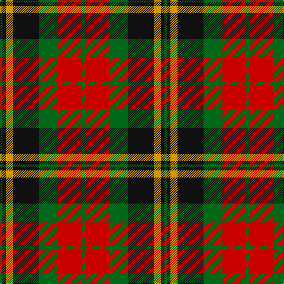

In pattern [GKYKGRG](/patterns/gkykgrg/).

This was sourced from register-of-tartans.  It is a [7 stripes tartan](/stripes/stripes7/).

Original link https://www.tartanregister.gov.uk/tartanDetails.aspx?ref=4508

## Thread count
G/4 K6 DY12 K44 G32 R40 G/6

## Palette
Each colour and its ΔE from the base-6 reference it is a variant of.

| Colour | Shade | Base | ΔE (OKLab) |
|---|---|---|---|
| DY | <code style="background-color:#D09800;">#D09800</code> `#D09800` | Y <code style="background-color:#F2BF00;">#F2BF00</code> | 0.12 |
| G | <code style="background-color:#006818;">#006818</code> `#006818` | G <code style="background-color:#006100;">#006100</code> | 0.02 |
| K | <code style="background-color:#101010;">#101010</code> `#101010` | K <code style="background-color:#000000;">#000000</code> | 0.17 |
| R | <code style="background-color:#C80000;">#C80000</code> `#C80000` | R <code style="background-color:#CC0000;">#CC0000</code> | 0.01 |

# Sample pattern

## Nearest tartans

The nearest existing variants by ΔTartan distance.

1. [Dickie](/setts/s8/g8r2g12k6g3b6r24k4~b00008c-g146400-k000000-rc82800~x2/) — ΔT 0.72
1. [Manson Family Tartan Tartan Number: 987. Earliest known date: 1983 The official recording of the sett shows the letter G for the dark green stripe. In heraldic terms this means 'Gules' - red. The designer, Hugh Kirkwood Rankine, clearly intended dark green and this is reproduced here. See products available Copyright © Blair Urquhart, Comrie, 2015](/setts/s8/g1r9g3k3g3r1k9w1~g006818-k101010-rc80000-we0e0e0~x2/) — ΔT 0.84
1. [Fulton (1999) (Name)](/setts/s9/b3k5r2g2r3g12r6k1r3~b2c2c80-g006818-k101010-rc80000~x4/) — ΔT 0.85
1. [MacMillan - 2002 (Black - Unofficial](/setts/s6/g3k31r17g6y18k3~g004810-k101010-r880000-ybc8c00~x2/) — ΔT 0.88
1. [Prince Edward Island District Tartan Tartan Number: 1815. Earliest known date: 1960-70 The warmth and glow of the fertile soil, The green field and tree, The yellow and the brown of Autumn, The white of surf or a summer snow, Rust, green, yellow and white, Yes! That's our Island Tartan. See products available Copyright © Blair Urquhart, Comrie, 2015](/setts/s7/w2k1g16k12r12k1w2~g006818-k101010-rc80000-we0e0e0~x2/) — ΔT 0.88
1. [Prince Edward Island #2](/setts/s7/w2k1g16k12r12k1w2~g005020-k101010-rdc0000-we0e0e0~x2/) — ΔT 0.89
1. [United Distillers](/setts/s6/r2b14r1k14r14y2~b680028-k101010-r948860-ye8c000~x2/) — ΔT 0.92
1. [Logan - 1797 (Dark)](/setts/s7/k9y4k1y4g15r4k1~g003820-k101010-rc80000-ye08070~x4/) — ΔT 0.94
1. [Blackstock Hunting](/setts/s7/k2r7k6g12y1g1k2~g006818-k101010-rc80000-ye8c000~x4/) — ΔT 0.96
1. [Strathspey, Check](/setts/s6/g3r22b5g10k10g2~b5480b0-g008000-k000000-rc00000~x2/) — ΔT 0.96

## Neighbour map

Every grey dot is one of 15726 variants placed by the first two principal components of the ΔTartan feature space (44% of its variance). Red is this tartan; blue dots are its nearest — click one to open its page.

<svg viewBox="0 0 640 380" role="img" style="max-width:100%;height:auto;border:1px solid #e0e0e0;border-radius:4px;display:block" xmlns="http://www.w3.org/2000/svg"><image href="/nn/cloud.v1.png" width="640" height="380"/><a href="/setts/s8/g8r2g12k6g3b6r24k4~b00008c-g146400-k000000-rc82800~x2/"><circle cx="198.6" cy="182.2" r="4" fill="#3465a4"><title>Dickie</title></circle></a><a href="/setts/s8/g1r9g3k3g3r1k9w1~g006818-k101010-rc80000-we0e0e0~x2/"><circle cx="201.3" cy="193.7" r="4" fill="#3465a4"><title>Manson Family Tartan Tartan Number: 987. Earliest known date: 1983 The official recording of the sett shows the letter G for the dark green stripe. In heraldic terms this means 'Gules' - red. The designer, Hugh Kirkwood Rankine, clearly intended dark green and this is reproduced here. See products available Copyright © Blair Urquhart, Comrie, 2015</title></circle></a><a href="/setts/s9/b3k5r2g2r3g12r6k1r3~b2c2c80-g006818-k101010-rc80000~x4/"><circle cx="208.3" cy="189.6" r="4" fill="#3465a4"><title>Fulton (1999) (Name)</title></circle></a><a href="/setts/s6/g3k31r17g6y18k3~g004810-k101010-r880000-ybc8c00~x2/"><circle cx="216.2" cy="211.2" r="4" fill="#3465a4"><title>MacMillan - 2002 (Black - Unofficial</title></circle></a><a href="/setts/s7/w2k1g16k12r12k1w2~g006818-k101010-rc80000-we0e0e0~x2/"><circle cx="187.9" cy="169.2" r="4" fill="#3465a4"><title>Prince Edward Island District Tartan Tartan Number: 1815. Earliest known date: 1960-70 The warmth and glow of the fertile soil, The green field and tree, The yellow and the brown of Autumn, The white of surf or a summer snow, Rust, green, yellow and white, Yes! That's our Island Tartan. See products available Copyright © Blair Urquhart, Comrie, 2015</title></circle></a><a href="/setts/s7/w2k1g16k12r12k1w2~g005020-k101010-rdc0000-we0e0e0~x2/"><circle cx="189.1" cy="168.7" r="4" fill="#3465a4"><title>Prince Edward Island #2</title></circle></a><a href="/setts/s6/r2b14r1k14r14y2~b680028-k101010-r948860-ye8c000~x2/"><circle cx="202.6" cy="194.2" r="4" fill="#3465a4"><title>United Distillers</title></circle></a><a href="/setts/s7/k9y4k1y4g15r4k1~g003820-k101010-rc80000-ye08070~x4/"><circle cx="213.0" cy="185.0" r="4" fill="#3465a4"><title>Logan - 1797 (Dark)</title></circle></a><a href="/setts/s7/k2r7k6g12y1g1k2~g006818-k101010-rc80000-ye8c000~x4/"><circle cx="227.2" cy="195.1" r="4" fill="#3465a4"><title>Blackstock Hunting</title></circle></a><a href="/setts/s6/g3r22b5g10k10g2~b5480b0-g008000-k000000-rc00000~x2/"><circle cx="196.3" cy="196.7" r="4" fill="#3465a4"><title>Strathspey, Check</title></circle></a><circle cx="177.6" cy="197.1" r="5" fill="#c00000"/></svg>

ID: /setts/s7/g3r20g16k22y6k3g2~g006818-k101010-rc80000-yd09800~x2/
