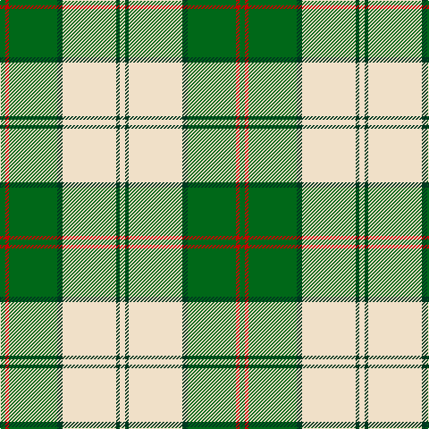

In pattern [GRGGWGW](/patterns/grggwgw/).

This was sourced from tartans-authority.  It is a [7 stripes tartan](/stripes/stripes7/).

Original link http://www.tartansauthority.com/tartan-ferret/display/7602/

## Attestations

This cloth appears in 3 source records; the oldest owns this page.

- March 2008 — Uist, Green (Dance) (tartans-authority, [record](http://www.tartansauthority.com/tartan-ferret/display/7602/))
- undated — Uist Green (register-of-tartans, [record](https://www.tartanregister.gov.uk/tartanDetails.aspx?ref=5626))
- undated — Uist Green Fashion Tartan Tartan Number: 7602. Earliest known date: March 2008 One of a series of dancer's tartans for the House of Edgar's in-house collection designed by Kirsty Anderson. See products available Copyright © Blair Urquhart, Comrie, 2015 (house-of-tartan, [record](http://www.house-of-tartan.scotland.net/house/TartanViewjs.asp?colr=Def&tnam=7602))

## Thread count
G/6 R4 G54 DG6 W60 DG4 W/6

## Palette
Each colour and its ΔE from the base-6 reference it is a variant of.

| Colour | Shade | Base | ΔE (OKLab) |
|---|---|---|---|
| DG | <code style="background-color:#003820;">#003820</code> `#003820` | G <code style="background-color:#006100;">#006100</code> | 0.15 |
| G | <code style="background-color:#006818;">#006818</code> `#006818` | G <code style="background-color:#006100;">#006100</code> | 0.02 |
| R | <code style="background-color:#C80000;">#C80000</code> `#C80000` | R <code style="background-color:#CC0000;">#CC0000</code> | 0.01 |
| W | <code style="background-color:#F0E0C8;">#F0E0C8</code> `#F0E0C8` | W <code style="background-color:#F7F7F7;">#F7F7F7</code> | 0.07 |

# Sample pattern

## Nearest tartans

The nearest existing variants by ΔTartan distance.

1. [Longniddry Green (Dance)](/setts/s8/g42ga2w2ga2g5b12w32g4~b1c1c1c-g006818-ga289c18-wfcfcfc~x2/) — ΔT 0.97
1. [Longniddry Green District Tartan Tartan Number: 764. Earliest known date: pre 1992 A dancers tartan from D.C. Dalgleish weavers of Selkirk See products available Copyright © Blair Urquhart, Comrie, 2015](/setts/s8/g42ga2w2ga2g5gb12w32g4~g006818-ga289c18-gb003820-we0e0e0~x2/) — ΔT 1.09
1. [Tilburg Hunting (District)](/setts/s7/b6k3b37y41w3y6w3~b1068a4-k101010-we0e0e0-yd8a810~x2/) — ΔT 1.16
1. [Bundy, Dress Black Personal)](/setts/s8/g1g1w1g15w15g1w1g1~g006818-wf8f8f8~x4/) — ΔT 1.18
1. [Longniddry, Green](/setts/s8/g42ga2w2ga2g5gb12w32g4~g008000-ga30a010-gb003000-we0e0e0~x2/) — ΔT 1.19
1. [MacDiarmid, dress](/setts/s9/w38r12w37g32k3w4k3g32r4~g008000-k000000-rc00000-we0e0e0/) — ΔT 1.23
1. [Cunningham Dress Green (Dance)](/setts/s7/w5g2w34g34k2g2y4~g289c18-k101010-wf8f8f8-ye8c000~x2/) — ΔT 1.23
1. [MacPherson Dress Green (Dance)](/setts/s7/w5r3w26g20w3g8y3~g006818-rc80000-we0e0e0-ye8c000~x2/) — ΔT 1.23
1. [MacDiarmid Dress](/setts/s9/w38r12w37g32k3w4k3g32r4~g006818-k101010-rc80000-we0e0e0~x2/) — ΔT 1.29
1. [MacDiarmid Dress Clan Tartan Tartan Number: 1486. Earliest known date: c.1830 This sett appears in Paton's collection which is housed at the Scottish Tartans Museum, Comrie in Perthshire, Scotland. The samples are undated but the collection is known to have been put together around the 1830's, with some additions during the Victorian period. See products available Copyright © Blair Urquhart, Comrie, 2015](/setts/s9/w38r12w37g32k3w4k3g32r4~g006818-k101010-rc80000-we0e0e0/) — ΔT 1.29

## Neighbour map

Every grey dot is one of 15726 variants placed by the first two principal components of the ΔTartan feature space (44% of its variance). Red is this tartan; blue dots are its nearest — click one to open its page.

<svg viewBox="0 0 640 380" role="img" style="max-width:100%;height:auto;border:1px solid #e0e0e0;border-radius:4px;display:block" xmlns="http://www.w3.org/2000/svg"><image href="/nn/cloud.v1.png" width="640" height="380"/><a href="/setts/s8/g42ga2w2ga2g5b12w32g4~b1c1c1c-g006818-ga289c18-wfcfcfc~x2/"><circle cx="263.6" cy="132.9" r="4" fill="#3465a4"><title>Longniddry Green (Dance)</title></circle></a><a href="/setts/s8/g42ga2w2ga2g5gb12w32g4~g006818-ga289c18-gb003820-we0e0e0~x2/"><circle cx="277.6" cy="140.3" r="4" fill="#3465a4"><title>Longniddry Green District Tartan Tartan Number: 764. Earliest known date: pre 1992 A dancers tartan from D.C. Dalgleish weavers of Selkirk See products available Copyright © Blair Urquhart, Comrie, 2015</title></circle></a><a href="/setts/s7/b6k3b37y41w3y6w3~b1068a4-k101010-we0e0e0-yd8a810~x2/"><circle cx="286.1" cy="163.3" r="4" fill="#3465a4"><title>Tilburg Hunting (District)</title></circle></a><a href="/setts/s8/g1g1w1g15w15g1w1g1~g006818-wf8f8f8~x4/"><circle cx="293.2" cy="148.7" r="4" fill="#3465a4"><title>Bundy, Dress Black Personal)</title></circle></a><a href="/setts/s8/g42ga2w2ga2g5gb12w32g4~g008000-ga30a010-gb003000-we0e0e0~x2/"><circle cx="278.1" cy="140.4" r="4" fill="#3465a4"><title>Longniddry, Green</title></circle></a><a href="/setts/s9/w38r12w37g32k3w4k3g32r4~g008000-k000000-rc00000-we0e0e0/"><circle cx="222.5" cy="165.7" r="4" fill="#3465a4"><title>MacDiarmid, dress</title></circle></a><a href="/setts/s7/w5g2w34g34k2g2y4~g289c18-k101010-wf8f8f8-ye8c000~x2/"><circle cx="280.2" cy="143.8" r="4" fill="#3465a4"><title>Cunningham Dress Green (Dance)</title></circle></a><a href="/setts/s7/w5r3w26g20w3g8y3~g006818-rc80000-we0e0e0-ye8c000~x2/"><circle cx="243.7" cy="186.9" r="4" fill="#3465a4"><title>MacPherson Dress Green (Dance)</title></circle></a><a href="/setts/s9/w38r12w37g32k3w4k3g32r4~g006818-k101010-rc80000-we0e0e0~x2/"><circle cx="224.2" cy="166.0" r="4" fill="#3465a4"><title>MacDiarmid Dress</title></circle></a><a href="/setts/s9/w38r12w37g32k3w4k3g32r4~g006818-k101010-rc80000-we0e0e0/"><circle cx="224.2" cy="166.0" r="4" fill="#3465a4"><title>MacDiarmid Dress Clan Tartan Tartan Number: 1486. Earliest known date: c.1830 This sett appears in Paton's collection which is housed at the Scottish Tartans Museum, Comrie in Perthshire, Scotland. The samples are undated but the collection is known to have been put together around the 1830's, with some additions during the Victorian period. See products available Copyright © Blair Urquhart, Comrie, 2015</title></circle></a><circle cx="265.1" cy="148.9" r="5" fill="#c00000"/></svg>

ID: /setts/s7/g3r2g27ga3w30ga2w3~g006818-ga003820-rc80000-wf0e0c8~x2/
