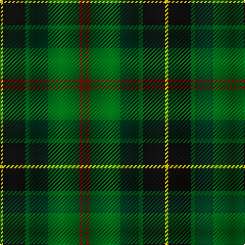

**Bands:** [YKGGGRG](/stripes/ykgggrg/) · **Stripes:** [LY K G DG G R G](/stripes/stripes7/) LY K G DG G R G

This was sourced from tartans-authority.  It is a [7 band tartan](/bands/bands7/).

Original link http://www.tartansauthority.com/tartan-ferret/display/10888/

## Also known as

This cloth is also recorded under:

- MacSween Hunting (Lochs, Isle of Lew

## Thread count
Y/3 K22 G4 DG18 G31 R3 G/3

## Palette
Each colour and its ΔE from the base-6 reference it is a variant of.

| Colour | Shade | Base | ΔE (OKLab) |
|---|---|---|---|
| DG | <code style="background-color:#003820;">#003820</code> `#003820` | G <code style="background-color:#006100;">#006100</code> | 0.15 |
| G | <code style="background-color:#006818;">#006818</code> `#006818` | G <code style="background-color:#006100;">#006100</code> | 0.02 |
| K | <code style="background-color:#101010;">#101010</code> `#101010` | K <code style="background-color:#000000;">#000000</code> | 0.17 |
| R | <code style="background-color:#C80000;">#C80000</code> `#C80000` | R <code style="background-color:#CC0000;">#CC0000</code> | 0.01 |
| Y | <code style="background-color:#E8C000;">#E8C000</code> `#E8C000` | Y <code style="background-color:#F2BF00;">#F2BF00</code> | 0.02 |

# Sample pattern

## Nearest tartans

The nearest existing variants by ΔTartan distance.

1. [Wcwm 1716](/setts/s6/g6ly3g26dg10dt30lb3~x2/) — ΔT 0.80
1. [New Mexico](/setts/s7/g10db42r5dg42g42ly5g10/) — ΔT 1.01
1. [Simple Technology (Corporate)](/setts/s5/r3g28db9dg18w3~x2/) — ΔT 1.03
1. [Choinka Family (Personal)](/setts/s11/dy4k2lo3k2dy7k9g20k2t3k2g4~x2/) — ΔT 1.10
1. [Leahy (Australia) (Personal)](/setts/s6/db2k6g2k6g12ly1~x4/) — ΔT 1.15
1. [Reidy Wedding](/setts/s7/g31dg7lo3dg14g8db18dp5~x2/) — ΔT 1.18
1. [Symonds (2016)](/setts/s6/g18ly1dp5ly1dg18r1~x4/) — ΔT 1.20
1. [Gorman, George (Personal)](/setts/s6/g9g1p2g1db4r1~x12/) — ΔT 1.20
1. [Zimmermann, Martin (Personal)](/setts/s6/db3dg19dg29k11r4ly2~x2/) — ΔT 1.25
1. [Womens Rural Institute](/setts/s8/dg4g24dp4k6dg4r3dg4dp3~x2/) — ΔT 1.26

## Neighbour map

Every grey dot is one of 14299 variants placed by the first two principal components of the ΔTartan feature space (44% of its variance). Red is this tartan; blue dots are its nearest — click one to open its page.

<svg viewBox="0 0 640 380" role="img" style="max-width:100%;height:auto;border:1px solid #e0e0e0;border-radius:4px;display:block" xmlns="http://www.w3.org/2000/svg"><image href="/nn/cloud.v1.png" width="640" height="380"/><a href="/setts/s6/g6ly3g26dg10dt30lb3~x2/"><circle cx="216.4" cy="211.9" r="4" fill="#3465a4"><title>Wcwm 1716</title></circle></a><a href="/setts/s7/g10db42r5dg42g42ly5g10/"><circle cx="187.9" cy="218.1" r="4" fill="#3465a4"><title>New Mexico</title></circle></a><a href="/setts/s5/r3g28db9dg18w3~x2/"><circle cx="234.8" cy="231.6" r="4" fill="#3465a4"><title>Simple Technology (Corporate)</title></circle></a><a href="/setts/s11/dy4k2lo3k2dy7k9g20k2t3k2g4~x2/"><circle cx="212.1" cy="177.5" r="4" fill="#3465a4"><title>Choinka Family (Personal)</title></circle></a><a href="/setts/s6/db2k6g2k6g12ly1~x4/"><circle cx="217.2" cy="208.1" r="4" fill="#3465a4"><title>Leahy (Australia) (Personal)</title></circle></a><a href="/setts/s7/g31dg7lo3dg14g8db18dp5~x2/"><circle cx="245.7" cy="231.1" r="4" fill="#3465a4"><title>Reidy Wedding</title></circle></a><a href="/setts/s6/g18ly1dp5ly1dg18r1~x4/"><circle cx="279.1" cy="185.9" r="4" fill="#3465a4"><title>Symonds (2016)</title></circle></a><a href="/setts/s6/g9g1p2g1db4r1~x12/"><circle cx="247.1" cy="202.7" r="4" fill="#3465a4"><title>Gorman, George (Personal)</title></circle></a><a href="/setts/s6/db3dg19dg29k11r4ly2~x2/"><circle cx="221.0" cy="188.8" r="4" fill="#3465a4"><title>Zimmermann, Martin (Personal)</title></circle></a><a href="/setts/s8/dg4g24dp4k6dg4r3dg4dp3~x2/"><circle cx="234.6" cy="195.3" r="4" fill="#3465a4"><title>Womens Rural Institute</title></circle></a><circle cx="240.1" cy="207.8" r="5" fill="#c00000"/></svg>

ID: /setts/s7/g3r3g31dg18g4k22ly3/
