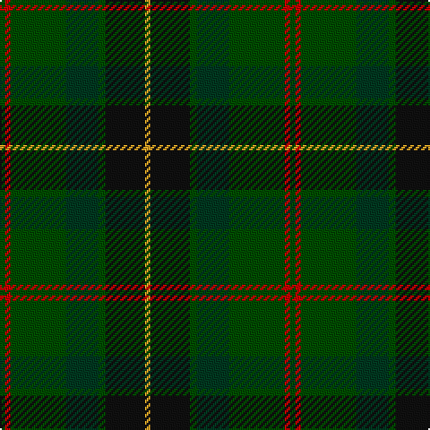

In pattern [GRGGGKY](/patterns/grgggky/).

This was sourced from register-of-tartans.  It is a [7 stripes tartan](/stripes/stripes7/).

Original link https://www.tartanregister.gov.uk/tartanDetails.aspx?ref=10888

## Thread count
G/3 R3 G31 DG18 G4 K22 Y/3

## Palette
Each colour and its ΔE from the base-6 reference it is a variant of.

| Colour | Shade | Base | ΔE (OKLab) |
|---|---|---|---|
| DG | <code style="background-color:#003820;">#003820</code> `#003820` | G <code style="background-color:#006400;">#006400</code> | 0.16 |
| G | <code style="background-color:#004C00;">#004C00</code> `#004C00` | G <code style="background-color:#006400;">#006400</code> | 0.08 |
| K | <code style="background-color:#101010;">#101010</code> `#101010` | K <code style="background-color:#000000;">#000000</code> | 0.17 |
| R | <code style="background-color:#C80000;">#C80000</code> `#C80000` | R <code style="background-color:#C80000;">#C80000</code> | 0.00 |
| Y | <code style="background-color:#E0A126;">#E0A126</code> `#E0A126` | Y <code style="background-color:#E8C000;">#E8C000</code> | 0.08 |

# Sample pattern

## Nearest tartans

The nearest existing variants by ΔTartan distance.

1. [Reidy Wedding](/setts/s7/g62b14y6b28g16ba36bb10-b002814-ba2c4084-bb780078-g146000-yd87c00/) — ΔT 1.20
1. [John Telfar Dunbar/Hunting Tartan Tartan Number: 776. Earliest known date: pre 2003 Check this entry... See products available Copyright © Blair Urquhart, Comrie, 2015](/setts/s7/g10k4g56k20ga52b8g8-b2c2c80-g006818-ga604000-k101010/) — ΔT 1.27
1. [Bennachie (Whisky)](/setts/s7/b28k10ba10k10b28g64r8-b003c64-ba6c0070-g285800-k101010-r880000/) — ΔT 1.28
1. [Montrose (1983)](/setts/s6/g12y6g52k20b60w6-b5c5c5c-g004c2c-k101010-wc0c0c0-ybca010/) — ΔT 1.28
1. [Bennett, John Paul (Personal)](/setts/s7/g4ga62k41b6k4b38r4-b5b5758-g715937-ga1a4014-k101010-rb93e5a/) — ΔT 1.29
1. [Tomass](/setts/s8/r8g4ga36gb4g8gb24gc8gb4-g503c28-ga003800-gb647c00-gc007800-r8c0000/) — ΔT 1.35
1. [Dobson (Palm Bay) (Personal)](/setts/s6/g90y6b12ba30k24ga30-b441800-ba202060-g00643c-ga003820-k1c1714-ye0a126/) — ΔT 1.38
1. [Glencross (Tynron) (Personal)](/setts/s6/b6g26ba26y4ga68w6-b680018-ba084555-g3b522f-ga052f14-wddd5af-yc58310/) — ΔT 1.41
1. [MacSween Hunting (Lochs, Isle of Lew](/setts/s7/g3r3g31ga18g4k22y3-g006818-ga003820-k101010-rc80000-ye8c000/) — ΔT 1.42
1. [Glasgow Cathedral 2000](/setts/s10/g44r6b20ba4b20r42g44r6y4b4-b003c64-ba1870a4-g005814-r940000-yb89800/) — ΔT 1.43

## Neighbour map

Every grey dot is one of 15726 variants placed by the first two principal components of the ΔTartan feature space (44% of its variance). Red is this tartan; blue dots are its nearest — click one to open its page.

<svg viewBox="0 0 640 380" role="img" style="max-width:100%;height:auto;border:1px solid #e0e0e0;border-radius:4px;display:block" xmlns="http://www.w3.org/2000/svg"><image href="/nn/cloud.v1.png" width="640" height="380"/><a href="/setts/s7/g62b14y6b28g16ba36bb10-b002814-ba2c4084-bb780078-g146000-yd87c00/"><circle cx="241.8" cy="224.3" r="4" fill="#3465a4"><title>Reidy Wedding</title></circle></a><a href="/setts/s7/g10k4g56k20ga52b8g8-b2c2c80-g006818-ga604000-k101010/"><circle cx="330.0" cy="225.9" r="4" fill="#3465a4"><title>John Telfar Dunbar/Hunting Tartan Tartan Number: 776. Earliest known date: pre 2003 Check this entry... See products available Copyright © Blair Urquhart, Comrie, 2015</title></circle></a><a href="/setts/s7/b28k10ba10k10b28g64r8-b003c64-ba6c0070-g285800-k101010-r880000/"><circle cx="248.3" cy="234.3" r="4" fill="#3465a4"><title>Bennachie (Whisky)</title></circle></a><a href="/setts/s6/g12y6g52k20b60w6-b5c5c5c-g004c2c-k101010-wc0c0c0-ybca010/"><circle cx="250.6" cy="221.6" r="4" fill="#3465a4"><title>Montrose (1983)</title></circle></a><a href="/setts/s7/g4ga62k41b6k4b38r4-b5b5758-g715937-ga1a4014-k101010-rb93e5a/"><circle cx="286.6" cy="202.3" r="4" fill="#3465a4"><title>Bennett, John Paul (Personal)</title></circle></a><a href="/setts/s8/r8g4ga36gb4g8gb24gc8gb4-g503c28-ga003800-gb647c00-gc007800-r8c0000/"><circle cx="230.0" cy="212.6" r="4" fill="#3465a4"><title>Tomass</title></circle></a><a href="/setts/s6/g90y6b12ba30k24ga30-b441800-ba202060-g00643c-ga003820-k1c1714-ye0a126/"><circle cx="261.3" cy="198.8" r="4" fill="#3465a4"><title>Dobson (Palm Bay) (Personal)</title></circle></a><a href="/setts/s6/b6g26ba26y4ga68w6-b680018-ba084555-g3b522f-ga052f14-wddd5af-yc58310/"><circle cx="297.5" cy="185.0" r="4" fill="#3465a4"><title>Glencross (Tynron) (Personal)</title></circle></a><a href="/setts/s7/g3r3g31ga18g4k22y3-g006818-ga003820-k101010-rc80000-ye8c000/"><circle cx="236.1" cy="202.7" r="4" fill="#3465a4"><title>MacSween Hunting (Lochs, Isle of Lew</title></circle></a><a href="/setts/s10/g44r6b20ba4b20r42g44r6y4b4-b003c64-ba1870a4-g005814-r940000-yb89800/"><circle cx="268.2" cy="194.6" r="4" fill="#3465a4"><title>Glasgow Cathedral 2000</title></circle></a><circle cx="273.2" cy="221.1" r="5" fill="#c00000"/></svg>

ID: /setts/s7/g3r3g31ga18g4k22y3-g004c00-ga003820-k101010-rc80000-ye0a126/
