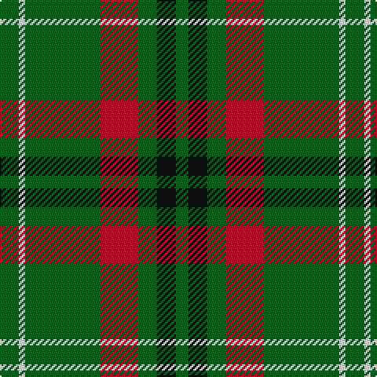

In pattern [GKGRGWG](/stripes/gkgrgwg/).

This was sourced from register-of-tartans.  It is a [7 stripe tartan](/stripes/stripes7/).

Original link https://www.tartanregister.gov.uk/tartanDetails.aspx?ref=112

## Also known as

This cloth is also recorded under:

- Arkansas State

## Attestations

This cloth appears in 3 source records; the oldest owns this page.

- 01/01/1998 — Arkansas (register-of-tartans, [record](https://www.tartanregister.gov.uk/tartanDetails.aspx?ref=112))
- 1998 — Arkansas (Fashion) (tartans-authority, [record](http://www.tartansauthority.com/tartan-ferret/display/2678/))
- undated — Arkansas State American District Tartan Tartan Number: 2678. Earliest known date: 1998 The official Arkansas state tartan. At one time there were two other contenders for this honour but this database only has details of one other - # 3264. Green represents the "Natural State" (the State's nickname), red the original settlers, white for the diamonds and black for the rich oil reserves. Approved by State Governor Mike Huckabee in the State Captal of Little Rock on 1st September, 1998. See products available Copyright © Blair Urquhart, Comrie, 2015 (house-of-tartan, [record](http://www.house-of-tartan.scotland.net/house/TartanViewjs.asp?colr=Def&tnam=2678))

## Register references

External register numbers recorded for this tartan.

- Scottish Register of Tartans: [112](https://www.tartanregister.gov.uk/tartanDetails.aspx?ref=112)
- Scottish Tartans Authority (ITI): 2678
- Scottish Tartans World Register: 2678

## Thread count
Ga/12 W4 Ga48 R24 Ga12 K12 Ga/8

## Palette
Each colour and the base-6 reference it is a variant of.

| Colour | Shade | Base |
|---|---|---|
| G | <code style="background-color:#285800;">#285800</code> `oklch(41.0% 0.122 135.8)` <small>#285800</small> | G <code style="background-color:#006100;">#006100</code> |
| Ga | <code style="background-color:#006818;">#006818</code> `oklch(45.0% 0.142 145.0)` <small>#006818</small> | G <code style="background-color:#006100;">#006100</code> |
| Gb | <code style="background-color:#289C18;">#289C18</code> `oklch(60.6% 0.191 141.6)` <small>#289C18</small> | G <code style="background-color:#006100;">#006100</code> |
| K | <code style="background-color:#101010;">#101010</code> `oklch(17.3% 0.000 89.9)` <small>#101010</small> | K <code style="background-color:#000000;">#000000</code> |
| R | <code style="background-color:#C8002C;">#C8002C</code> `oklch(52.6% 0.212 22.0)` <small>#C8002C</small> | R <code style="background-color:#CC0000;">#CC0000</code> |
| W | <code style="background-color:#FCFCFC;">#FCFCFC</code> `oklch(99.1% 0.000 89.9)` <small>#FCFCFC</small> | W <code style="background-color:#F7F7F7;">#F7F7F7</code> |

# Sample pattern

## Nearest tartans

The nearest existing variants by ΔTartan distance, with this tartan at the top so the swatches line up against it.

ΔTartan

Tartan

Sett

—

<a href="/ttd/edit/#slug=g3w1g12r6g3k3g2~x4">Arkansas</a> <a class="nn-out" href="/setts/s7/g3w1g12r6g3k3g2~x4/" title="open its dictionary page">↗</a>

0.88

<a href="/ttd/edit/#slug=r8g12w5k11g42k3~x2">Sir Billi (Corporate)</a> <a class="nn-out" href="/setts/s6/r8g12w5k11g42k3~x2/" title="open its dictionary page">↗</a>

1.02

<a href="/ttd/edit/#slug=db1r3g11r2db5g11ly1~x2">MacKintosh, hunting</a> <a class="nn-out" href="/setts/s7/db1r3g11r2db5g11ly1~x2/" title="open its dictionary page">↗</a>

1.04

<a href="/ttd/edit/#slug=ly2g12db6r3g12r4db1~x2">MacKintosh Hunting</a> <a class="nn-out" href="/setts/s7/ly2g12db6r3g12r4db1~x2/" title="open its dictionary page">↗</a>

1.15

<a href="/ttd/edit/#slug=dg12w5k11dg42k3dg42k11w5dg12r8~x2">Sir Billi</a> <a class="nn-out" href="/setts/s10/dg12w5k11dg42k3dg42k11w5dg12r8~x2/" title="open its dictionary page">↗</a>

1.18

<a href="/ttd/edit/#slug=r3g20k20g20lo2g2lo2~x2">Paton (Personal)</a> <a class="nn-out" href="/setts/s7/r3g20k20g20lo2g2lo2~x2/" title="open its dictionary page">↗</a>

1.23

<a href="/ttd/edit/#slug=ly2dg12db6r3dg12r4db1">MacKintosh Hunting</a> <a class="nn-out" href="/setts/s7/ly2dg12db6r3dg12r4db1/" title="open its dictionary page">↗</a>

1.25

<a href="/ttd/edit/#slug=g4r1g15t5r1w5g4r1~x4">McGirr (Letterkenny) David, (Pers.)</a> <a class="nn-out" href="/setts/s8/g4r1g15t5r1w5g4r1~x4/" title="open its dictionary page">↗</a>

1.25

<a href="/ttd/edit/#slug=g9r4g1r4g15r4g1~x4">Logan #4</a> <a class="nn-out" href="/setts/s7/g9r4g1r4g15r4g1~x4/" title="open its dictionary page">↗</a>

1.27

<a href="/ttd/edit/#slug=r3g22db16g14r2g6lo2~x2">Scottish Scouts (1957) (Corporate)</a> <a class="nn-out" href="/setts/s7/r3g22db16g14r2g6lo2~x2/" title="open its dictionary page">↗</a>

1.33

<a href="/ttd/edit/#slug=g24r4g3k14g5r2g10~x2">Northcroft (Personal)</a> <a class="nn-out" href="/setts/s7/g24r4g3k14g5r2g10~x2/" title="open its dictionary page">↗</a>

## Neighbour map

Every grey dot is one of 14299 variants placed by the first two principal components of the ΔTartan feature space (44% of its variance). Red is this tartan; blue dots are its nearest — click one to open its page.

<svg viewBox="0 0 640 380" role="img" style="max-width:100%;height:auto;border:1px solid #e0e0e0;border-radius:4px;display:block" xmlns="http://www.w3.org/2000/svg"><image href="/nn/cloud.v1.png" width="640" height="380"/><a href="/setts/s6/r8g12w5k11g42k3~x2/"><circle cx="373.7" cy="191.9" r="4" fill="#3465a4"><title>Sir Billi (Corporate)</title></circle></a><a href="/setts/s7/db1r3g11r2db5g11ly1~x2/"><circle cx="365.2" cy="217.4" r="4" fill="#3465a4"><title>MacKintosh, hunting</title></circle></a><a href="/setts/s7/ly2g12db6r3g12r4db1~x2/"><circle cx="322.7" cy="216.9" r="4" fill="#3465a4"><title>MacKintosh Hunting</title></circle></a><a href="/setts/s10/dg12w5k11dg42k3dg42k11w5dg12r8~x2/"><circle cx="406.3" cy="185.1" r="4" fill="#3465a4"><title>Sir Billi</title></circle></a><a href="/setts/s7/r3g20k20g20lo2g2lo2~x2/"><circle cx="347.8" cy="221.4" r="4" fill="#3465a4"><title>Paton (Personal)</title></circle></a><a href="/setts/s7/ly2dg12db6r3dg12r4db1/"><circle cx="302.3" cy="209.5" r="4" fill="#3465a4"><title>MacKintosh Hunting</title></circle></a><a href="/setts/s8/g4r1g15t5r1w5g4r1~x4/"><circle cx="353.4" cy="180.5" r="4" fill="#3465a4"><title>McGirr (Letterkenny) David, (Pers.)</title></circle></a><a href="/setts/s7/g9r4g1r4g15r4g1~x4/"><circle cx="428.6" cy="217.3" r="4" fill="#3465a4"><title>Logan #4</title></circle></a><a href="/setts/s7/r3g22db16g14r2g6lo2~x2/"><circle cx="365.8" cy="226.6" r="4" fill="#3465a4"><title>Scottish Scouts (1957) (Corporate)</title></circle></a><a href="/setts/s7/g24r4g3k14g5r2g10~x2/"><circle cx="418.0" cy="239.4" r="4" fill="#3465a4"><title>Northcroft (Personal)</title></circle></a><circle cx="367.1" cy="208.6" r="5" fill="#c00000"/></svg>

ID: /setts/s7/g3w1g12r6g3k3g2~x4/
