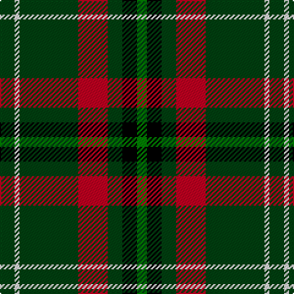

In pattern [GKGRGWG](/patterns/gkgrgwg/).

This was sourced from weddslist.  It is a [7 stripes tartan](/stripes/stripes7/).

Original link http://www.weddslist.com/cgi-bin/tartans/pg.pl?source=sts

## Thread count
DG/12 LN4 DG48 R24 DG12 K12 G/8

## Palette
Each colour and its ΔE from the base-6 reference it is a variant of.

| Colour | Shade | Base | ΔE (OKLab) |
|---|---|---|---|
| DG | <code style="background-color:#004010;">#004010</code> `#004010` | G <code style="background-color:#006100;">#006100</code> | 0.11 |
| G | <code style="background-color:#008000;">#008000</code> `#008000` | G <code style="background-color:#006100;">#006100</code> | 0.10 |
| K | <code style="background-color:#000000;">#000000</code> `#000000` | K <code style="background-color:#000000;">#000000</code> | 0.00 |
| LN | <code style="background-color:#E0E0E0;">#E0E0E0</code> `#E0E0E0` | W <code style="background-color:#F7F7F7;">#F7F7F7</code> | 0.07 |
| R | <code style="background-color:#C00020;">#C00020</code> `#C00020` | R <code style="background-color:#CC0000;">#CC0000</code> | 0.03 |

# Sample pattern

## Nearest tartans

The nearest existing variants by ΔTartan distance.

1. [Holestone (Corporate)](/setts/s8/k4y8k26r6g15r6k26w2~g006818-k101010-rc04c08-wf8f8f8-ybc8c00~x2/) — ΔT 0.74
1. [MacKintosh Hunting](/setts/s7/y2g12b6r3g12r4b1~b000064-g004c00-rc80000-yffff00~x2/) — ΔT 0.99
1. [Duchess of York](/setts/s9/b1r9g5r1k5r1g5r9w1~b304080-g008000-k000000-r703000-we0e0e0~x2/) — ΔT 1.04
1. [Merwe](/setts/s6/g15y2k30g32r3w2~g006818-k101010-rc80000-wfcfcfc-ye8c000~x2/) — ΔT 1.13
1. [Aggreko Shepherd (Personal)](/setts/s7/y10w4g30k22g27b4wa2~b5c5c5c-g003820-k101010-wf8f8f8-wa98c8e8-yfc7c00~x2/) — ΔT 1.15
1. [Asheville Firefighters, The](/setts/s6/k17g48y4r10b12g4~b202060-g006818-k101010-rc80000-ye8c000/) — ΔT 1.15
1. [St Johns County's Sheriff's Office](/setts/s5/r17b7y8g58k6~b0000cd-g002901-k101010-rb90012-ycf9702~x2/) — ΔT 1.17
1. [Lossiemouth/Hersbruck](/setts/s6/g26b3g12k10ba15w2~b2c2c80-ba780078-g006818-k101010-we0e0e0~x2/) — ΔT 1.20
1. [Asheville Firefighters, The](/setts/s6/k17g48y4r10w12g4~g004028-k101010-rc80000-wa8ace8-yffe600/) — ΔT 1.22
1. [St Patrick's Krewe](/setts/s8/g50r5g8w10g8b8g8y21~b0f2c67-g23321b-rca2625-wf9f5ef-ye0a126~x2/) — ΔT 1.24

## Neighbour map

Every grey dot is one of 15726 variants placed by the first two principal components of the ΔTartan feature space (44% of its variance). Red is this tartan; blue dots are its nearest — click one to open its page.

<svg viewBox="0 0 640 380" role="img" style="max-width:100%;height:auto;border:1px solid #e0e0e0;border-radius:4px;display:block" xmlns="http://www.w3.org/2000/svg"><image href="/nn/cloud.v1.png" width="640" height="380"/><a href="/setts/s8/k4y8k26r6g15r6k26w2~g006818-k101010-rc04c08-wf8f8f8-ybc8c00~x2/"><circle cx="285.5" cy="182.5" r="4" fill="#3465a4"><title>Holestone (Corporate)</title></circle></a><a href="/setts/s7/y2g12b6r3g12r4b1~b000064-g004c00-rc80000-yffff00~x2/"><circle cx="300.1" cy="211.3" r="4" fill="#3465a4"><title>MacKintosh Hunting</title></circle></a><a href="/setts/s9/b1r9g5r1k5r1g5r9w1~b304080-g008000-k000000-r703000-we0e0e0~x2/"><circle cx="246.9" cy="189.4" r="4" fill="#3465a4"><title>Duchess of York</title></circle></a><a href="/setts/s6/g15y2k30g32r3w2~g006818-k101010-rc80000-wfcfcfc-ye8c000~x2/"><circle cx="310.5" cy="184.4" r="4" fill="#3465a4"><title>Merwe</title></circle></a><a href="/setts/s7/y10w4g30k22g27b4wa2~b5c5c5c-g003820-k101010-wf8f8f8-wa98c8e8-yfc7c00~x2/"><circle cx="261.6" cy="170.0" r="4" fill="#3465a4"><title>Aggreko Shepherd (Personal)</title></circle></a><a href="/setts/s6/k17g48y4r10b12g4~b202060-g006818-k101010-rc80000-ye8c000/"><circle cx="276.3" cy="188.1" r="4" fill="#3465a4"><title>Asheville Firefighters, The</title></circle></a><a href="/setts/s5/r17b7y8g58k6~b0000cd-g002901-k101010-rb90012-ycf9702~x2/"><circle cx="315.2" cy="198.4" r="4" fill="#3465a4"><title>St Johns County's Sheriff's Office</title></circle></a><a href="/setts/s6/g26b3g12k10ba15w2~b2c2c80-ba780078-g006818-k101010-we0e0e0~x2/"><circle cx="273.2" cy="206.3" r="4" fill="#3465a4"><title>Lossiemouth/Hersbruck</title></circle></a><a href="/setts/s6/k17g48y4r10w12g4~g004028-k101010-rc80000-wa8ace8-yffe600/"><circle cx="259.4" cy="178.9" r="4" fill="#3465a4"><title>Asheville Firefighters, The</title></circle></a><a href="/setts/s8/g50r5g8w10g8b8g8y21~b0f2c67-g23321b-rca2625-wf9f5ef-ye0a126~x2/"><circle cx="292.4" cy="168.5" r="4" fill="#3465a4"><title>St Patrick's Krewe</title></circle></a><circle cx="292.9" cy="191.4" r="5" fill="#c00000"/></svg>

ID: /setts/s7/g3w1g12r6g3k3ga2~g004010-ga008000-k000000-rc00020-we0e0e0~x4/
