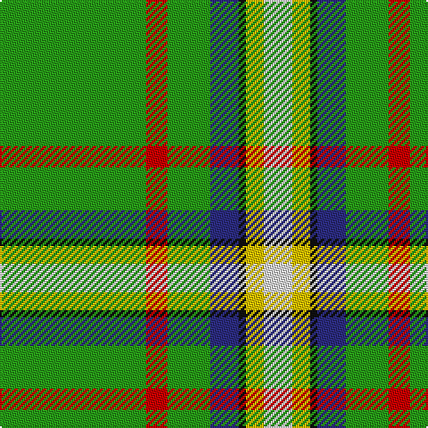

In pattern [GRGBKYW](/patterns/grgbkyw/).

This was sourced from tartans-authority.  It is a [7 stripes tartan](/stripes/stripes7/).

Original link http://www.tartansauthority.com/tartan-ferret/display/10163/

## Thread count
G/82 R12 G24 DB16 K4 Y10 LN/16

## Palette
Each colour and its ΔE from the base-6 reference it is a variant of.

| Colour | Shade | Base | ΔE (OKLab) |
|---|---|---|---|
| DB | <code style="background-color:#2C2C80;">#2C2C80</code> `#2C2C80` | B <code style="background-color:#2A418A;">#2A418A</code> | 0.06 |
| G | <code style="background-color:#289C18;">#289C18</code> `#289C18` | G <code style="background-color:#006100;">#006100</code> | 0.19 |
| K | <code style="background-color:#101010;">#101010</code> `#101010` | K <code style="background-color:#000000;">#000000</code> | 0.17 |
| LN | <code style="background-color:#E0E0E0;">#E0E0E0</code> `#E0E0E0` | W <code style="background-color:#F7F7F7;">#F7F7F7</code> | 0.07 |
| R | <code style="background-color:#C80000;">#C80000</code> `#C80000` | R <code style="background-color:#CC0000;">#CC0000</code> | 0.01 |
| Y | <code style="background-color:#E8C000;">#E8C000</code> `#E8C000` | Y <code style="background-color:#F2BF00;">#F2BF00</code> | 0.02 |

# Sample pattern

## Nearest tartans

The nearest existing variants by ΔTartan distance.

1. [Decatur Presbyterian Church](/setts/s7/g41r6g12b8k2y5w8~b473c8b-g008b00-k101010-rcd0000-wffffff-yffe600~x2/) — ΔT 0.35
1. [Lethbridge, City of](/setts/s12/g20r1g10y2b3k1w2y10ra1g10b2k1~b5c8ca8-g006818-k101010-re87878-rac8002c-we0e0e0-ye8c000~x2/) — ΔT 1.51
1. [Greenup (2015)](/setts/s6/b8g50ba4w2wa5y2~b441800-ba5f749c-g649848-w98c8e8-wafcfcfc-yf8e38c~x2/) — ΔT 1.51
1. [Rollings Personal Tartan Tartan Number: 3244. Earliest known date: August 2002 Colours reduced from seven to six. Originally the outside white stripes were gray. See products available Copyright © Blair Urquhart, Comrie, 2015](/setts/s10/g55r4w3b11wa4ba11w3r4g55k4~b780078-ba202060-g289c18-k101010-r880000-wc0c0c0-wae0e0e0~x2/) — ΔT 1.63
1. [Mounth, The, (rejected)](/setts/s7/g36ga5b17w2g14gb3ba2~b000050-ba800080-g008000-ga003000-gb808080-we0e0e0~x2/) — ΔT 1.64
1. [Canadian Caledonian](/setts/s10/b3g16y1r1w1r6g3r1g3w1~b304080-g008000-rc00000-we0e0e0-yf0c000~x2/) — ΔT 1.67
1. [Crieff, and Strathearn](/setts/s7/g55b7r24g12ba4y3ba4~b800080-ba304080-g008000-rc00000-yf0c000~x2/) — ΔT 1.71
1. [Seattle](/setts/s10/g14w1b2r1g1r1b2w1g4y1~b304080-g008000-rc00000-we0e0e0-yf0c000~x4/) — ΔT 1.73
1. [Exabyte](/setts/s5/r3w35b4g47wa3~b304080-g008000-r802040-wc0c0c0-wae0e0e0~x2/) — ΔT 1.80
1. [Washington](/setts/s7/w3r4b13g37ba3k3y2~b304080-ba8080d0-g008000-k000000-rc00000-we0e0e0-yf0c000~x2/) — ΔT 1.81

## Neighbour map

Every grey dot is one of 15726 variants placed by the first two principal components of the ΔTartan feature space (44% of its variance). Red is this tartan; blue dots are its nearest — click one to open its page.

<svg viewBox="0 0 640 380" role="img" style="max-width:100%;height:auto;border:1px solid #e0e0e0;border-radius:4px;display:block" xmlns="http://www.w3.org/2000/svg"><image href="/nn/cloud.v1.png" width="640" height="380"/><a href="/setts/s7/g41r6g12b8k2y5w8~b473c8b-g008b00-k101010-rcd0000-wffffff-yffe600~x2/"><circle cx="314.8" cy="128.3" r="4" fill="#3465a4"><title>Decatur Presbyterian Church</title></circle></a><a href="/setts/s12/g20r1g10y2b3k1w2y10ra1g10b2k1~b5c8ca8-g006818-k101010-re87878-rac8002c-we0e0e0-ye8c000~x2/"><circle cx="304.1" cy="95.5" r="4" fill="#3465a4"><title>Lethbridge, City of</title></circle></a><a href="/setts/s6/b8g50ba4w2wa5y2~b441800-ba5f749c-g649848-w98c8e8-wafcfcfc-yf8e38c~x2/"><circle cx="418.7" cy="114.7" r="4" fill="#3465a4"><title>Greenup (2015)</title></circle></a><a href="/setts/s10/g55r4w3b11wa4ba11w3r4g55k4~b780078-ba202060-g289c18-k101010-r880000-wc0c0c0-wae0e0e0~x2/"><circle cx="366.0" cy="97.5" r="4" fill="#3465a4"><title>Rollings Personal Tartan Tartan Number: 3244. Earliest known date: August 2002 Colours reduced from seven to six. Originally the outside white stripes were gray. See products available Copyright © Blair Urquhart, Comrie, 2015</title></circle></a><a href="/setts/s7/g36ga5b17w2g14gb3ba2~b000050-ba800080-g008000-ga003000-gb808080-we0e0e0~x2/"><circle cx="319.3" cy="149.8" r="4" fill="#3465a4"><title>Mounth, The, (rejected)</title></circle></a><a href="/setts/s10/b3g16y1r1w1r6g3r1g3w1~b304080-g008000-rc00000-we0e0e0-yf0c000~x2/"><circle cx="338.5" cy="133.7" r="4" fill="#3465a4"><title>Canadian Caledonian</title></circle></a><a href="/setts/s7/g55b7r24g12ba4y3ba4~b800080-ba304080-g008000-rc00000-yf0c000~x2/"><circle cx="357.2" cy="154.3" r="4" fill="#3465a4"><title>Crieff, and Strathearn</title></circle></a><a href="/setts/s10/g14w1b2r1g1r1b2w1g4y1~b304080-g008000-rc00000-we0e0e0-yf0c000~x4/"><circle cx="382.1" cy="138.4" r="4" fill="#3465a4"><title>Seattle</title></circle></a><a href="/setts/s5/r3w35b4g47wa3~b304080-g008000-r802040-wc0c0c0-wae0e0e0~x2/"><circle cx="288.6" cy="172.0" r="4" fill="#3465a4"><title>Exabyte</title></circle></a><a href="/setts/s7/w3r4b13g37ba3k3y2~b304080-ba8080d0-g008000-k000000-rc00000-we0e0e0-yf0c000~x2/"><circle cx="267.4" cy="106.7" r="4" fill="#3465a4"><title>Washington</title></circle></a><circle cx="323.9" cy="131.3" r="5" fill="#c00000"/></svg>

ID: /setts/s7/g41r6g12b8k2y5w8~b2c2c80-g289c18-k101010-rc80000-we0e0e0-ye8c000~x2/
