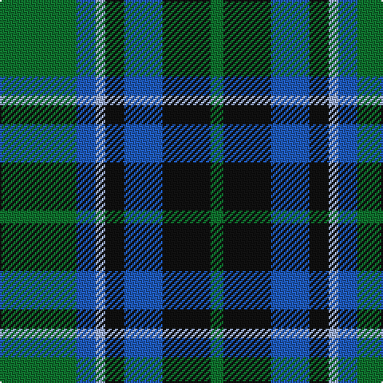

In pattern [GBWKBKG](/patterns/gbwkbkg/).

This was sourced from register-of-tartans.  It is a [7 stripes tartan](/stripes/stripes7/).

Original link https://www.tartanregister.gov.uk/tartanDetails.aspx?ref=10405

## Thread count
G/48 B12 LP6 K12 B24 K30 G/8

## Palette
Each colour and its ΔE from the base-6 reference it is a variant of.

| Colour | Shade | Base | ΔE (OKLab) |
|---|---|---|---|
| B | <code style="background-color:#1F5ABA;">#1F5ABA</code> `#1F5ABA` | B <code style="background-color:#2C4084;">#2C4084</code> | 0.11 |
| G | <code style="background-color:#10712E;">#10712E</code> `#10712E` | G <code style="background-color:#006400;">#006400</code> | 0.05 |
| K | <code style="background-color:#101010;">#101010</code> `#101010` | K <code style="background-color:#000000;">#000000</code> | 0.17 |
| LP | <code style="background-color:#9EAFDB;">#9EAFDB</code> `#9EAFDB` | W <code style="background-color:#F4F4F0;">#F4F4F0</code> | 0.22 |

# Sample pattern

ID: /setts/s7/g48b12w6k12b24k30g8-b1f5aba-g10712e-k101010-w9eafdb/
