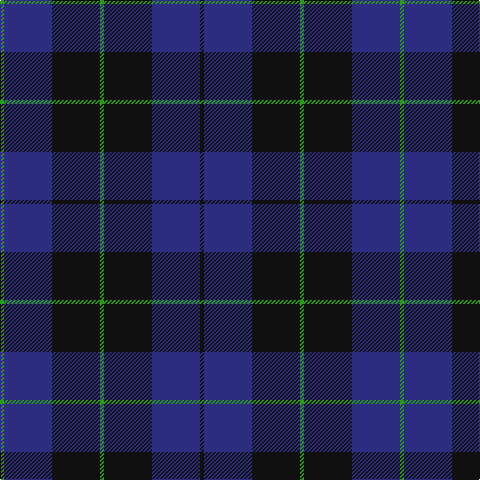

In pattern [GBKGKBK](/patterns/gbkgkbk/).

This was sourced from tartans-authority.  It is a [7 stripes tartan](/stripes/stripes7/).

Original link http://www.tartansauthority.com/tartan-ferret/display/2521/

## Attestations

This cloth appears in 2 source records; the oldest owns this page.

- 1997 — Marchmont (Personal) (tartans-authority, [record](http://www.tartansauthority.com/tartan-ferret/display/2521/))
- undated — Marchmont Personal Tartan Tartan Number: 2521. Earliest known date: 1997 Designed by Keith Lumsden of Scottish Tartans Society. A tartan for personal blankets and clothing. See products available Copyright © Blair Urquhart, Comrie, 2015 (house-of-tartan, [record](http://www.house-of-tartan.scotland.net/house/TartanViewjs.asp?colr=Def&tnam=2521))

## Thread count
G/4 DB48 K48 G4 K48 DB48 K/4

## Palette
Each colour and its ΔE from the base-6 reference it is a variant of.

| Colour | Shade | Base | ΔE (OKLab) |
|---|---|---|---|
| DB | <code style="background-color:#2C2C80;">#2C2C80</code> `#2C2C80` | B <code style="background-color:#2C4084;">#2C4084</code> | 0.05 |
| G | <code style="background-color:#289C18;">#289C18</code> `#289C18` | G <code style="background-color:#006400;">#006400</code> | 0.18 |
| K | <code style="background-color:#101010;">#101010</code> `#101010` | K <code style="background-color:#000000;">#000000</code> | 0.17 |

# Sample pattern

ID: /setts/s7/g4b48k48g4k48b48k4-b2c2c80-g289c18-k101010/
