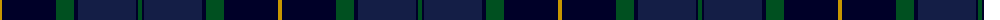
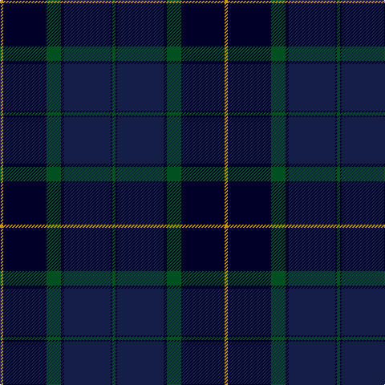

In pattern [GKBKGKY](/patterns/gkbkgky/).

This was sourced from register-of-tartans.  It is a [7 stripes tartan](/stripes/stripes7/).

Original link https://www.tartanregister.gov.uk/tartanDetails.aspx?ref=473

## Thread count
DY/4 DB54 G18 DB4 DBa58 DB2 G/4

## Palette
Each colour and its ΔE from the base-6 reference it is a variant of.

| Colour | Shade | Base | ΔE (OKLab) |
|---|---|---|---|
| DB | <code style="background-color:#000028;">#000028</code> `#000028` | K <code style="background-color:#000000;">#000000</code> | 0.15 |
| DBa | <code style="background-color:#141E46;">#141E46</code> `#141E46` | B <code style="background-color:#2C4084;">#2C4084</code> | 0.15 |
| DY | <code style="background-color:#C89600;">#C89600</code> `#C89600` | Y <code style="background-color:#E8C000;">#E8C000</code> | 0.12 |
| G | <code style="background-color:#005020;">#005020</code> `#005020` | G <code style="background-color:#006400;">#006400</code> | 0.08 |

# Sample pattern

## Nearest tartans

The nearest existing variants by ΔTartan distance.

1. [Pitceathly Chamberlain Tartan Tartan Number: 10190. Earliest known date: 2010 Designed for the 80th birthday of Sophia Joan Chamberlain nee Pitceathly for her own use and that of her immediate family. See products available Copyright © Blair Urquhart, Comrie, 2015](/setts/s10/b4k6g10k14b40k4b10k4g40w2-b2c2c80-g003014-k101010-wc8c8c8/) — ΔT 1.16
1. [Doral](/setts/s7/b104ba24b8ba68g16w4g16-b000064-ba0c5454-g343400-wfcfcfc/) — ΔT 1.32
1. [Scottish Canals (Corporate)](/setts/s7/g4b2ba58b4g18b52y4-b202060-ba2c2c80-g006818-ye8c000/) — ΔT 1.33
1. [Waterfront](/setts/s6/r2b38k20w1g20r2-b141e46-g003c14-k101010-rdc0000-we0e0e0/) — ΔT 1.48
1. [Java St Andrew Society hunting](/setts/s7/b100g52k18g8w4r4g20-b141e46-g003c14-k101010-rdc0000-we0e0e0/) — ΔT 1.49
1. [Monarchs](/setts/s6/b76k16ba4k16g36ba4-b2c2c80-ba680028-g005448-k101010/) — ΔT 1.52
1. [Passion of Scotland (Fashion)](/setts/s7/b12r8b4ba50k60g4k4-b344054-ba1c1c50-g408060-k101010-r888888/) — ΔT 1.53
1. [Peter of Lee](/setts/s8/r8g6k4g76b60k6b6k6-b000050-g003000-k000000-rc00000/) — ΔT 1.56
1. [Stansbury](/setts/s8/g56r6k56b16ba2g16r4k6-b2c2c80-ba5c8ca8-g003820-k101010-rc80000/) — ΔT 1.58
1. [Royal Highland Yacht Club](/setts/s11/k52b6k2ba4k2b6k6b24g28k4w4-b141e46-ba840068-g003c14-k000028-we0e0e0/) — ΔT 1.58

## Neighbour map

Every grey dot is one of 15726 variants placed by the first two principal components of the ΔTartan feature space (44% of its variance). Red is this tartan; blue dots are its nearest — click one to open its page.

<svg viewBox="0 0 640 380" role="img" style="max-width:100%;height:auto;border:1px solid #e0e0e0;border-radius:4px;display:block" xmlns="http://www.w3.org/2000/svg"><image href="/nn/cloud.v1.png" width="640" height="380"/><a href="/setts/s10/b4k6g10k14b40k4b10k4g40w2-b2c2c80-g003014-k101010-wc8c8c8/"><circle cx="325.1" cy="195.1" r="4" fill="#3465a4"><title>Pitceathly Chamberlain Tartan Tartan Number: 10190. Earliest known date: 2010 Designed for the 80th birthday of Sophia Joan Chamberlain nee Pitceathly for her own use and that of her immediate family. See products available Copyright © Blair Urquhart, Comrie, 2015</title></circle></a><a href="/setts/s7/b104ba24b8ba68g16w4g16-b000064-ba0c5454-g343400-wfcfcfc/"><circle cx="343.4" cy="191.2" r="4" fill="#3465a4"><title>Doral</title></circle></a><a href="/setts/s7/g4b2ba58b4g18b52y4-b202060-ba2c2c80-g006818-ye8c000/"><circle cx="353.2" cy="188.8" r="4" fill="#3465a4"><title>Scottish Canals (Corporate)</title></circle></a><a href="/setts/s6/r2b38k20w1g20r2-b141e46-g003c14-k101010-rdc0000-we0e0e0/"><circle cx="350.0" cy="181.0" r="4" fill="#3465a4"><title>Waterfront</title></circle></a><a href="/setts/s7/b100g52k18g8w4r4g20-b141e46-g003c14-k101010-rdc0000-we0e0e0/"><circle cx="376.3" cy="185.8" r="4" fill="#3465a4"><title>Java St Andrew Society hunting</title></circle></a><a href="/setts/s6/b76k16ba4k16g36ba4-b2c2c80-ba680028-g005448-k101010/"><circle cx="376.4" cy="222.4" r="4" fill="#3465a4"><title>Monarchs</title></circle></a><a href="/setts/s7/b12r8b4ba50k60g4k4-b344054-ba1c1c50-g408060-k101010-r888888/"><circle cx="329.6" cy="200.7" r="4" fill="#3465a4"><title>Passion of Scotland (Fashion)</title></circle></a><a href="/setts/s8/r8g6k4g76b60k6b6k6-b000050-g003000-k000000-rc00000/"><circle cx="353.2" cy="183.2" r="4" fill="#3465a4"><title>Peter of Lee</title></circle></a><a href="/setts/s8/g56r6k56b16ba2g16r4k6-b2c2c80-ba5c8ca8-g003820-k101010-rc80000/"><circle cx="343.8" cy="174.5" r="4" fill="#3465a4"><title>Stansbury</title></circle></a><a href="/setts/s11/k52b6k2ba4k2b6k6b24g28k4w4-b141e46-ba840068-g003c14-k000028-we0e0e0/"><circle cx="317.9" cy="144.9" r="4" fill="#3465a4"><title>Royal Highland Yacht Club</title></circle></a><circle cx="354.5" cy="191.6" r="5" fill="#c00000"/></svg>

ID: /setts/s7/g4k2b58k4g18k54y4-b141e46-g005020-k000028-yc89600/
