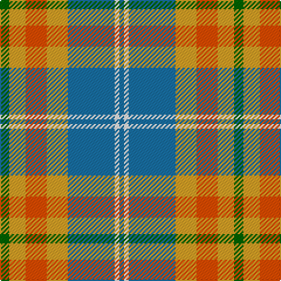

In pattern [BWBYRYG](/stripes/bwbyryg/).

This was sourced from register-of-tartans.  It is a [7 stripe tartan](/stripes/stripes7/).

Original link https://www.tartanregister.gov.uk/tartanDetails.aspx?ref=11220

## Register references

External register numbers recorded for this tartan.

- Scottish Register of Tartans: [11220](https://www.tartanregister.gov.uk/tartanDetails.aspx?ref=11220)

## Thread count
G/8 Y14 R18 Y18 B40 W4 B/4

## Palette
Each colour and its ΔE from the base-6 reference it is a variant of.

| Colour | Shade | Base | ΔE (OKLab) |
|---|---|---|---|
| B | <code style="background-color:#1870A4;">#1870A4</code> `#1870A4` | B <code style="background-color:#2A418A;">#2A418A</code> | 0.13 |
| G | <code style="background-color:#006400;">#006400</code> `#006400` | G <code style="background-color:#006100;">#006100</code> | 0.01 |
| R | <code style="background-color:#FA4B00;">#FA4B00</code> `#FA4B00` | R <code style="background-color:#CC0000;">#CC0000</code> | 0.13 |
| W | <code style="background-color:#FFFFFF;">#FFFFFF</code> `#FFFFFF` | W <code style="background-color:#F7F7F7;">#F7F7F7</code> | 0.02 |
| Y | <code style="background-color:#E0A126;">#E0A126</code> `#E0A126` | Y <code style="background-color:#F2BF00;">#F2BF00</code> | 0.08 |

# Sample pattern

## Nearest tartans

The nearest existing variants by ΔTartan distance.

1. [Manitoba Dress (Dance)](/setts/s8/g3r10lb2g3lb13g2lb2g3~x2/) — ΔT 0.85
1. [MacLachlan Dress Clan Tartan Tartan Number: 828. Earliest known date: 1990 Based on the MacLachlan pattern in Old And Rare See products available Copyright © Blair Urquhart, Comrie, 2015](/setts/s7/r34w3g4g23w24k3g4~x2/) — ΔT 0.99
1. [Afternoon Tea / Milk Tea](/setts/s6/w15lo98do72r25do8lg15/) — ΔT 1.00
1. [S.I.D.E. (Corporate)](/setts/s5/ly15r9t30w3db4~x2/) — ΔT 1.02
1. [Cercle de Fermières Varennes](/setts/s6/o30r3dg14w10r3b30~x2/) — ΔT 1.04
1. [MacLean, dress](/setts/s6/r1w12g6r8t3ly1~x4/) — ΔT 1.06
1. [Fraser hunting, dress](/setts/s11/db4o24g17o3w18o3w18o3g17o24r4~x2/) — ΔT 1.17
1. [Tombow 140th Anniversary, The](/setts/s7/g4ly7o9ly9db20w2db2~x2/) — ΔT 1.22
1. [MacKintosh Dress (Dance)](/setts/s6/r3w33dp8dg18r9g3~x2/) — ΔT 1.22
1. [Brodie, Silver](/setts/s7/r3n20ly2n20y20lb20r3~x2/) — ΔT 1.23

## Neighbour map

Every grey dot is one of 14299 variants placed by the first two principal components of the ΔTartan feature space (44% of its variance). Red is this tartan; blue dots are its nearest — click one to open its page.

<svg viewBox="0 0 640 380" role="img" style="max-width:100%;height:auto;border:1px solid #e0e0e0;border-radius:4px;display:block" xmlns="http://www.w3.org/2000/svg"><image href="/nn/cloud.v1.png" width="640" height="380"/><a href="/setts/s8/g3r10lb2g3lb13g2lb2g3~x2/"><circle cx="173.6" cy="181.0" r="4" fill="#3465a4"><title>Manitoba Dress (Dance)</title></circle></a><a href="/setts/s7/r34w3g4g23w24k3g4~x2/"><circle cx="154.6" cy="155.2" r="4" fill="#3465a4"><title>MacLachlan Dress Clan Tartan Tartan Number: 828. Earliest known date: 1990 Based on the MacLachlan pattern in Old And Rare See products available Copyright © Blair Urquhart, Comrie, 2015</title></circle></a><a href="/setts/s6/w15lo98do72r25do8lg15/"><circle cx="227.8" cy="181.5" r="4" fill="#3465a4"><title>Afternoon Tea / Milk Tea</title></circle></a><a href="/setts/s5/ly15r9t30w3db4~x2/"><circle cx="230.9" cy="192.9" r="4" fill="#3465a4"><title>S.I.D.E. (Corporate)</title></circle></a><a href="/setts/s6/o30r3dg14w10r3b30~x2/"><circle cx="147.0" cy="194.3" r="4" fill="#3465a4"><title>Cercle de Fermières Varennes</title></circle></a><a href="/setts/s6/r1w12g6r8t3ly1~x4/"><circle cx="158.9" cy="164.8" r="4" fill="#3465a4"><title>MacLean, dress</title></circle></a><a href="/setts/s11/db4o24g17o3w18o3w18o3g17o24r4~x2/"><circle cx="161.9" cy="181.0" r="4" fill="#3465a4"><title>Fraser hunting, dress</title></circle></a><a href="/setts/s7/g4ly7o9ly9db20w2db2~x2/"><circle cx="156.1" cy="170.7" r="4" fill="#3465a4"><title>Tombow 140th Anniversary, The</title></circle></a><a href="/setts/s6/r3w33dp8dg18r9g3~x2/"><circle cx="176.2" cy="158.0" r="4" fill="#3465a4"><title>MacKintosh Dress (Dance)</title></circle></a><a href="/setts/s7/r3n20ly2n20y20lb20r3~x2/"><circle cx="221.5" cy="207.7" r="4" fill="#3465a4"><title>Brodie, Silver</title></circle></a><circle cx="182.4" cy="181.8" r="5" fill="#c00000"/></svg>

ID: /setts/s7/g4lo7r9lo9b20w2b2~x2/
