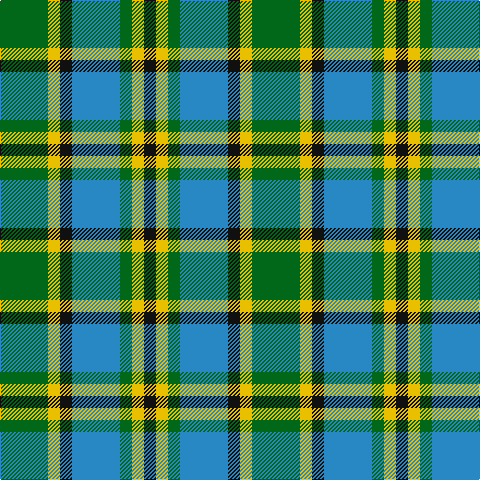

This page is one **sett** — a single exact thread-count. It belongs to the [tartan](/tartans/g4y1k1b4g1y1k1/)
(the same proportion at any scale), whose colour order is pattern [GYKBGYK](/stripes/gykbgyk/).

Sourced from register-of-tartans.  It is a [7 stripe tartan](/stripes/stripes7/).

Original link https://www.tartanregister.gov.uk/tartanDetails.aspx?ref=4447

2 attestations — the source records this cloth was collapsed from (oldest owns this page)

<ul>
<li>01/03/2005 — Verble (Personal) (register-of-tartans, <a href="https://www.tartanregister.gov.uk/tartanDetails.aspx?ref=4447">record</a>)</li>
<li>2005 March — Verble (Personal) (tartans-authority, <a href="http://www.tartansauthority.com/tartan-ferret/display/6659/">record</a>)</li>
</ul>

## Register references

External register numbers recorded for this tartan.

- Scottish Register of Tartans: [4447](https://www.tartanregister.gov.uk/tartanDetails.aspx?ref=4447)
- Scottish Tartans Authority (ITI): 6659

## Thread count
G/48 Y12 K12 B48 G12 Y12 K/12

## Palette
Each colour and the base-6 reference it is a variant of.

| Colour | Shade | Base |
|---|---|---|
| B | <code style="background-color:#2888C4;">#2888C4</code> `oklch(60.1% 0.125 241.5)` <small>#2888C4</small> | B <code style="background-color:#2A418A;">#2A418A</code> |
| Ba | <code style="background-color:#2474E8;">#2474E8</code> `oklch(57.8% 0.192 258.7)` <small>#2474E8</small> | B <code style="background-color:#2A418A;">#2A418A</code> |
| G | <code style="background-color:#006818;">#006818</code> `oklch(45.0% 0.142 145.0)` <small>#006818</small> | G <code style="background-color:#006100;">#006100</code> |
| K | <code style="background-color:#101010;">#101010</code> `oklch(17.3% 0.000 89.9)` <small>#101010</small> | K <code style="background-color:#000000;">#000000</code> |
| Y | <code style="background-color:#E8C000;">#E8C000</code> `oklch(81.9% 0.168 93.7)` <small>#E8C000</small> | Y <code style="background-color:#F2BF00;">#F2BF00</code> |

# Sample pattern

## Nearest tartans

The nearest existing variants by ΔTartan distance, with this tartan at the top so the swatches line up against it.

ΔTartan

Tartan

Sett

—

<a href="/ttd/edit/#slug=g4ly1k1t4g1ly1k1~x12">Verble (Personal)</a> <a class="nn-out" href="/setts/s7/g4ly1k1t4g1ly1k1~x12/" title="open its dictionary page">↗</a>

1.37

<a href="/ttd/edit/#slug=ly5k5g17k6o24k6ly3~x2">Cape Breton District Tartan Tartan Number: 1883. Earliest known date: 1957 In 1907, Mrs Lillian Crewe Walsh of Glace Bay, Cape Breton, wrote a poem in praise of Cape Breton. This poem was given by Mrs Walsh to Mrs Grant in 1957 and the tartan designed to accord with the poem. Grey for our Cape Breton Steel, Green for our lofty See products available Copyright © Blair Urquhart, Comrie, 2015</a> <a class="nn-out" href="/setts/s7/ly5k5g17k6o24k6ly3~x2/" title="open its dictionary page">↗</a>

1.41

<a href="/ttd/edit/#slug=lb47g6b13dy20g6b6g28~x2">State Seal of North Carolina (Fash.)</a> <a class="nn-out" href="/setts/s7/lb47g6b13dy20g6b6g28~x2/" title="open its dictionary page">↗</a>

1.45

<a href="/ttd/edit/#slug=k4w2g13k13t12k2~x2">Melville</a> <a class="nn-out" href="/setts/s6/k4w2g13k13t12k2~x2/" title="open its dictionary page">↗</a>

1.46

<a href="/ttd/edit/#slug=k4g14k14g2w14b3~x2">MacKay, Dress (Corporate)</a> <a class="nn-out" href="/setts/s6/k4g14k14g2w14b3~x2/" title="open its dictionary page">↗</a>

1.47

<a href="/setts/s8/g6k1r1t2r2~x4/">Wilson's No.193</a>

1.47

<a href="/ttd/edit/#slug=db21g5k5g15w3g5w3g5k3~x2">Tweedside, hunting</a> <a class="nn-out" href="/setts/s9/db21g5k5g15w3g5w3g5k3~x2/" title="open its dictionary page">↗</a>

1.50

<a href="/ttd/edit/#slug=w3dt10dt12g11db3g11g4g2~x2">Queen of the South</a> <a class="nn-out" href="/setts/s8/w3dt10dt12g11db3g11g4g2~x2/" title="open its dictionary page">↗</a>

1.52

<a href="/ttd/edit/#slug=b2g13b11y4w9b2~x2">Loch Leven</a> <a class="nn-out" href="/setts/s6/b2g13b11y4w9b2~x2/" title="open its dictionary page">↗</a>

1.53

<a href="/ttd/edit/#slug=k2g13k11t4w9k2~x2">Loch Leven, Check</a> <a class="nn-out" href="/setts/s6/k2g13k11t4w9k2~x2/" title="open its dictionary page">↗</a>

1.53

<a href="/ttd/edit/#slug=r2db10k5g12w2~x2">Davidson of Tulloch</a> <a class="nn-out" href="/setts/s5/r2db10k5g12w2~x2/" title="open its dictionary page">↗</a>

## Neighbour map

Every grey dot is one of 14299 variants placed by the first two principal components of the ΔTartan feature space (44% of its variance). Red is this tartan; blue dots are its nearest — click one to open its page.

<svg viewBox="0 0 640 380" role="img" style="max-width:100%;height:auto;border:1px solid #e0e0e0;border-radius:4px;display:block" xmlns="http://www.w3.org/2000/svg"><image href="/nn/cloud.v1.png" width="640" height="380"/><a href="/setts/s7/ly5k5g17k6o24k6ly3~x2/"><circle cx="152.5" cy="207.8" r="4" fill="#3465a4"><title>Cape Breton District Tartan Tartan Number: 1883. Earliest known date: 1957 In 1907, Mrs Lillian Crewe Walsh of Glace Bay, Cape Breton, wrote a poem in praise of Cape Breton. This poem was given by Mrs Walsh to Mrs Grant in 1957 and the tartan designed to accord with the poem. Grey for our Cape Breton Steel, Green for our lofty See products available Copyright © Blair Urquhart, Comrie, 2015</title></circle></a><a href="/setts/s7/lb47g6b13dy20g6b6g28~x2/"><circle cx="165.9" cy="213.9" r="4" fill="#3465a4"><title>State Seal of North Carolina (Fash.)</title></circle></a><a href="/setts/s6/k4w2g13k13t12k2~x2/"><circle cx="166.6" cy="238.0" r="4" fill="#3465a4"><title>Melville</title></circle></a><a href="/setts/s6/k4g14k14g2w14b3~x2/"><circle cx="120.4" cy="222.5" r="4" fill="#3465a4"><title>MacKay, Dress (Corporate)</title></circle></a><a href="/setts/s8/g6k1r1t2r2~x4/"><circle cx="164.3" cy="218.3" r="4" fill="#3465a4"><title>Wilson's No.193</title></circle></a><a href="/setts/s9/db21g5k5g15w3g5w3g5k3~x2/"><circle cx="189.0" cy="202.1" r="4" fill="#3465a4"><title>Tweedside, hunting</title></circle></a><a href="/setts/s8/w3dt10dt12g11db3g11g4g2~x2/"><circle cx="141.9" cy="225.0" r="4" fill="#3465a4"><title>Queen of the South</title></circle></a><a href="/setts/s6/b2g13b11y4w9b2~x2/"><circle cx="131.5" cy="233.2" r="4" fill="#3465a4"><title>Loch Leven</title></circle></a><a href="/setts/s6/k2g13k11t4w9k2~x2/"><circle cx="113.1" cy="227.8" r="4" fill="#3465a4"><title>Loch Leven, Check</title></circle></a><a href="/setts/s5/r2db10k5g12w2~x2/"><circle cx="119.5" cy="224.9" r="4" fill="#3465a4"><title>Davidson of Tulloch</title></circle></a><circle cx="130.9" cy="241.3" r="5" fill="#c00000"/></svg>

ID: /setts/s7/g4ly1k1t4g1ly1k1~x12/
