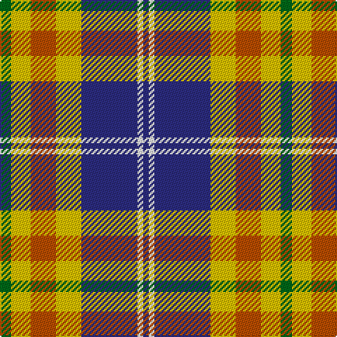

**Bands:** [GYRYBWB](/stripes/gyrybwb/) · **Stripes:** [G LY O LY DB W DB](/stripes/stripes7/) G LY O LY DB W DB

This was sourced from tartans-authority.  It is a [7 band tartan](/bands/bands7/).

Original link http://www.tartansauthority.com/tartan-ferret/display/11220/

## Thread count
G/8 Y14 DO18 Y18 DB40 W4 DB/4

## Palette
Each colour and its ΔE from the base-6 reference it is a variant of.

| Colour | Shade | Base | ΔE (OKLab) |
|---|---|---|---|
| DB | <code style="background-color:#2C2C80;">#2C2C80</code> `#2C2C80` | B <code style="background-color:#2A418A;">#2A418A</code> | 0.06 |
| DO | <code style="background-color:#B84C00;">#B84C00</code> `#B84C00` | R <code style="background-color:#CC0000;">#CC0000</code> | 0.08 |
| G | <code style="background-color:#006818;">#006818</code> `#006818` | G <code style="background-color:#006100;">#006100</code> | 0.02 |
| W | <code style="background-color:#FCFCFC;">#FCFCFC</code> `#FCFCFC` | W <code style="background-color:#F7F7F7;">#F7F7F7</code> | 0.01 |
| Y | <code style="background-color:#E8C000;">#E8C000</code> `#E8C000` | Y <code style="background-color:#F2BF00;">#F2BF00</code> | 0.02 |

# Sample pattern

## Nearest tartans

The nearest existing variants by ΔTartan distance.

1. [Thomson Dress (Grey) (Fashion)](/setts/s6/r4o25k6w12k11ly3~x2/) — ΔT 0.46
1. [Glasgow](/setts/s7/dg20r3y3r15w19dg3t2~x2/) — ΔT 0.85
1. [Pengelly, The Cornish (Name)](/setts/s7/lb5k26ly4lb24dp8k3r4~x2/) — ΔT 0.89
1. [MacTavish Dress](/setts/s6/r4t28k6lb12k12lo3~x2/) — ΔT 0.93
1. [Thompson Grey Family Tartan Tartan Number: 1611. Earliest known date: pre 2003 Designed for Lord Thomson of Fleet in 1958 based on a sample in the Moy Hall collection dating from the mid 19th century. The tartan is also suitable for MacTavishs and Thompsons, who claim descent from the Clan MacIntosh. See products available Copyright © Blair Urquhart, Comrie, 2015](/setts/s6/r2o20k5w10k10r2~x2/) — ΔT 0.96
1. [Northern Ontario](/setts/s7/dy17g5db2w12db2ly4g7~x4/) — ΔT 0.96
1. [MacDuff Dress #5](/setts/s7/w39db9k10dg11r7k3r7~x2/) — ΔT 0.97
1. [MacDuff dress](/setts/s7/w39db9k10g11r7k3r7~x2/) — ΔT 0.98
1. [Culloden, dress Ancient](/setts/s8/r6db2p21w3dg19w26dg3w5~x2/) — ΔT 0.99
1. [Thompson Camel Clan Tartan Tartan Number: 2421. Earliest known date: 1967 Designed by Scotty Thompson. It it a simple colour variation on the usual blue Thompson, but is often confused with the Burberry Check. See products available Copyright © Blair Urquhart, Comrie, 2015](/setts/s6/r2lo20k5w10k10w2~x2/) — ΔT 1.00

## Neighbour map

Every grey dot is one of 14299 variants placed by the first two principal components of the ΔTartan feature space (44% of its variance). Red is this tartan; blue dots are its nearest — click one to open its page.

<svg viewBox="0 0 640 380" role="img" style="max-width:100%;height:auto;border:1px solid #e0e0e0;border-radius:4px;display:block" xmlns="http://www.w3.org/2000/svg"><image href="/nn/cloud.v1.png" width="640" height="380"/><a href="/setts/s6/r4o25k6w12k11ly3~x2/"><circle cx="141.3" cy="185.0" r="4" fill="#3465a4"><title>Thomson Dress (Grey) (Fashion)</title></circle></a><a href="/setts/s7/dg20r3y3r15w19dg3t2~x2/"><circle cx="134.8" cy="157.9" r="4" fill="#3465a4"><title>Glasgow</title></circle></a><a href="/setts/s7/lb5k26ly4lb24dp8k3r4~x2/"><circle cx="152.6" cy="162.2" r="4" fill="#3465a4"><title>Pengelly, The Cornish (Name)</title></circle></a><a href="/setts/s6/r4t28k6lb12k12lo3~x2/"><circle cx="168.3" cy="187.2" r="4" fill="#3465a4"><title>MacTavish Dress</title></circle></a><a href="/setts/s6/r2o20k5w10k10r2~x2/"><circle cx="174.6" cy="192.3" r="4" fill="#3465a4"><title>Thompson Grey Family Tartan Tartan Number: 1611. Earliest known date: pre 2003 Designed for Lord Thomson of Fleet in 1958 based on a sample in the Moy Hall collection dating from the mid 19th century. The tartan is also suitable for MacTavishs and Thompsons, who claim descent from the Clan MacIntosh. See products available Copyright © Blair Urquhart, Comrie, 2015</title></circle></a><a href="/setts/s7/dy17g5db2w12db2ly4g7~x4/"><circle cx="103.4" cy="175.6" r="4" fill="#3465a4"><title>Northern Ontario</title></circle></a><a href="/setts/s7/w39db9k10dg11r7k3r7~x2/"><circle cx="171.3" cy="138.8" r="4" fill="#3465a4"><title>MacDuff Dress #5</title></circle></a><a href="/setts/s7/w39db9k10g11r7k3r7~x2/"><circle cx="165.2" cy="138.0" r="4" fill="#3465a4"><title>MacDuff dress</title></circle></a><a href="/setts/s8/r6db2p21w3dg19w26dg3w5~x2/"><circle cx="155.5" cy="140.0" r="4" fill="#3465a4"><title>Culloden, dress Ancient</title></circle></a><a href="/setts/s6/r2lo20k5w10k10w2~x2/"><circle cx="176.4" cy="189.9" r="4" fill="#3465a4"><title>Thompson Camel Clan Tartan Tartan Number: 2421. Earliest known date: 1967 Designed by Scotty Thompson. It it a simple colour variation on the usual blue Thompson, but is often confused with the Burberry Check. See products available Copyright © Blair Urquhart, Comrie, 2015</title></circle></a><circle cx="156.1" cy="170.7" r="5" fill="#c00000"/></svg>

ID: /setts/s7/g4ly7o9ly9db20w2db2~x2/
