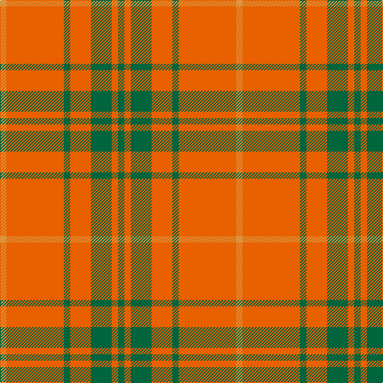

In pattern [GRGRGRY](/stripes/grgrgry/).

This was sourced from tartans-authority.  It is a [7 stripe tartan](/stripes/stripes7/).

Original link http://www.tartansauthority.com/tartan-ferret/display/4096/

## Thread count
O/8 Oa72 G8 Oa26 G26 Oa8 G/8

## Palette
Each colour and its ΔE from the base-6 reference it is a variant of.

| Colour | Shade | Base | ΔE (OKLab) |
|---|---|---|---|
| G | <code style="background-color:#00643C;">#00643C</code> `#00643C` | G <code style="background-color:#006100;">#006100</code> | 0.05 |
| O | <code style="background-color:#DC943C;">#DC943C</code> `#DC943C` | Y <code style="background-color:#F2BF00;">#F2BF00</code> | 0.12 |
| Oa | <code style="background-color:#E86000;">#E86000</code> `#E86000` | R <code style="background-color:#CC0000;">#CC0000</code> | 0.14 |

# Sample pattern

## Nearest tartans

The nearest existing variants by ΔTartan distance.

1. [Wolfe](/setts/s12/o36g4o13g13o4g4o4g13o13g4o36lo4~x2/) — ΔT 1.23
1. [Cameron](/setts/s6/r1g3r1g3r8ly1~x8/) — ΔT 1.44
1. [Cameron](/setts/s6/r2g6r2g6r16ly1~x2/) — ΔT 1.46
1. [Cameron (Clan)](/setts/s6/r2g6r2g6r16ly1~x4/) — ΔT 1.50
1. [Cameron, Ancient](/setts/s7/r58ly3r6g16r12g16r6/) — ΔT 1.53
1. [MacDonell of Keppoch](/setts/s11/r8g2r6db1r2db1r8g12r14db1r2~x2/) — ΔT 1.61
1. [Crawford](/setts/s7/r6lb2r30dg12r3dg12r3/) — ΔT 1.69
1. [Claus of the North Pole (Restricted)](/setts/s7/r21g3r21g16lo3w2lo3~x2/) — ΔT 1.70
1. [MacQuarrie #5](/setts/s6/r16g1r1g1r4g12~x4/) — ΔT 1.72
1. [Auld Lang Syne (red) Tartan Tartan Number: 2402. Earliest known date: Threadcount and colours aren't 100% original. Generated manually. See products available Copyright © Blair Urquhart, Comrie, 2015](/setts/s7/r4g14r5k6r24g2r4~x2/) — ΔT 1.75

## Neighbour map

Every grey dot is one of 14299 variants placed by the first two principal components of the ΔTartan feature space (44% of its variance). Red is this tartan; blue dots are its nearest — click one to open its page.

<svg viewBox="0 0 640 380" role="img" style="max-width:100%;height:auto;border:1px solid #e0e0e0;border-radius:4px;display:block" xmlns="http://www.w3.org/2000/svg"><image href="/nn/cloud.v1.png" width="640" height="380"/><a href="/setts/s12/o36g4o13g13o4g4o4g13o13g4o36lo4~x2/"><circle cx="462.0" cy="197.4" r="4" fill="#3465a4"><title>Wolfe</title></circle></a><a href="/setts/s6/r1g3r1g3r8ly1~x8/"><circle cx="370.7" cy="226.4" r="4" fill="#3465a4"><title>Cameron</title></circle></a><a href="/setts/s6/r2g6r2g6r16ly1~x2/"><circle cx="416.7" cy="200.8" r="4" fill="#3465a4"><title>Cameron</title></circle></a><a href="/setts/s6/r2g6r2g6r16ly1~x4/"><circle cx="421.8" cy="202.2" r="4" fill="#3465a4"><title>Cameron (Clan)</title></circle></a><a href="/setts/s7/r58ly3r6g16r12g16r6/"><circle cx="495.9" cy="181.3" r="4" fill="#3465a4"><title>Cameron, Ancient</title></circle></a><a href="/setts/s11/r8g2r6db1r2db1r8g12r14db1r2~x2/"><circle cx="462.4" cy="189.2" r="4" fill="#3465a4"><title>MacDonell of Keppoch</title></circle></a><a href="/setts/s7/r6lb2r30dg12r3dg12r3/"><circle cx="417.2" cy="193.4" r="4" fill="#3465a4"><title>Crawford</title></circle></a><a href="/setts/s7/r21g3r21g16lo3w2lo3~x2/"><circle cx="356.4" cy="192.1" r="4" fill="#3465a4"><title>Claus of the North Pole (Restricted)</title></circle></a><a href="/setts/s6/r16g1r1g1r4g12~x4/"><circle cx="456.7" cy="215.1" r="4" fill="#3465a4"><title>MacQuarrie #5</title></circle></a><a href="/setts/s7/r4g14r5k6r24g2r4~x2/"><circle cx="394.7" cy="205.8" r="4" fill="#3465a4"><title>Auld Lang Syne (red) Tartan Tartan Number: 2402. Earliest known date: Threadcount and colours aren't 100% original. Generated manually. See products available Copyright © Blair Urquhart, Comrie, 2015</title></circle></a><circle cx="448.2" cy="214.9" r="5" fill="#c00000"/></svg>

ID: /setts/s7/g4o4g13o13g4o36lo4~x2/
