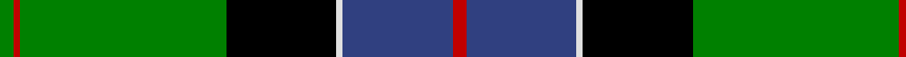
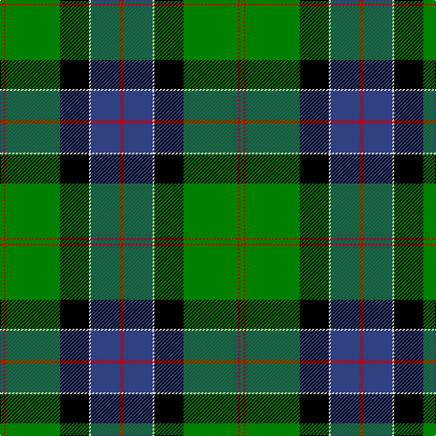

In pattern [GRGKWBR](/patterns/grgkwbr/).

This was sourced from weddslist.  It is a [7 stripes tartan](/stripes/stripes7/).

Original link http://www.weddslist.com/cgi-bin/tartans/pg.pl?source=sts

## Thread count
G/4 R2 G60 K32 LN2 B32 R/4

## Palette
Each colour and its ΔE from the base-6 reference it is a variant of.

| Colour | Shade | Base | ΔE (OKLab) |
|---|---|---|---|
| B | <code style="background-color:#304080;">#304080</code> `#304080` | B <code style="background-color:#2C4084;">#2C4084</code> | 0.01 |
| G | <code style="background-color:#008000;">#008000</code> `#008000` | G <code style="background-color:#006400;">#006400</code> | 0.09 |
| K | <code style="background-color:#000000;">#000000</code> `#000000` | K <code style="background-color:#000000;">#000000</code> | 0.00 |
| LN | <code style="background-color:#E0E0E0;">#E0E0E0</code> `#E0E0E0` | W <code style="background-color:#F4F4F0;">#F4F4F0</code> | 0.06 |
| R | <code style="background-color:#C00000;">#C00000</code> `#C00000` | R <code style="background-color:#C80000;">#C80000</code> | 0.02 |

# Sample pattern

## Nearest tartans

The nearest existing variants by ΔTartan distance.

1. [John.W.Mackay, Restricted](/setts/s9/k8g68y2k36g6b36r6g6r6-b304080-g008000-k000000-rc00020-yf0c000/) — ΔT 0.60
1. [MacNeil 3](/setts/s8/g90w4r6k30r6b30r6b30-b304080-g008000-k000000-rc00000-we0e0e0/) — ΔT 0.75
1. [Hutchens (Kansas) (Personal)](/setts/s9/b20k24g6k2g2k2g60y8w8-b000080-g006400-k101010-wffffff-yb8860b/) — ΔT 0.82
1. [Colquhoun](/setts/s7/b8k4b32w2k16g48r8-b304080-g008000-k000000-rc00000-we0e0e0/) — ΔT 0.90
1. [MacDonald of the Isles](/setts/s9/w8g60k2g2k2g6k24b20r6-b304080-g008000-k000000-rc00000-we0e0e0/) — ΔT 0.92
1. [MacDonald of The Isles](/setts/s9/w8g60k2g2k2g6k24b20r6-b202060-g006818-k101010-rc80000-wfcfcfc/) — ΔT 0.97
1. [MacLaren](/setts/s7/b48k16g16r4g16k2y4-b304080-g008000-k000000-rc00000-yf0c000/) — ΔT 1.04
1. [MacDonnald of ye Ylis](/setts/s9/w4g30k1g1k1g3k12b10r3-b00004c-g004c00-k000000-rc80000-wd0d0d0/) — ΔT 1.09
1. [Tooth](/setts/s8/g10y2r4g50k28b38w8g4-b304080-g008000-k000000-rc00000-we0e0e0-yf0c000/) — ΔT 1.10
1. [MacDonald of the Isles VS Clan Tartan Tartan Number: 1366. Earliest known date: 1842 The design first appeared in the Vestiarium Scoticum and is different from earlier setts attributed to the Lord of the Isles or to any of the Clan Donald branches. It is not generally regarded as a clan tartan. The Sobieski Stuart brothers who published the Vestiarium claimed to be the heirs to a manuscript once in the hands of Prince Charles Edward himself but the original was never produced for public examination. The book appears to be a curious mixture of fact and fiction in keeping with the romantic ideals of the Victorian era. See products available Copyright © Blair Urquhart, Comrie, 2015](/setts/s9/w8g60k2g2k2g6k24b20r6-b2c2c80-g006818-k101010-rc80000-we0e0e0/) — ΔT 1.11

## Neighbour map

Every grey dot is one of 15726 variants placed by the first two principal components of the ΔTartan feature space (44% of its variance). Red is this tartan; blue dots are its nearest — click one to open its page.

<svg viewBox="0 0 640 380" role="img" style="max-width:100%;height:auto;border:1px solid #e0e0e0;border-radius:4px;display:block" xmlns="http://www.w3.org/2000/svg"><image href="/nn/cloud.v1.png" width="640" height="380"/><a href="/setts/s9/k8g68y2k36g6b36r6g6r6-b304080-g008000-k000000-rc00020-yf0c000/"><circle cx="240.3" cy="111.6" r="4" fill="#3465a4"><title>John.W.Mackay, Restricted</title></circle></a><a href="/setts/s8/g90w4r6k30r6b30r6b30-b304080-g008000-k000000-rc00000-we0e0e0/"><circle cx="225.6" cy="133.3" r="4" fill="#3465a4"><title>MacNeil 3</title></circle></a><a href="/setts/s9/b20k24g6k2g2k2g60y8w8-b000080-g006400-k101010-wffffff-yb8860b/"><circle cx="273.0" cy="113.8" r="4" fill="#3465a4"><title>Hutchens (Kansas) (Personal)</title></circle></a><a href="/setts/s7/b8k4b32w2k16g48r8-b304080-g008000-k000000-rc00000-we0e0e0/"><circle cx="208.1" cy="146.8" r="4" fill="#3465a4"><title>Colquhoun</title></circle></a><a href="/setts/s9/w8g60k2g2k2g6k24b20r6-b304080-g008000-k000000-rc00000-we0e0e0/"><circle cx="266.2" cy="105.8" r="4" fill="#3465a4"><title>MacDonald of the Isles</title></circle></a><a href="/setts/s9/w8g60k2g2k2g6k24b20r6-b202060-g006818-k101010-rc80000-wfcfcfc/"><circle cx="288.1" cy="113.9" r="4" fill="#3465a4"><title>MacDonald of The Isles</title></circle></a><a href="/setts/s7/b48k16g16r4g16k2y4-b304080-g008000-k000000-rc00000-yf0c000/"><circle cx="231.8" cy="145.2" r="4" fill="#3465a4"><title>MacLaren</title></circle></a><a href="/setts/s9/w4g30k1g1k1g3k12b10r3-b00004c-g004c00-k000000-rc80000-wd0d0d0/"><circle cx="285.1" cy="116.1" r="4" fill="#3465a4"><title>MacDonnald of ye Ylis</title></circle></a><a href="/setts/s8/g10y2r4g50k28b38w8g4-b304080-g008000-k000000-rc00000-we0e0e0-yf0c000/"><circle cx="189.0" cy="119.3" r="4" fill="#3465a4"><title>Tooth</title></circle></a><a href="/setts/s9/w8g60k2g2k2g6k24b20r6-b2c2c80-g006818-k101010-rc80000-we0e0e0/"><circle cx="294.4" cy="116.4" r="4" fill="#3465a4"><title>MacDonald of the Isles VS Clan Tartan Tartan Number: 1366. Earliest known date: 1842 The design first appeared in the Vestiarium Scoticum and is different from earlier setts attributed to the Lord of the Isles or to any of the Clan Donald branches. It is not generally regarded as a clan tartan. The Sobieski Stuart brothers who published the Vestiarium claimed to be the heirs to a manuscript once in the hands of Prince Charles Edward himself but the original was never produced for public examination. The book appears to be a curious mixture of fact and fiction in keeping with the romantic ideals of the Victorian era. See products available Copyright © Blair Urquhart, Comrie, 2015</title></circle></a><circle cx="247.0" cy="129.6" r="5" fill="#c00000"/></svg>

ID: /setts/s7/g4r2g60k32w2b32r4-b304080-g008000-k000000-rc00000-we0e0e0/
