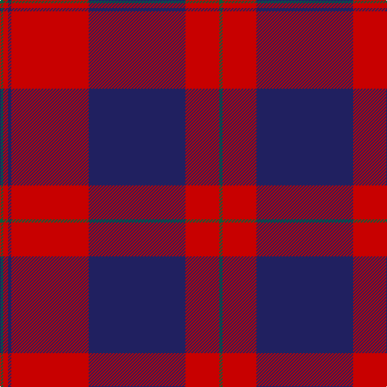

In pattern [GRBRBRG](/patterns/grbrbrg/).

This was sourced from register-of-tartans.  It is a [7 stripes tartan](/stripes/stripes7/).

Original link https://www.tartanregister.gov.uk/tartanDetails.aspx?ref=1270

## Thread count
G/4 R6 DB4 R96 DB120 R42 G/4

## Palette
Each colour and its ΔE from the base-6 reference it is a variant of.

| Colour | Shade | Base | ΔE (OKLab) |
|---|---|---|---|
| DB | <code style="background-color:#202060;">#202060</code> `#202060` | B <code style="background-color:#2A418A;">#2A418A</code> | 0.11 |
| G | <code style="background-color:#00643C;">#00643C</code> `#00643C` | G <code style="background-color:#006100;">#006100</code> | 0.05 |
| R | <code style="background-color:#C80000;">#C80000</code> `#C80000` | R <code style="background-color:#CC0000;">#CC0000</code> | 0.01 |

# Sample pattern

## Nearest tartans

The nearest existing variants by ΔTartan distance.

1. [Double Elvis Gallery (Corporate)](/setts/s6/r80b30k4ba2b30k12-b2c2c80-ba440044-k101010-rc80000/) — ΔT 1.25
1. [Leslie Clan Tartan Tartan Number: 1142. Earliest known date: 1842 The Vestarium Scoticum See products available Copyright © Blair Urquhart, Comrie, 2015](/setts/s8/r8k12y2k12r8b32r64k2-b2c2c80-k101010-rc80000-ye8c000/) — ΔT 1.29
1. [Greater Victoria Police PB (Corp)](/setts/s7/r14b2r52b62w2b2w4-b14283c-r880000-we0e0e0/) — ΔT 1.31
1. [Mens Bigi](/setts/s8/y8k34r2k8r4k8r66w6-k101010-r901c38-wfcfcfc-yd87c00/) — ΔT 1.34
1. [Unidentified Plaid #12](/setts/s8/b3r64b3r3b62r3b3r3-b2c4084-rdc0000/) — ΔT 1.35
1. [Las Vegas Fire Fighters](/setts/s8/r2k6w4k56r60k2r4w2-k101010-rc80000-wc0c0c0/) — ΔT 1.43
1. [Robberstad](/setts/s9/r120b30r8ba20w4ba20w4ba20r8-b3850c8-ba003c64-rc80000-wf8f8f8/) — ΔT 1.43
1. [Knights Templar - Grand Priory (Corp](/setts/s8/b2r4w2b60r60k2r4w2-b1c0070-k101010-ra00000-wfcfcfc/) — ΔT 1.45
1. [Rosser (Welsh Name)](/setts/s6/r16k57r36k2r4r2-k101010-rc80000/) — ΔT 1.48
1. [Caledonian](/setts/s6/r120b40r16g90r16b4-b5a008c-g005020-rdc0000/) — ΔT 1.49

## Neighbour map

Every grey dot is one of 15726 variants placed by the first two principal components of the ΔTartan feature space (44% of its variance). Red is this tartan; blue dots are its nearest — click one to open its page.

<svg viewBox="0 0 640 380" role="img" style="max-width:100%;height:auto;border:1px solid #e0e0e0;border-radius:4px;display:block" xmlns="http://www.w3.org/2000/svg"><image href="/nn/cloud.v1.png" width="640" height="380"/><a href="/setts/s6/r80b30k4ba2b30k12-b2c2c80-ba440044-k101010-rc80000/"><circle cx="366.9" cy="143.4" r="4" fill="#3465a4"><title>Double Elvis Gallery (Corporate)</title></circle></a><a href="/setts/s8/r8k12y2k12r8b32r64k2-b2c2c80-k101010-rc80000-ye8c000/"><circle cx="376.4" cy="125.9" r="4" fill="#3465a4"><title>Leslie Clan Tartan Tartan Number: 1142. Earliest known date: 1842 The Vestarium Scoticum See products available Copyright © Blair Urquhart, Comrie, 2015</title></circle></a><a href="/setts/s7/r14b2r52b62w2b2w4-b14283c-r880000-we0e0e0/"><circle cx="408.7" cy="165.3" r="4" fill="#3465a4"><title>Greater Victoria Police PB (Corp)</title></circle></a><a href="/setts/s8/y8k34r2k8r4k8r66w6-k101010-r901c38-wfcfcfc-yd87c00/"><circle cx="362.9" cy="122.5" r="4" fill="#3465a4"><title>Mens Bigi</title></circle></a><a href="/setts/s8/b3r64b3r3b62r3b3r3-b2c4084-rdc0000/"><circle cx="432.3" cy="160.1" r="4" fill="#3465a4"><title>Unidentified Plaid #12</title></circle></a><a href="/setts/s8/r2k6w4k56r60k2r4w2-k101010-rc80000-wc0c0c0/"><circle cx="381.3" cy="128.5" r="4" fill="#3465a4"><title>Las Vegas Fire Fighters</title></circle></a><a href="/setts/s9/r120b30r8ba20w4ba20w4ba20r8-b3850c8-ba003c64-rc80000-wf8f8f8/"><circle cx="385.5" cy="111.0" r="4" fill="#3465a4"><title>Robberstad</title></circle></a><a href="/setts/s8/b2r4w2b60r60k2r4w2-b1c0070-k101010-ra00000-wfcfcfc/"><circle cx="380.3" cy="117.6" r="4" fill="#3465a4"><title>Knights Templar - Grand Priory (Corp</title></circle></a><a href="/setts/s6/r16k57r36k2r4r2-k101010-rc80000/"><circle cx="361.8" cy="166.5" r="4" fill="#3465a4"><title>Rosser (Welsh Name)</title></circle></a><a href="/setts/s6/r120b40r16g90r16b4-b5a008c-g005020-rdc0000/"><circle cx="370.6" cy="172.3" r="4" fill="#3465a4"><title>Caledonian</title></circle></a><circle cx="409.8" cy="154.7" r="5" fill="#c00000"/></svg>

ID: /setts/s7/g4r42b120r96b4r6g4-b202060-g00643c-rc80000/
