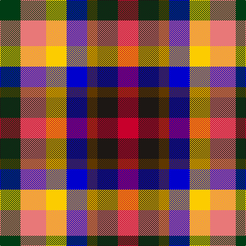

In pattern [GRYBGKR](/patterns/grybgkr/).

This was sourced from register-of-tartans.  It is a [7 stripes tartan](/stripes/stripes7/).

Original link https://www.tartanregister.gov.uk/tartanDetails.aspx?ref=11232

## Register references

External register numbers recorded for this tartan.

- Scottish Register of Tartans: [11232](https://www.tartanregister.gov.uk/tartanDetails.aspx?ref=11232)

## Thread count
DG/40 LR50 Y40 B40 T20 K40 R/40

## Palette
Each colour and its ΔE from the base-6 reference it is a variant of.

| Colour | Shade | Base | ΔE (OKLab) |
|---|---|---|---|
| B | <code style="background-color:#0000CD;">#0000CD</code> `#0000CD` | B <code style="background-color:#2A418A;">#2A418A</code> | 0.14 |
| DG | <code style="background-color:#003C14;">#003C14</code> `#003C14` | G <code style="background-color:#006100;">#006100</code> | 0.13 |
| K | <code style="background-color:#1C1714;">#1C1714</code> `#1C1714` | K <code style="background-color:#000000;">#000000</code> | 0.21 |
| LR | <code style="background-color:#E87878;">#E87878</code> `#E87878` | R <code style="background-color:#CC0000;">#CC0000</code> | 0.19 |
| R | <code style="background-color:#C8002C;">#C8002C</code> `#C8002C` | R <code style="background-color:#CC0000;">#CC0000</code> | 0.03 |
| T | <code style="background-color:#603800;">#603800</code> `#603800` | G <code style="background-color:#006100;">#006100</code> | 0.16 |
| Y | <code style="background-color:#FCCC00;">#FCCC00</code> `#FCCC00` | Y <code style="background-color:#F2BF00;">#F2BF00</code> | 0.04 |

# Sample pattern

## Nearest tartans

The nearest existing variants by ΔTartan distance.

1. [Krifa-Jean (Personal)](/setts/s7/g4r5b4y4ba2ra4r4~b2c2c80-ba441800-g003820-rc80000-ra888888-yfccc00~x5/) — ΔT 0.90
1. [Becker (Name)](/setts/s6/w3wa2b3r3k3y1~b2c2c80-k101010-rc80000-w98c8e8-waa8ace8-yfccc00~x8/) — ΔT 1.47
1. [Williams, Edmund (Personal)](/setts/s6/b15ba15g15ga15k8w5~b440044-ba780078-g289c18-ga003820-k101010-wfcfcfc~x2/) — ΔT 1.74
1. [Rainbow (Fashion)](/setts/s6/g2y1ya1r1b1ba1~b780078-ba2c2c80-g289c18-rc80000-ye8c000-yad87c00~x36/) — ΔT 1.92
1. [Rainbow](/setts/s6/g2y1ya1r1b1ba1~b800080-ba304080-g30a010-rc00000-yf0c000-yaff8500~x36/) — ΔT 2.02
1. [Lytley Formal (Personal)](/setts/s6/b1ba1r1bb2ra1y1~b2c2c80-ba003c64-bb780078-rc80000-ra880000-yfccc00~x10/) — ΔT 2.06
1. [Nicolson of Assynt & Coigach (Name)](/setts/s7/b8r11g5ba3y3w5k3~b2c2c80-ba1c1c50-g006818-k101010-rc80000-we0e0e0-ye8c000~x2/) — ΔT 2.15
1. [Nicolson of Taransay Hunting (Personal)](/setts/s7/r11b3ba8w3y3g5k5~b1c1c50-ba2c2c80-g006818-k101010-rc80000-we0e0e0-ye8c000~x4/) — ΔT 2.17
1. [Tipperary County Crest (Fashion)](/setts/s9/r10y36k24r30ya8k16w18b16ya9~b2c2c80-k101010-r880000-we0e0e0-ya0a0a0-yabc8c00/) — ΔT 2.27
1. [Unidentified (2103)](/setts/s11/b2k2b2k2w1r1w1r1w1r1ra2~b5c5c5c-k101010-r888888-rac80000-we0e0e0~x8/) — ΔT 2.31

## Neighbour map

Every grey dot is one of 15726 variants placed by the first two principal components of the ΔTartan feature space (44% of its variance). Red is this tartan; blue dots are its nearest — click one to open its page.

<svg viewBox="0 0 640 380" role="img" style="max-width:100%;height:auto;border:1px solid #e0e0e0;border-radius:4px;display:block" xmlns="http://www.w3.org/2000/svg"><image href="/nn/cloud.v1.png" width="640" height="380"/><a href="/setts/s7/g4r5b4y4ba2ra4r4~b2c2c80-ba441800-g003820-rc80000-ra888888-yfccc00~x5/"><circle cx="14.0" cy="257.6" r="4" fill="#3465a4"><title>Krifa-Jean (Personal)</title></circle></a><a href="/setts/s6/w3wa2b3r3k3y1~b2c2c80-k101010-rc80000-w98c8e8-waa8ace8-yfccc00~x8/"><circle cx="14.0" cy="254.4" r="4" fill="#3465a4"><title>Becker (Name)</title></circle></a><a href="/setts/s6/b15ba15g15ga15k8w5~b440044-ba780078-g289c18-ga003820-k101010-wfcfcfc~x2/"><circle cx="14.0" cy="263.3" r="4" fill="#3465a4"><title>Williams, Edmund (Personal)</title></circle></a><a href="/setts/s6/g2y1ya1r1b1ba1~b780078-ba2c2c80-g289c18-rc80000-ye8c000-yad87c00~x36/"><circle cx="14.0" cy="272.3" r="4" fill="#3465a4"><title>Rainbow (Fashion)</title></circle></a><a href="/setts/s6/g2y1ya1r1b1ba1~b800080-ba304080-g30a010-rc00000-yf0c000-yaff8500~x36/"><circle cx="14.0" cy="270.3" r="4" fill="#3465a4"><title>Rainbow</title></circle></a><a href="/setts/s6/b1ba1r1bb2ra1y1~b2c2c80-ba003c64-bb780078-rc80000-ra880000-yfccc00~x10/"><circle cx="14.0" cy="275.0" r="4" fill="#3465a4"><title>Lytley Formal (Personal)</title></circle></a><a href="/setts/s7/b8r11g5ba3y3w5k3~b2c2c80-ba1c1c50-g006818-k101010-rc80000-we0e0e0-ye8c000~x2/"><circle cx="14.0" cy="196.8" r="4" fill="#3465a4"><title>Nicolson of Assynt &amp; Coigach (Name)</title></circle></a><a href="/setts/s7/r11b3ba8w3y3g5k5~b1c1c50-ba2c2c80-g006818-k101010-rc80000-we0e0e0-ye8c000~x4/"><circle cx="14.0" cy="200.3" r="4" fill="#3465a4"><title>Nicolson of Taransay Hunting (Personal)</title></circle></a><a href="/setts/s9/r10y36k24r30ya8k16w18b16ya9~b2c2c80-k101010-r880000-we0e0e0-ya0a0a0-yabc8c00/"><circle cx="14.0" cy="199.9" r="4" fill="#3465a4"><title>Tipperary County Crest (Fashion)</title></circle></a><a href="/setts/s11/b2k2b2k2w1r1w1r1w1r1ra2~b5c5c5c-k101010-r888888-rac80000-we0e0e0~x8/"><circle cx="14.0" cy="258.2" r="4" fill="#3465a4"><title>Unidentified (2103)</title></circle></a><circle cx="14.0" cy="254.3" r="5" fill="#c00000"/></svg>

ID: /setts/s7/g4r5y4b4ga2k4ra4~b0000cd-g003c14-ga603800-k1c1714-re87878-rac8002c-yfccc00~x10/
