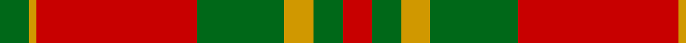
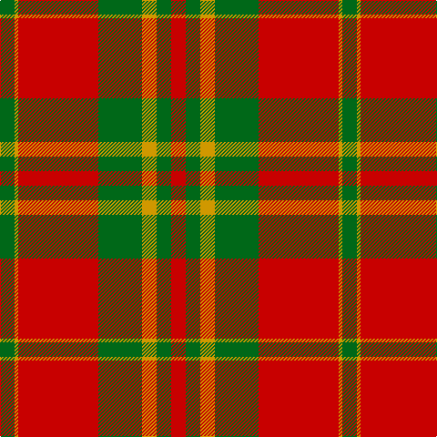

In pattern [GYRGYGR](/patterns/gyrgygr/).

This was sourced from register-of-tartans.  It is a [7 stripes tartan](/stripes/stripes7/).

Original link https://www.tartanregister.gov.uk/tartanDetails.aspx?ref=3861

## Attestations

This cloth appears in 2 source records; the oldest owns this page.

- 01/01/1972 — Spice Apple (register-of-tartans, [record](https://www.tartanregister.gov.uk/tartanDetails.aspx?ref=3861))
- pre 1972 — Spice Apple (Fashion) (tartans-authority, [record](http://www.tartansauthority.com/tartan-ferret/display/5314/))

## Thread count
G/16 DY4 R88 G48 DY16 G16 R/16

## Palette
Each colour and its ΔE from the base-6 reference it is a variant of.

| Colour | Shade | Base | ΔE (OKLab) |
|---|---|---|---|
| DY | <code style="background-color:#D09800;">#D09800</code> `#D09800` | Y <code style="background-color:#F2BF00;">#F2BF00</code> | 0.12 |
| G | <code style="background-color:#006818;">#006818</code> `#006818` | G <code style="background-color:#006100;">#006100</code> | 0.02 |
| R | <code style="background-color:#C80000;">#C80000</code> `#C80000` | R <code style="background-color:#CC0000;">#CC0000</code> | 0.01 |

# Sample pattern

## Nearest tartans

The nearest existing variants by ΔTartan distance.

1. [Robertson 6](/setts/s6/g1r18b4r1g10r1~b304080-g008000-rc00000~x4/) — ΔT 0.93
1. [Unidentified Cant #09](/setts/s8/r44b2g26r3b2r3g26b2~b2c2c80-g006818-rc80000/) — ΔT 0.97
1. [Livingstone #2](/setts/s10/g12r4k1r2k1r4g16r20g2r8~g006818-k101010-rc80000~x2/) — ΔT 1.01
1. [Caledonian](/setts/s6/r60b20r8g45r8b2~b800080-g008000-rc00000~x2/) — ΔT 1.02
1. [Dunbar Family Tartan Tartan Number: 1472. Earliest known date: 1842 The sett for this Lowland family first appeared in the Vestiarium Scoticum. There is also a Dunbar district tartan woven by Wilson's of Bannockburn around 1850. It is not possible to say whether Wilson's pattern was intended as a district or a family sett. The Chief of the Dunbars, Sir Jean Dunbar of Mochrum, once a jockey, lives in Florida, U.S.A. See products available Copyright © Blair Urquhart, Comrie, 2015](/setts/s6/r6g21k8r28k1r4~g006818-k101010-rc80000~x2/) — ΔT 1.10
1. [Livingstone](/setts/s10/g12r4k1r2k1r4g16r20g2r8~g008000-k000000-rc00000~x2/) — ΔT 1.14
1. [Caledonian - 1819 (Fashion?)](/setts/s6/r60b20r8g45r8b2~b440044-g006818-rc80000/) — ΔT 1.15
1. [MacDonald of Glenaladale (symmetrical)](/setts/s6/g5w2r27g27r5w2~g006818-rc80000-we0e0e0~x2/) — ΔT 1.16
1. [Wilson's, No 5](/setts/s6/r32b5g17r4g5w2~b5480b0-g008000-rc00000-we0e0e0~x2/) — ΔT 1.17
1. [MacAulay](/setts/s6/k2r16g6r3g8w1~g006818-k101010-rc80000-wc0c0c0~x2/) — ΔT 1.20

## Neighbour map

Every grey dot is one of 15726 variants placed by the first two principal components of the ΔTartan feature space (44% of its variance). Red is this tartan; blue dots are its nearest — click one to open its page.

<svg viewBox="0 0 640 380" role="img" style="max-width:100%;height:auto;border:1px solid #e0e0e0;border-radius:4px;display:block" xmlns="http://www.w3.org/2000/svg"><image href="/nn/cloud.v1.png" width="640" height="380"/><a href="/setts/s6/g1r18b4r1g10r1~b304080-g008000-rc00000~x4/"><circle cx="397.7" cy="188.7" r="4" fill="#3465a4"><title>Robertson 6</title></circle></a><a href="/setts/s8/r44b2g26r3b2r3g26b2~b2c2c80-g006818-rc80000/"><circle cx="375.9" cy="171.0" r="4" fill="#3465a4"><title>Unidentified Cant #09</title></circle></a><a href="/setts/s10/g12r4k1r2k1r4g16r20g2r8~g006818-k101010-rc80000~x2/"><circle cx="387.9" cy="178.0" r="4" fill="#3465a4"><title>Livingstone #2</title></circle></a><a href="/setts/s6/r60b20r8g45r8b2~b800080-g008000-rc00000~x2/"><circle cx="380.2" cy="180.6" r="4" fill="#3465a4"><title>Caledonian</title></circle></a><a href="/setts/s6/r6g21k8r28k1r4~g006818-k101010-rc80000~x2/"><circle cx="380.3" cy="185.4" r="4" fill="#3465a4"><title>Dunbar Family Tartan Tartan Number: 1472. Earliest known date: 1842 The sett for this Lowland family first appeared in the Vestiarium Scoticum. There is also a Dunbar district tartan woven by Wilson's of Bannockburn around 1850. It is not possible to say whether Wilson's pattern was intended as a district or a family sett. The Chief of the Dunbars, Sir Jean Dunbar of Mochrum, once a jockey, lives in Florida, U.S.A. See products available Copyright © Blair Urquhart, Comrie, 2015</title></circle></a><a href="/setts/s10/g12r4k1r2k1r4g16r20g2r8~g008000-k000000-rc00000~x2/"><circle cx="372.4" cy="173.0" r="4" fill="#3465a4"><title>Livingstone</title></circle></a><a href="/setts/s6/r60b20r8g45r8b2~b440044-g006818-rc80000/"><circle cx="378.9" cy="181.3" r="4" fill="#3465a4"><title>Caledonian - 1819 (Fashion?)</title></circle></a><a href="/setts/s6/g5w2r27g27r5w2~g006818-rc80000-we0e0e0~x2/"><circle cx="334.5" cy="202.0" r="4" fill="#3465a4"><title>MacDonald of Glenaladale (symmetrical)</title></circle></a><a href="/setts/s6/r32b5g17r4g5w2~b5480b0-g008000-rc00000-we0e0e0~x2/"><circle cx="352.4" cy="180.0" r="4" fill="#3465a4"><title>Wilson's, No 5</title></circle></a><a href="/setts/s6/k2r16g6r3g8w1~g006818-k101010-rc80000-wc0c0c0~x2/"><circle cx="335.5" cy="192.1" r="4" fill="#3465a4"><title>MacAulay</title></circle></a><circle cx="368.7" cy="185.6" r="5" fill="#c00000"/></svg>

ID: /setts/s7/g4y1r22g12y4g4r4~g006818-rc80000-yd09800~x4/
