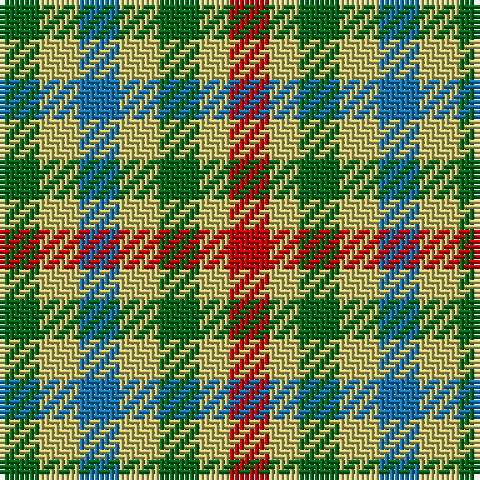

In pattern [GYBYGYR](/patterns/gybygyr/).

This was sourced from register-of-tartans.  It is a [7 stripes tartan](/stripes/stripes7/).

Original link https://www.tartanregister.gov.uk/tartanDetails.aspx?ref=2178

## Register references

External register numbers recorded for this tartan.

- Scottish Register of Tartans: [2178](https://www.tartanregister.gov.uk/tartanDetails.aspx?ref=2178)
- Scottish Tartans Authority (ITI): 5471

## Thread count
G/8 LG8 B8 LG8 G8 LG6 R/8

## Palette
Each colour and its ΔE from the base-6 reference it is a variant of.

| Colour | Shade | Base | ΔE (OKLab) |
|---|---|---|---|
| B | <code style="background-color:#1474B4;">#1474B4</code> `#1474B4` | B <code style="background-color:#2A418A;">#2A418A</code> | 0.15 |
| G | <code style="background-color:#006818;">#006818</code> `#006818` | G <code style="background-color:#006100;">#006100</code> | 0.02 |
| LG | <code style="background-color:#C4BC68;">#C4BC68</code> `#C4BC68` | Y <code style="background-color:#F2BF00;">#F2BF00</code> | 0.08 |
| R | <code style="background-color:#C80000;">#C80000</code> `#C80000` | R <code style="background-color:#CC0000;">#CC0000</code> | 0.01 |

# Sample pattern

## Nearest tartans

The nearest existing variants by ΔTartan distance.

1. [Lochwood (Estate Check)](/setts/s7/g1y1r1y1g1y1r1~g006818-rc80000-yc4bc68~x8/) — ΔT 1.46
1. [Sturch (Corporate)](/setts/s4/r2b2g3y2~b1c1c50-g006818-rc80000-ye8c000~x5/) — ΔT 2.08
1. [Strathspey (Estate Check)](/setts/s9/b1w1k1w1ba1w1k1w1ba1~b003c64-ba441800-k101010-wf0e0c4~x6/) — ΔT 2.38
1. [Seaforth (Estate Check)](/setts/s9/g1r1k1r1g1r1k1r1ra1~g886000-k000000-ra0783c-ra8c0000~x12/) — ΔT 2.42
1. [Seaforth Estate Check Estate Check Weavers Tartan Tartan Number: 5344. Earliest known date: pre 1990 No details. See products available Copyright © Blair Urquhart, Comrie, 2015](/setts/s9/g1r1k1r1g1r1k1r1ra1~g886000-k000000-ra0783c-ra8c0000~x6/) — ΔT 2.42
1. [Angle Dress (Fashion)](/setts/s5/k5g8y5g3y5~g408060-k101010-ybc8c00~x4/) — ΔT 2.50
1. [Ballindalloch Check](/setts/s5/b1r1b1r1g1~b4c0c28-g004c00-ra0783c~x8/) — ΔT 2.61
1. [Duffus Lord... Portrait Tartan Tartan Number: 1661. Earliest known date: 1705 The hose in the portrait of Lord Duffus (1705). Reconstructed and woven by Scottish Tartans Society. See products available Copyright © Blair Urquhart, Comrie, 2015](/setts/s7/y15r7k12y12k12g12r7~g604000-k101010-rc80000-ye8c000~x2/) — ΔT 2.61
1. [Mitchell, Martin (Personal)](/setts/s6/y12ya8r5k6y7g5~g00643c-k101010-r880000-ya0a0a0-yad87c00~x4/) — ΔT 2.61
1. [Unidentified, Arisaid](/setts/s12/r30w24g15ga15w24r30w24ga15g15w24r30w23~g003000-ga30a010-r900030-we0e0e0~x2/) — ΔT 2.66

## Neighbour map

Every grey dot is one of 15726 variants placed by the first two principal components of the ΔTartan feature space (44% of its variance). Red is this tartan; blue dots are its nearest — click one to open its page.

<svg viewBox="0 0 640 380" role="img" style="max-width:100%;height:auto;border:1px solid #e0e0e0;border-radius:4px;display:block" xmlns="http://www.w3.org/2000/svg"><image href="/nn/cloud.v1.png" width="640" height="380"/><a href="/setts/s7/g1y1r1y1g1y1r1~g006818-rc80000-yc4bc68~x8/"><circle cx="14.0" cy="366.0" r="4" fill="#3465a4"><title>Lochwood (Estate Check)</title></circle></a><a href="/setts/s4/r2b2g3y2~b1c1c50-g006818-rc80000-ye8c000~x5/"><circle cx="14.0" cy="359.4" r="4" fill="#3465a4"><title>Sturch (Corporate)</title></circle></a><a href="/setts/s9/b1w1k1w1ba1w1k1w1ba1~b003c64-ba441800-k101010-wf0e0c4~x6/"><circle cx="14.0" cy="366.0" r="4" fill="#3465a4"><title>Strathspey (Estate Check)</title></circle></a><a href="/setts/s9/g1r1k1r1g1r1k1r1ra1~g886000-k000000-ra0783c-ra8c0000~x12/"><circle cx="14.0" cy="366.0" r="4" fill="#3465a4"><title>Seaforth (Estate Check)</title></circle></a><a href="/setts/s9/g1r1k1r1g1r1k1r1ra1~g886000-k000000-ra0783c-ra8c0000~x6/"><circle cx="14.0" cy="366.0" r="4" fill="#3465a4"><title>Seaforth Estate Check Estate Check Weavers Tartan Tartan Number: 5344. Earliest known date: pre 1990 No details. See products available Copyright © Blair Urquhart, Comrie, 2015</title></circle></a><a href="/setts/s5/k5g8y5g3y5~g408060-k101010-ybc8c00~x4/"><circle cx="147.6" cy="341.9" r="4" fill="#3465a4"><title>Angle Dress (Fashion)</title></circle></a><a href="/setts/s5/b1r1b1r1g1~b4c0c28-g004c00-ra0783c~x8/"><circle cx="66.5" cy="366.0" r="4" fill="#3465a4"><title>Ballindalloch Check</title></circle></a><a href="/setts/s7/y15r7k12y12k12g12r7~g604000-k101010-rc80000-ye8c000~x2/"><circle cx="22.7" cy="304.6" r="4" fill="#3465a4"><title>Duffus Lord... Portrait Tartan Tartan Number: 1661. Earliest known date: 1705 The hose in the portrait of Lord Duffus (1705). Reconstructed and woven by Scottish Tartans Society. See products available Copyright © Blair Urquhart, Comrie, 2015</title></circle></a><a href="/setts/s6/y12ya8r5k6y7g5~g00643c-k101010-r880000-ya0a0a0-yad87c00~x4/"><circle cx="78.5" cy="287.6" r="4" fill="#3465a4"><title>Mitchell, Martin (Personal)</title></circle></a><a href="/setts/s12/r30w24g15ga15w24r30w24ga15g15w24r30w23~g003000-ga30a010-r900030-we0e0e0~x2/"><circle cx="54.0" cy="278.8" r="4" fill="#3465a4"><title>Unidentified, Arisaid</title></circle></a><circle cx="22.2" cy="366.0" r="5" fill="#c00000"/></svg>

ID: /setts/s7/g4y4b4y4g4y3r4~b1474b4-g006818-rc80000-yc4bc68~x2/
