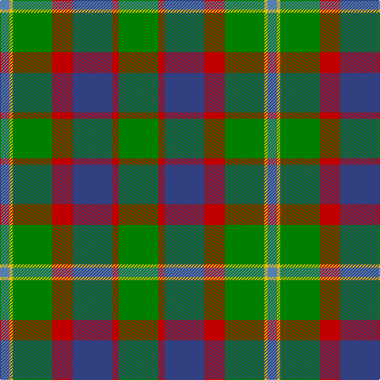

In pattern [BYGRBRG](/patterns/bygrbrg/).

This was sourced from weddslist.  It is a [7 stripes tartan](/stripes/stripes7/).

Original link http://www.weddslist.com/cgi-bin/tartans/pg.pl?source=sts

## Thread count
Ba/12 Y4 G50 R26 B50 R8 G/50

## Palette
Each colour and its ΔE from the base-6 reference it is a variant of.

| Colour | Shade | Base | ΔE (OKLab) |
|---|---|---|---|
| B | <code style="background-color:#304080;">#304080</code> `#304080` | B <code style="background-color:#2C4084;">#2C4084</code> | 0.01 |
| Ba | <code style="background-color:#5480B0;">#5480B0</code> `#5480B0` | B <code style="background-color:#2C4084;">#2C4084</code> | 0.20 |
| G | <code style="background-color:#008000;">#008000</code> `#008000` | G <code style="background-color:#006400;">#006400</code> | 0.09 |
| R | <code style="background-color:#C00000;">#C00000</code> `#C00000` | R <code style="background-color:#C80000;">#C80000</code> | 0.02 |
| Y | <code style="background-color:#F0C000;">#F0C000</code> `#F0C000` | Y <code style="background-color:#E8C000;">#E8C000</code> | 0.01 |

# Sample pattern

## Nearest tartans

The nearest existing variants by ΔTartan distance.

1. [Rotary International](/setts/s7/g30r6b30r16g30y4ba8-b2888c4-ba202060-g006818-rc80000-yd8b000/) — ΔT 0.87
1. [Sinclair](/setts/s7/g20r6g60ga20w4b30r8-b304080-g008000-ga808080-rc00000-we0e0e0/) — ΔT 0.92
1. [Bahamas](/setts/s8/b16y4b44g12r4w20g24b6-b40647c-g004800-rc80000-wc8c8c8-y9c9c00/) — ΔT 0.97
1. [MacConnell](/setts/s10/b44g12b10ba4g44r12g10r8g18w6-b304080-ba5480b0-g008000-rc00000-we0e0e0/) — ΔT 1.04
1. [Bahamas (District)](/setts/s8/b16y4b44g12r4w20g24b6-b40647c-g007c00-rc80000-wc8c8c8-y9c9c00/) — ΔT 1.06
1. [Taylor](/setts/s8/g16k4g26r8g24b44g10y6-b304080-g008000-k000000-rd03030-yf0c000/) — ΔT 1.10
1. [St Andrews Bay](/setts/s7/y60w8y40g40k40ya6k12-g006818-k101010-we0e0e0-ya08858-yad87c00/) — ΔT 1.20
1. [Mayo](/setts/s7/k8g32b22r32g50y4ba6-b304080-ba5480b0-g008000-k000000-rc00000-yf0c000/) — ΔT 1.23
1. [Red Dirt Girl](/setts/s9/g42r4ga36r4ga36r4gb16w12g20-g604000-ga288028-gb003820-ra00000-wfcfcfc/) — ΔT 1.24
1. [Lossiemouth/Hersbruck](/setts/s6/g52b6g24k20ba30w4-b2c2c80-ba780078-g006818-k101010-we0e0e0/) — ΔT 1.24

## Neighbour map

Every grey dot is one of 15726 variants placed by the first two principal components of the ΔTartan feature space (44% of its variance). Red is this tartan; blue dots are its nearest — click one to open its page.

<svg viewBox="0 0 640 380" role="img" style="max-width:100%;height:auto;border:1px solid #e0e0e0;border-radius:4px;display:block" xmlns="http://www.w3.org/2000/svg"><image href="/nn/cloud.v1.png" width="640" height="380"/><a href="/setts/s7/g30r6b30r16g30y4ba8-b2888c4-ba202060-g006818-rc80000-yd8b000/"><circle cx="203.6" cy="223.8" r="4" fill="#3465a4"><title>Rotary International</title></circle></a><a href="/setts/s7/g20r6g60ga20w4b30r8-b304080-g008000-ga808080-rc00000-we0e0e0/"><circle cx="286.2" cy="185.4" r="4" fill="#3465a4"><title>Sinclair</title></circle></a><a href="/setts/s8/b16y4b44g12r4w20g24b6-b40647c-g004800-rc80000-wc8c8c8-y9c9c00/"><circle cx="246.1" cy="192.4" r="4" fill="#3465a4"><title>Bahamas</title></circle></a><a href="/setts/s10/b44g12b10ba4g44r12g10r8g18w6-b304080-ba5480b0-g008000-rc00000-we0e0e0/"><circle cx="243.2" cy="177.1" r="4" fill="#3465a4"><title>MacConnell</title></circle></a><a href="/setts/s8/b16y4b44g12r4w20g24b6-b40647c-g007c00-rc80000-wc8c8c8-y9c9c00/"><circle cx="257.9" cy="197.5" r="4" fill="#3465a4"><title>Bahamas (District)</title></circle></a><a href="/setts/s8/g16k4g26r8g24b44g10y6-b304080-g008000-k000000-rd03030-yf0c000/"><circle cx="263.4" cy="197.0" r="4" fill="#3465a4"><title>Taylor</title></circle></a><a href="/setts/s7/y60w8y40g40k40ya6k12-g006818-k101010-we0e0e0-ya08858-yad87c00/"><circle cx="197.5" cy="197.5" r="4" fill="#3465a4"><title>St Andrews Bay</title></circle></a><a href="/setts/s7/k8g32b22r32g50y4ba6-b304080-ba5480b0-g008000-k000000-rc00000-yf0c000/"><circle cx="220.4" cy="174.1" r="4" fill="#3465a4"><title>Mayo</title></circle></a><a href="/setts/s9/g42r4ga36r4ga36r4gb16w12g20-g604000-ga288028-gb003820-ra00000-wfcfcfc/"><circle cx="197.6" cy="192.0" r="4" fill="#3465a4"><title>Red Dirt Girl</title></circle></a><a href="/setts/s6/g52b6g24k20ba30w4-b2c2c80-ba780078-g006818-k101010-we0e0e0/"><circle cx="273.2" cy="205.0" r="4" fill="#3465a4"><title>Lossiemouth/Hersbruck</title></circle></a><circle cx="240.4" cy="201.8" r="5" fill="#c00000"/></svg>

ID: /setts/s7/g50r8b50r26g50y4ba12-b304080-ba5480b0-g008000-rc00000-yf0c000/
