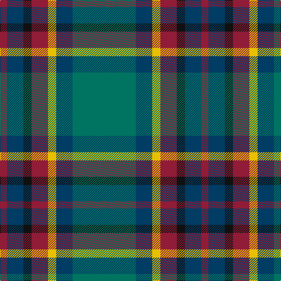

**Bands:** [GBYRKBR](/stripes/gbyrkbr/) · **Stripes:** [G DT LY R K DT R](/stripes/stripes7/) G DT LY R K DT R

This was sourced from tartans-authority.  It is a [7 band tartan](/bands/bands7/).

Original link http://www.tartansauthority.com/tartan-ferret/display/7539/

## Attestations

This cloth appears in 2 source records; the oldest owns this page.

- circa 2002 — Gloucester County Pipe Band (Corp) (tartans-authority, [record](http://www.tartansauthority.com/tartan-ferret/display/7539/))
- undated — Gloucester County Pipe Band (register-of-tartans, [record](https://www.tartanregister.gov.uk/tartanDetails.aspx?ref=5574))

## Register references

External register numbers recorded for this tartan.

- Scottish Register of Tartans: [5574](https://www.tartanregister.gov.uk/tartanDetails.aspx?ref=5574)
- Scottish Tartans Authority (ITI): 7539

## Thread count
DR/12 DB28 K14 DR28 Y14 DB28 G/108

## Palette
Each colour and its ΔE from the base-6 reference it is a variant of.

| Colour | Shade | Base | ΔE (OKLab) |
|---|---|---|---|
| DB | <code style="background-color:#003C64;">#003C64</code> `#003C64` | B <code style="background-color:#2A418A;">#2A418A</code> | 0.08 |
| DR | <code style="background-color:#901C38;">#901C38</code> `#901C38` | R <code style="background-color:#CC0000;">#CC0000</code> | 0.13 |
| G | <code style="background-color:#007460;">#007460</code> `#007460` | G <code style="background-color:#006100;">#006100</code> | 0.11 |
| K | <code style="background-color:#101010;">#101010</code> `#101010` | K <code style="background-color:#000000;">#000000</code> | 0.17 |
| Y | <code style="background-color:#E8C000;">#E8C000</code> `#E8C000` | Y <code style="background-color:#F2BF00;">#F2BF00</code> | 0.02 |

# Sample pattern

## Nearest tartans

The nearest existing variants by ΔTartan distance.

1. [Womens Rural Institute](/setts/s8/dg4g24dp4k6dg4r3dg4dp3~x2/) — ΔT 0.66
1. [Scottish Power (Corporate)](/setts/s8/dg5g32dp5k10dg8r3dg8dp3~x2/) — ΔT 0.73
1. [Graeme Heckenberg Hunting](/setts/s7/db3g13lr1o3lr1db10lo1~x2/) — ΔT 0.89
1. [Sinclair Green (Personal)](/setts/s7/g4r2g30n15w2db15r4~x2/) — ΔT 0.90
1. [Gorman, George (Personal)](/setts/s6/g9g1p2g1db4r1~x12/) — ΔT 0.91
1. [Donegal](/setts/s10/y3g17db3g3db3dr5db18r2db8r2~x2/) — ΔT 0.95
1. [Stewart of Appin Hunting Clan Tartan Tartan Number: 430. Earliest known date: 1930-50 There is extensive correspondence about the use of the terms 'ancient' and 'hunting' in relation to this sett in the Stewart files at the Scottish Tartan Society. The use of brown makes this sett proportionately similar to the count recorded by James Scarlett as early nineteenth century. He says that the brown was probably black originally. (No. 417, The Highland Textile, 1990) See products available Copyright © Blair Urquhart, Comrie, 2015](/setts/s10/g11r4g4r7g41dy11t4db41r4db8/) — ΔT 0.95
1. [Ednie (Personal)](/setts/s7/b11k4g4m1g4k1r1~x4/) — ΔT 0.97
1. [Stewart of Appin, Ancient hunting](/setts/s10/g11r4g4r7g41o11t4db41r4db8/) — ΔT 1.02
1. [Heckenberg Htg (Personal)](/setts/s7/db3g13t1r3t1db10ly1~x2/) — ΔT 1.02

## Neighbour map

Every grey dot is one of 14313 variants placed by the first two principal components of the ΔTartan feature space (44% of its variance). Red is this tartan; blue dots are its nearest — click one to open its page.

<svg viewBox="0 0 640 380" role="img" style="max-width:100%;height:auto;border:1px solid #e0e0e0;border-radius:4px;display:block" xmlns="http://www.w3.org/2000/svg"><image href="/nn/cloud.v1.png" width="640" height="380"/><a href="/setts/s8/dg4g24dp4k6dg4r3dg4dp3~x2/"><circle cx="234.6" cy="195.2" r="4" fill="#3465a4"><title>Womens Rural Institute</title></circle></a><a href="/setts/s8/dg5g32dp5k10dg8r3dg8dp3~x2/"><circle cx="243.4" cy="196.9" r="4" fill="#3465a4"><title>Scottish Power (Corporate)</title></circle></a><a href="/setts/s7/db3g13lr1o3lr1db10lo1~x2/"><circle cx="261.8" cy="190.8" r="4" fill="#3465a4"><title>Graeme Heckenberg Hunting</title></circle></a><a href="/setts/s7/g4r2g30n15w2db15r4~x2/"><circle cx="255.1" cy="182.9" r="4" fill="#3465a4"><title>Sinclair Green (Personal)</title></circle></a><a href="/setts/s6/g9g1p2g1db4r1~x12/"><circle cx="247.1" cy="202.8" r="4" fill="#3465a4"><title>Gorman, George (Personal)</title></circle></a><a href="/setts/s10/y3g17db3g3db3dr5db18r2db8r2~x2/"><circle cx="259.1" cy="190.8" r="4" fill="#3465a4"><title>Donegal</title></circle></a><a href="/setts/s10/g11r4g4r7g41dy11t4db41r4db8/"><circle cx="238.6" cy="178.3" r="4" fill="#3465a4"><title>Stewart of Appin Hunting Clan Tartan Tartan Number: 430. Earliest known date: 1930-50 There is extensive correspondence about the use of the terms 'ancient' and 'hunting' in relation to this sett in the Stewart files at the Scottish Tartan Society. The use of brown makes this sett proportionately similar to the count recorded by James Scarlett as early nineteenth century. He says that the brown was probably black originally. (No. 417, The Highland Textile, 1990) See products available Copyright © Blair Urquhart, Comrie, 2015</title></circle></a><a href="/setts/s7/b11k4g4m1g4k1r1~x4/"><circle cx="213.0" cy="194.5" r="4" fill="#3465a4"><title>Ednie (Personal)</title></circle></a><a href="/setts/s10/g11r4g4r7g41o11t4db41r4db8/"><circle cx="235.9" cy="176.5" r="4" fill="#3465a4"><title>Stewart of Appin, Ancient hunting</title></circle></a><a href="/setts/s7/db3g13t1r3t1db10ly1~x2/"><circle cx="236.5" cy="178.7" r="4" fill="#3465a4"><title>Heckenberg Htg (Personal)</title></circle></a><circle cx="240.0" cy="201.0" r="5" fill="#c00000"/></svg>

ID: /setts/s7/g54dt14ly7r14k7dt14r6~x2/
