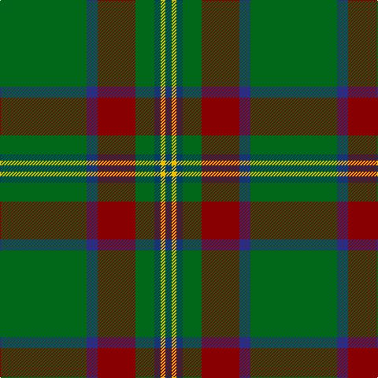

In pattern [BYBGRBG](/stripes/bybgrbg/).

This was sourced from register-of-tartans.  It is a [7 stripe tartan](/stripes/stripes7/).

Original link https://www.tartanregister.gov.uk/tartanDetails.aspx?ref=804

## Attestations

This cloth appears in 2 source records; the oldest owns this page.

- 01/01/1988 — Crieff & Strathearn #1 (register-of-tartans, [record](https://www.tartanregister.gov.uk/tartanDetails.aspx?ref=804))
- circa 1988 — Crieff & Strathearn #1 (District) (tartans-authority, [record](http://www.tartansauthority.com/tartan-ferret/display/664/))

## Register references

External register numbers recorded for this tartan.

- Scottish Register of Tartans: [804](https://www.tartanregister.gov.uk/tartanDetails.aspx?ref=804)
- Scottish Tartans Authority (ITI): 664
- Scottish Tartans World Register: 664

## Thread count
G/110 DBa14 DR48 G24 DB8 Y6 DB/8

## Palette
Each colour and its ΔE from the base-6 reference it is a variant of.

| Colour | Shade | Base | ΔE (OKLab) |
|---|---|---|---|
| DB | <code style="background-color:#003C64;">#003C64</code> `#003C64` | B <code style="background-color:#2A418A;">#2A418A</code> | 0.08 |
| DBa | <code style="background-color:#2C2C80;">#2C2C80</code> `#2C2C80` | B <code style="background-color:#2A418A;">#2A418A</code> | 0.06 |
| DR | <code style="background-color:#880000;">#880000</code> `#880000` | R <code style="background-color:#CC0000;">#CC0000</code> | 0.15 |
| G | <code style="background-color:#006818;">#006818</code> `#006818` | G <code style="background-color:#006100;">#006100</code> | 0.02 |
| Y | <code style="background-color:#E8C000;">#E8C000</code> `#E8C000` | Y <code style="background-color:#F2BF00;">#F2BF00</code> | 0.02 |

# Sample pattern

## Nearest tartans

The nearest existing variants by ΔTartan distance.

1. [Shiach (Personal)](/setts/s8/g45k4r2g4r2k4n21r5~x2/) — ΔT 0.98
1. [Crieff and Strathearn District Tartan Tartan Number: 664. Earliest known date: 1988 A branch of the Stewart clan from Galloway and the South West of Scotland. See products available Copyright © Blair Urquhart, Comrie, 2015](/setts/s7/g55dp7r24g12db4ly3db4~x2/) — ΔT 1.00
1. [Shaw of Tordarroch Green (Htg) (Clan](/setts/s8/t5k1g30db15r8g30r8db2~x2/) — ΔT 1.21
1. [Crieff, and Strathearn](/setts/s7/g55p7r24g12db4ly3db4~x2/) — ΔT 1.24
1. [Smoke Showing (UFES)](/setts/s9/g3n5k4n33g12k4w2n18ly3~x2/) — ΔT 1.29
1. [Hynde (Sir John)](/setts/s11/g28r2g28r7lb2r7lb2r7k5dp4lb2~x2/) — ΔT 1.30
1. [Selvon-Bruce (Personal)](/setts/s7/k3g2k3g18r2db2lo1~x4/) — ΔT 1.33
1. [Green Rover (Personal)](/setts/s7/lo10k2g5k2dg46lo2k2~x2/) — ΔT 1.33
1. [U.S. Army (Military)](/setts/s6/db6k17y4g51ly3g4~x2/) — ΔT 1.34
1. [St Andrews Links](/setts/s7/dt16g4dt3g3lo2g24r2~x2/) — ΔT 1.37

## Neighbour map

Every grey dot is one of 14299 variants placed by the first two principal components of the ΔTartan feature space (44% of its variance). Red is this tartan; blue dots are its nearest — click one to open its page.

<svg viewBox="0 0 640 380" role="img" style="max-width:100%;height:auto;border:1px solid #e0e0e0;border-radius:4px;display:block" xmlns="http://www.w3.org/2000/svg"><image href="/nn/cloud.v1.png" width="640" height="380"/><a href="/setts/s8/g45k4r2g4r2k4n21r5~x2/"><circle cx="369.3" cy="154.6" r="4" fill="#3465a4"><title>Shiach (Personal)</title></circle></a><a href="/setts/s7/g55dp7r24g12db4ly3db4~x2/"><circle cx="365.9" cy="158.0" r="4" fill="#3465a4"><title>Crieff and Strathearn District Tartan Tartan Number: 664. Earliest known date: 1988 A branch of the Stewart clan from Galloway and the South West of Scotland. See products available Copyright © Blair Urquhart, Comrie, 2015</title></circle></a><a href="/setts/s8/t5k1g30db15r8g30r8db2~x2/"><circle cx="365.4" cy="161.3" r="4" fill="#3465a4"><title>Shaw of Tordarroch Green (Htg) (Clan</title></circle></a><a href="/setts/s7/g55p7r24g12db4ly3db4~x2/"><circle cx="358.7" cy="154.8" r="4" fill="#3465a4"><title>Crieff, and Strathearn</title></circle></a><a href="/setts/s9/g3n5k4n33g12k4w2n18ly3~x2/"><circle cx="401.0" cy="168.6" r="4" fill="#3465a4"><title>Smoke Showing (UFES)</title></circle></a><a href="/setts/s11/g28r2g28r7lb2r7lb2r7k5dp4lb2~x2/"><circle cx="336.1" cy="153.6" r="4" fill="#3465a4"><title>Hynde (Sir John)</title></circle></a><a href="/setts/s7/k3g2k3g18r2db2lo1~x4/"><circle cx="379.4" cy="154.9" r="4" fill="#3465a4"><title>Selvon-Bruce (Personal)</title></circle></a><a href="/setts/s7/lo10k2g5k2dg46lo2k2~x2/"><circle cx="453.3" cy="153.7" r="4" fill="#3465a4"><title>Green Rover (Personal)</title></circle></a><a href="/setts/s6/db6k17y4g51ly3g4~x2/"><circle cx="339.8" cy="159.4" r="4" fill="#3465a4"><title>U.S. Army (Military)</title></circle></a><a href="/setts/s7/dt16g4dt3g3lo2g24r2~x2/"><circle cx="383.9" cy="221.1" r="4" fill="#3465a4"><title>St Andrews Links</title></circle></a><circle cx="386.8" cy="175.4" r="5" fill="#c00000"/></svg>

ID: /setts/s7/g55db7r24g12dt4ly3dt4~x2/
