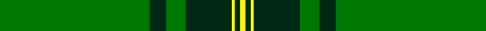

In pattern [GGGGYGY](/stripes/ggggygy/).

This was sourced from register-of-tartans.  It is a [7 stripe tartan](/stripes/stripes7/).

Original link https://www.tartanregister.gov.uk/tartanDetails.aspx?ref=11524

## Register references

External register numbers recorded for this tartan.

- Scottish Register of Tartans: [11524](https://www.tartanregister.gov.uk/tartanDetails.aspx?ref=11524)

## Thread count
G/110 DG12 G14 DG34 Y2 DG4 Y/4

## Palette
Each colour and the base-6 reference it is a variant of.

| Colour | Shade | Base |
|---|---|---|
| DG | <code style="background-color:#002814;">#002814</code> `oklch(24.4% 0.059 156.5)` <small>#002814</small> | G <code style="background-color:#006100;">#006100</code> |
| G | <code style="background-color:#007800;">#007800</code> `oklch(49.6% 0.169 142.5)` <small>#007800</small> | G <code style="background-color:#006100;">#006100</code> |
| Y | <code style="background-color:#FFFF00;">#FFFF00</code> `oklch(96.8% 0.211 109.8)` <small>#FFFF00</small> | Y <code style="background-color:#F2BF00;">#F2BF00</code> |

# Sample pattern

## Nearest tartans

The nearest existing variants by ΔTartan distance.

1. [Marshall University](/setts/s8/g25w1dg2w1g6k2w2dg3~x2/) — ΔT 1.71
1. [Crane of Cluny (Personal)](/setts/s8/g82k6g3k9r2k5g2ly2~x2/) — ΔT 1.88
1. [Semper](/setts/s8/g16dg1lg4dg41lg1dg6g2dg2~x2/) — ΔT 1.89
1. [Delta Lambda Phi (Corporate)](/setts/s12/lo5k1lo6g20w1g3w1g3w1g30k1lo2~x2/) — ΔT 1.90
1. [Kinfauns Castle (Corporate)](/setts/s6/r4dp12g2dp2g46w1~x2/) — ΔT 1.98
1. [Walterstrm (2014))](/setts/s8/g78db13ly6r3ly5g6db9ly6~x2/) — ΔT 1.99
1. [Royal and Ancient, The](/setts/s6/g49db16o3db2o2db6~x2/) — ΔT 2.02
1. [Fife, Duke Of](/setts/s6/dg32k6dg4k8r1k2~x4/) — ΔT 2.05
1. [St. Christopher (Corporate)](/setts/s8/dg5r3dg3lo2dg1ly8dg24lo2~x2/) — ΔT 2.06
1. [St Andrews Hotel, Golf Resort, and SPA](/setts/s6/g50db20k3db2o2db5~x2/) — ΔT 2.08

## Neighbour map

Every grey dot is one of 14299 variants placed by the first two principal components of the ΔTartan feature space (44% of its variance). Red is this tartan; blue dots are its nearest — click one to open its page.

<svg viewBox="0 0 640 380" role="img" style="max-width:100%;height:auto;border:1px solid #e0e0e0;border-radius:4px;display:block" xmlns="http://www.w3.org/2000/svg"><image href="/nn/cloud.v1.png" width="640" height="380"/><a href="/setts/s8/g25w1dg2w1g6k2w2dg3~x2/"><circle cx="472.2" cy="144.1" r="4" fill="#3465a4"><title>Marshall University</title></circle></a><a href="/setts/s8/g82k6g3k9r2k5g2ly2~x2/"><circle cx="589.7" cy="132.9" r="4" fill="#3465a4"><title>Crane of Cluny (Personal)</title></circle></a><a href="/setts/s8/g16dg1lg4dg41lg1dg6g2dg2~x2/"><circle cx="503.7" cy="153.1" r="4" fill="#3465a4"><title>Semper</title></circle></a><a href="/setts/s12/lo5k1lo6g20w1g3w1g3w1g30k1lo2~x2/"><circle cx="514.6" cy="131.6" r="4" fill="#3465a4"><title>Delta Lambda Phi (Corporate)</title></circle></a><a href="/setts/s6/r4dp12g2dp2g46w1~x2/"><circle cx="518.5" cy="140.9" r="4" fill="#3465a4"><title>Kinfauns Castle (Corporate)</title></circle></a><a href="/setts/s8/g78db13ly6r3ly5g6db9ly6~x2/"><circle cx="424.7" cy="132.9" r="4" fill="#3465a4"><title>Walterstrm (2014))</title></circle></a><a href="/setts/s6/g49db16o3db2o2db6~x2/"><circle cx="470.7" cy="201.6" r="4" fill="#3465a4"><title>Royal and Ancient, The</title></circle></a><a href="/setts/s6/dg32k6dg4k8r1k2~x4/"><circle cx="530.4" cy="208.9" r="4" fill="#3465a4"><title>Fife, Duke Of</title></circle></a><a href="/setts/s8/dg5r3dg3lo2dg1ly8dg24lo2~x2/"><circle cx="442.4" cy="158.4" r="4" fill="#3465a4"><title>St. Christopher (Corporate)</title></circle></a><a href="/setts/s6/g50db20k3db2o2db5~x2/"><circle cx="416.7" cy="173.4" r="4" fill="#3465a4"><title>St Andrews Hotel, Golf Resort, and SPA</title></circle></a><circle cx="514.1" cy="156.9" r="5" fill="#c00000"/></svg>

ID: /setts/s7/g55dg6g7dg17ly1dg2ly2~x2/
