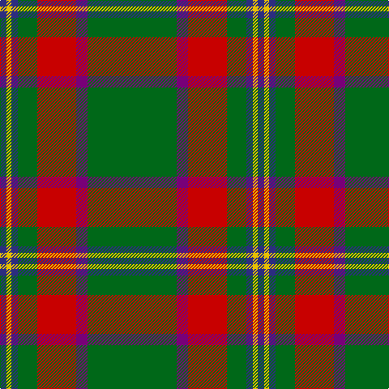

**Bands:** [BYBGRBG](/stripes/bybgrbg/) · **Stripes:** [DB LY DB G R DP G](/stripes/stripes7/) DB LY DB G R DP G

This was sourced from house-of-tartan.  It is a [7 band tartan](/bands/bands7/).

Original link http://www.house-of-tartan.scotland.net/house/TartanViewjs.asp?colr=Def&tnam=664

## Thread count
DB/8 Y6 DB8 G24 R48 P14 G/110

## Palette
Each colour and its ΔE from the base-6 reference it is a variant of.

| Colour | Shade | Base | ΔE (OKLab) |
|---|---|---|---|
| DB | <code style="background-color:#2C2C80;">#2C2C80</code> `#2C2C80` | B <code style="background-color:#2A418A;">#2A418A</code> | 0.06 |
| G | <code style="background-color:#006818;">#006818</code> `#006818` | G <code style="background-color:#006100;">#006100</code> | 0.02 |
| P | <code style="background-color:#780078;">#780078</code> `#780078` | B <code style="background-color:#2A418A;">#2A418A</code> | 0.17 |
| R | <code style="background-color:#C80000;">#C80000</code> `#C80000` | R <code style="background-color:#CC0000;">#CC0000</code> | 0.01 |
| Y | <code style="background-color:#E8C000;">#E8C000</code> `#E8C000` | Y <code style="background-color:#F2BF00;">#F2BF00</code> | 0.02 |

# Sample pattern

## Nearest tartans

The nearest existing variants by ΔTartan distance.

1. [Crieff, and Strathearn](/setts/s7/g55p7r24g12db4ly3db4~x2/) — ΔT 0.64
1. [Hall (P.I.E.) (Personal)](/setts/s8/ly5g3ly3g53r7db5r13w4~x2/) — ΔT 0.99
1. [Crieff & Strathearn #1](/setts/s7/g55db7r24g12dt4ly3dt4~x2/) — ΔT 1.00
1. [Hynde (Sir John)](/setts/s11/g28r2g28r7lb2r7lb2r7k5dp4lb2~x2/) — ΔT 1.07
1. [Canadian Caledonian](/setts/s10/db3g16ly1r1w1r6g3r1g3w1~x4/) — ΔT 1.12
1. [Selvon-Bruce (Personal)](/setts/s7/k3g2k3g18r2db2lo1~x4/) — ΔT 1.20
1. [Cavalier, Green](/setts/s11/y40dt10o2dt2w2dt3r8y6dt2y4w2~x2/) — ΔT 1.26
1. [Shaw of Tordarroch Green (Htg) (Clan](/setts/s8/t5k1g30db15r8g30r8db2~x2/) — ΔT 1.28
1. [Shannon (?)](/setts/s7/dy48dp11g16ly16dy11r3dy11~x2/) — ΔT 1.28
1. [St Johns County Sheriff Office (Cor)](/setts/s5/r17db7lo8g58k6~x2/) — ΔT 1.29

## Neighbour map

Every grey dot is one of 14313 variants placed by the first two principal components of the ΔTartan feature space (44% of its variance). Red is this tartan; blue dots are its nearest — click one to open its page.

<svg viewBox="0 0 640 380" role="img" style="max-width:100%;height:auto;border:1px solid #e0e0e0;border-radius:4px;display:block" xmlns="http://www.w3.org/2000/svg"><image href="/nn/cloud.v1.png" width="640" height="380"/><a href="/setts/s7/g55p7r24g12db4ly3db4~x2/"><circle cx="359.0" cy="154.9" r="4" fill="#3465a4"><title>Crieff, and Strathearn</title></circle></a><a href="/setts/s8/ly5g3ly3g53r7db5r13w4~x2/"><circle cx="345.6" cy="131.7" r="4" fill="#3465a4"><title>Hall (P.I.E.) (Personal)</title></circle></a><a href="/setts/s7/g55db7r24g12dt4ly3dt4~x2/"><circle cx="387.0" cy="175.4" r="4" fill="#3465a4"><title>Crieff &amp; Strathearn #1</title></circle></a><a href="/setts/s11/g28r2g28r7lb2r7lb2r7k5dp4lb2~x2/"><circle cx="336.3" cy="153.7" r="4" fill="#3465a4"><title>Hynde (Sir John)</title></circle></a><a href="/setts/s10/db3g16ly1r1w1r6g3r1g3w1~x4/"><circle cx="334.7" cy="130.4" r="4" fill="#3465a4"><title>Canadian Caledonian</title></circle></a><a href="/setts/s7/k3g2k3g18r2db2lo1~x4/"><circle cx="379.6" cy="155.0" r="4" fill="#3465a4"><title>Selvon-Bruce (Personal)</title></circle></a><a href="/setts/s11/y40dt10o2dt2w2dt3r8y6dt2y4w2~x2/"><circle cx="388.2" cy="122.7" r="4" fill="#3465a4"><title>Cavalier, Green</title></circle></a><a href="/setts/s8/t5k1g30db15r8g30r8db2~x2/"><circle cx="365.6" cy="161.4" r="4" fill="#3465a4"><title>Shaw of Tordarroch Green (Htg) (Clan</title></circle></a><a href="/setts/s7/dy48dp11g16ly16dy11r3dy11~x2/"><circle cx="331.4" cy="181.4" r="4" fill="#3465a4"><title>Shannon (?)</title></circle></a><a href="/setts/s5/r17db7lo8g58k6~x2/"><circle cx="325.8" cy="200.3" r="4" fill="#3465a4"><title>St Johns County Sheriff Office (Cor)</title></circle></a><circle cx="366.2" cy="158.2" r="5" fill="#c00000"/></svg>

ID: /setts/s7/g55dp7r24g12db4ly3db4~x2/
