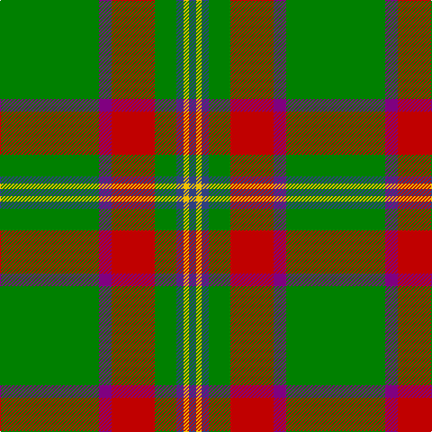

In pattern [BYBGRBG](/stripes/bybgrbg/).

This was sourced from weddslist.  It is a [7 stripe tartan](/stripes/stripes7/).

Original link http://www.weddslist.com/cgi-bin/tartans/pg.pl?source=sts

## Thread count
G/110 P14 R48 G24 B8 Y6 B/8

## Palette
Each colour and the base-6 reference it is a variant of.

| Colour | Shade | Base |
|---|---|---|
| B | <code style="background-color:#304080;">#304080</code> `oklch(39.4% 0.109 270.2)` <small>#304080</small> | B <code style="background-color:#2A418A;">#2A418A</code> |
| G | <code style="background-color:#008000;">#008000</code> `oklch(52.0% 0.177 142.5)` <small>#008000</small> | G <code style="background-color:#006100;">#006100</code> |
| P | <code style="background-color:#800080;">#800080</code> `oklch(42.1% 0.193 328.4)` <small>#800080</small> | B <code style="background-color:#2A418A;">#2A418A</code> |
| R | <code style="background-color:#C00000;">#C00000</code> `oklch(50.7% 0.208 29.2)` <small>#C00000</small> | R <code style="background-color:#CC0000;">#CC0000</code> |
| Y | <code style="background-color:#F0C000;">#F0C000</code> `oklch(82.7% 0.169 90.5)` <small>#F0C000</small> | Y <code style="background-color:#F2BF00;">#F2BF00</code> |

# Sample pattern

## Nearest tartans

The nearest existing variants by ΔTartan distance, with this tartan at the top so the swatches line up against it.

ΔTartan

Tartan

Sett

—

<a href="/ttd/edit/#slug=g55p7r24g12db4ly3db4~x2">Crieff, and Strathearn</a> <a class="nn-out" href="/setts/s7/g55p7r24g12db4ly3db4~x2/" title="open its dictionary page">↗</a>

0.64

<a href="/ttd/edit/#slug=g55dp7r24g12db4ly3db4~x2">Crieff and Strathearn District Tartan Tartan Number: 664. Earliest known date: 1988 A branch of the Stewart clan from Galloway and the South West of Scotland. See products available Copyright © Blair Urquhart, Comrie, 2015</a> <a class="nn-out" href="/setts/s7/g55dp7r24g12db4ly3db4~x2/" title="open its dictionary page">↗</a>

0.86

<a href="/ttd/edit/#slug=ly5g3ly3g53r7db5r13w4~x2">Hall (P.I.E.) (Personal)</a> <a class="nn-out" href="/setts/s8/ly5g3ly3g53r7db5r13w4~x2/" title="open its dictionary page">↗</a>

0.90

<a href="/ttd/edit/#slug=db3g16ly1r1w1r6g3r1g3w1~x2">Canadian Caledonian</a> <a class="nn-out" href="/setts/s10/db3g16ly1r1w1r6g3r1g3w1~x2/" title="open its dictionary page">↗</a>

1.04

<a href="/ttd/edit/#slug=db3g16ly1r1w1r6g3r1g3w1~x4">Canadian Caledonian</a> <a class="nn-out" href="/setts/s10/db3g16ly1r1w1r6g3r1g3w1~x4/" title="open its dictionary page">↗</a>

1.09

<a href="/ttd/edit/#slug=k3g2k3g18r2db2lo1~x4">Selvon-Bruce (Personal)</a> <a class="nn-out" href="/setts/s7/k3g2k3g18r2db2lo1~x4/" title="open its dictionary page">↗</a>

1.13

<a href="/ttd/edit/#slug=w6g5r5g45k4lo24k4g5~x2">O'Neill (Name)</a> <a class="nn-out" href="/setts/s8/w6g5r5g45k4lo24k4g5~x2/" title="open its dictionary page">↗</a>

1.15

<a href="/ttd/edit/#slug=lo4r4k2r10g30lo2g3r2~x2">Beard</a> <a class="nn-out" href="/setts/s8/lo4r4k2r10g30lo2g3r2~x2/" title="open its dictionary page">↗</a>

1.24

<a href="/ttd/edit/#slug=g55db7r24g12dt4ly3dt4~x2">Crieff &amp; Strathearn #1</a> <a class="nn-out" href="/setts/s7/g55db7r24g12dt4ly3dt4~x2/" title="open its dictionary page">↗</a>

1.24

<a href="/ttd/edit/#slug=dp5lo5dy13g41r3~x2">Clare (Prince George) (Personal)</a> <a class="nn-out" href="/setts/s5/dp5lo5dy13g41r3~x2/" title="open its dictionary page">↗</a>

1.25

<a href="/ttd/edit/#slug=g28r2g28r7lb2r7lb2r7k5dp4lb2~x2">Hynde (Sir John)</a> <a class="nn-out" href="/setts/s11/g28r2g28r7lb2r7lb2r7k5dp4lb2~x2/" title="open its dictionary page">↗</a>

## Neighbour map

Every grey dot is one of 14299 variants placed by the first two principal components of the ΔTartan feature space (44% of its variance). Red is this tartan; blue dots are its nearest — click one to open its page.

<svg viewBox="0 0 640 380" role="img" style="max-width:100%;height:auto;border:1px solid #e0e0e0;border-radius:4px;display:block" xmlns="http://www.w3.org/2000/svg"><image href="/nn/cloud.v1.png" width="640" height="380"/><a href="/setts/s7/g55dp7r24g12db4ly3db4~x2/"><circle cx="365.9" cy="158.0" r="4" fill="#3465a4"><title>Crieff and Strathearn District Tartan Tartan Number: 664. Earliest known date: 1988 A branch of the Stewart clan from Galloway and the South West of Scotland. See products available Copyright © Blair Urquhart, Comrie, 2015</title></circle></a><a href="/setts/s8/ly5g3ly3g53r7db5r13w4~x2/"><circle cx="345.3" cy="131.6" r="4" fill="#3465a4"><title>Hall (P.I.E.) (Personal)</title></circle></a><a href="/setts/s10/db3g16ly1r1w1r6g3r1g3w1~x2/"><circle cx="340.2" cy="133.8" r="4" fill="#3465a4"><title>Canadian Caledonian</title></circle></a><a href="/setts/s10/db3g16ly1r1w1r6g3r1g3w1~x4/"><circle cx="334.4" cy="130.3" r="4" fill="#3465a4"><title>Canadian Caledonian</title></circle></a><a href="/setts/s7/k3g2k3g18r2db2lo1~x4/"><circle cx="379.4" cy="154.9" r="4" fill="#3465a4"><title>Selvon-Bruce (Personal)</title></circle></a><a href="/setts/s8/w6g5r5g45k4lo24k4g5~x2/"><circle cx="299.6" cy="167.3" r="4" fill="#3465a4"><title>O'Neill (Name)</title></circle></a><a href="/setts/s8/lo4r4k2r10g30lo2g3r2~x2/"><circle cx="361.3" cy="165.1" r="4" fill="#3465a4"><title>Beard</title></circle></a><a href="/setts/s7/g55db7r24g12dt4ly3dt4~x2/"><circle cx="386.8" cy="175.4" r="4" fill="#3465a4"><title>Crieff &amp; Strathearn #1</title></circle></a><a href="/setts/s5/dp5lo5dy13g41r3~x2/"><circle cx="365.4" cy="190.7" r="4" fill="#3465a4"><title>Clare (Prince George) (Personal)</title></circle></a><a href="/setts/s11/g28r2g28r7lb2r7lb2r7k5dp4lb2~x2/"><circle cx="336.1" cy="153.6" r="4" fill="#3465a4"><title>Hynde (Sir John)</title></circle></a><circle cx="358.7" cy="154.8" r="5" fill="#c00000"/></svg>

ID: /setts/s7/g55p7r24g12db4ly3db4~x2/
