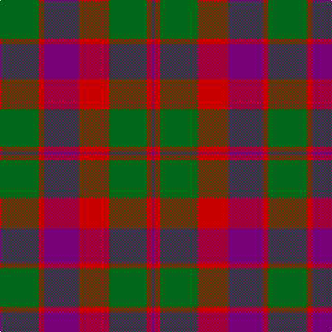

In pattern [BRGRBRG](/patterns/brgrbrg/).

This was sourced from register-of-tartans.  It is a [7 stripes tartan](/stripes/stripes7/).

Original link https://www.tartanregister.gov.uk/tartanDetails.aspx?ref=1358

## Thread count
G/56 R8 P50 R44 G54 R8 P/4

## Palette
Each colour and its ΔE from the base-6 reference it is a variant of.

| Colour | Shade | Base | ΔE (OKLab) |
|---|---|---|---|
| G | <code style="background-color:#006818;">#006818</code> `#006818` | G <code style="background-color:#006400;">#006400</code> | 0.02 |
| P | <code style="background-color:#780078;">#780078</code> `#780078` | B <code style="background-color:#2C4084;">#2C4084</code> | 0.16 |
| R | <code style="background-color:#C80000;">#C80000</code> `#C80000` | R <code style="background-color:#C80000;">#C80000</code> | 0.00 |

# Sample pattern

## Nearest tartans

The nearest existing variants by ΔTartan distance.

1. [Glasgow, Ciity of (District)](/setts/s7/g56r8b50r44g54r8b4-b440044-g285800-rc80000/) — ΔT 0.50
1. [Skene - 1831 (Clan)](/setts/s7/b24r12g4r12g48r12g4-b202060-g006818-rc80000/) — ΔT 0.88
1. [MacFadyen, MacBean (Old)](/setts/s7/b6r50b34r10g44r18b6-b304080-g008000-rc00000/) — ΔT 0.91
1. [MacQuarrie 2](/setts/s7/r12g32r8b24r32ba2r4-b304080-ba5480b0-g008000-rc00000/) — ΔT 1.02
1. [Glasgow (Error)](/setts/s11/b4r8g48r40b48r8g48r40g48r8b4-b2c2c80-g006818-rc80000/) — ΔT 1.05
1. [Edinchat](/setts/s6/b8r112g52r8b52r8-b2c2c80-g006818-rc04c08/) — ΔT 1.06
1. [MacFadyan (MacGregor Hastie)](/setts/s7/b6r50b34r10g44r18b6-b2c2c80-g006818-rc80000/) — ΔT 1.09
1. [Skene D](/setts/s7/b9r6g2r6g18r6g2-b00004c-g004c00-rc80000/) — ΔT 1.13
1. [Skene D](/setts/s7/b18r12g4r12g36r12g4-b000052-g11450d-raa0000/) — ΔT 1.14
1. [Skene D](/setts/s7/b9r6g2r6g18r6g2-b000052-g11450d-raa0000/) — ΔT 1.14

## Neighbour map

Every grey dot is one of 15726 variants placed by the first two principal components of the ΔTartan feature space (44% of its variance). Red is this tartan; blue dots are its nearest — click one to open its page.

<svg viewBox="0 0 640 380" role="img" style="max-width:100%;height:auto;border:1px solid #e0e0e0;border-radius:4px;display:block" xmlns="http://www.w3.org/2000/svg"><image href="/nn/cloud.v1.png" width="640" height="380"/><a href="/setts/s7/g56r8b50r44g54r8b4-b440044-g285800-rc80000/"><circle cx="305.6" cy="226.9" r="4" fill="#3465a4"><title>Glasgow, Ciity of (District)</title></circle></a><a href="/setts/s7/b24r12g4r12g48r12g4-b202060-g006818-rc80000/"><circle cx="297.5" cy="214.9" r="4" fill="#3465a4"><title>Skene - 1831 (Clan)</title></circle></a><a href="/setts/s7/b6r50b34r10g44r18b6-b304080-g008000-rc00000/"><circle cx="268.3" cy="234.6" r="4" fill="#3465a4"><title>MacFadyen, MacBean (Old)</title></circle></a><a href="/setts/s7/r12g32r8b24r32ba2r4-b304080-ba5480b0-g008000-rc00000/"><circle cx="288.0" cy="194.1" r="4" fill="#3465a4"><title>MacQuarrie 2</title></circle></a><a href="/setts/s11/b4r8g48r40b48r8g48r40g48r8b4-b2c2c80-g006818-rc80000/"><circle cx="276.6" cy="208.7" r="4" fill="#3465a4"><title>Glasgow (Error)</title></circle></a><a href="/setts/s6/b8r112g52r8b52r8-b2c2c80-g006818-rc04c08/"><circle cx="347.9" cy="206.9" r="4" fill="#3465a4"><title>Edinchat</title></circle></a><a href="/setts/s7/b6r50b34r10g44r18b6-b2c2c80-g006818-rc80000/"><circle cx="266.0" cy="232.8" r="4" fill="#3465a4"><title>MacFadyan (MacGregor Hastie)</title></circle></a><a href="/setts/s7/b9r6g2r6g18r6g2-b00004c-g004c00-rc80000/"><circle cx="255.3" cy="232.7" r="4" fill="#3465a4"><title>Skene D</title></circle></a><a href="/setts/s7/b18r12g4r12g36r12g4-b000052-g11450d-raa0000/"><circle cx="276.1" cy="243.6" r="4" fill="#3465a4"><title>Skene D</title></circle></a><a href="/setts/s7/b9r6g2r6g18r6g2-b000052-g11450d-raa0000/"><circle cx="276.1" cy="243.6" r="4" fill="#3465a4"><title>Skene D</title></circle></a><circle cx="298.3" cy="222.3" r="5" fill="#c00000"/></svg>

ID: /setts/s7/g56r8b50r44g54r8b4-b780078-g006818-rc80000/
