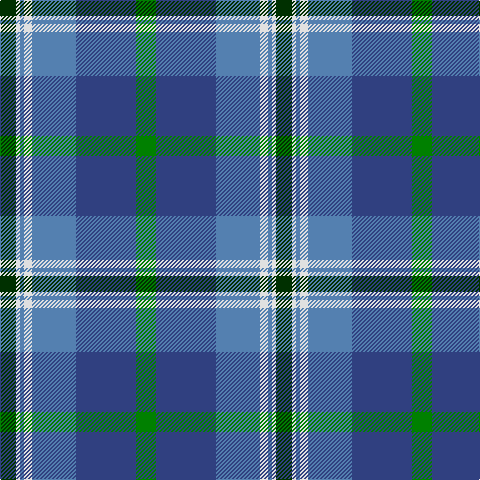

In pattern [GBBWBWG](/patterns/gbbwbwg/).

This was sourced from weddslist.  It is a [7 stripes tartan](/stripes/stripes7/).

Original link http://www.weddslist.com/cgi-bin/tartans/pg.pl?source=sts

## Thread count
DG/16 LN4 Ba4 LN8 Ba44 B60 G/20

## Palette
Each colour and its ΔE from the base-6 reference it is a variant of.

| Colour | Shade | Base | ΔE (OKLab) |
|---|---|---|---|
| B | <code style="background-color:#304080;">#304080</code> `#304080` | B <code style="background-color:#2A418A;">#2A418A</code> | 0.02 |
| Ba | <code style="background-color:#5480B0;">#5480B0</code> `#5480B0` | B <code style="background-color:#2A418A;">#2A418A</code> | 0.19 |
| DG | <code style="background-color:#003000;">#003000</code> `#003000` | G <code style="background-color:#006100;">#006100</code> | 0.17 |
| G | <code style="background-color:#008000;">#008000</code> `#008000` | G <code style="background-color:#006100;">#006100</code> | 0.10 |
| LN | <code style="background-color:#E0E0E0;">#E0E0E0</code> `#E0E0E0` | W <code style="background-color:#F7F7F7;">#F7F7F7</code> | 0.07 |

# Sample pattern

## Nearest tartans

The nearest existing variants by ΔTartan distance.

1. [Highlands Country Club Corporate Tartan Tartan Number: 687. Earliest known date: 1984 Weft uses a dark green. See products available Copyright © Blair Urquhart, Comrie, 2015](/setts/s7/g5b15ba11w2ba1w1ga4x4~b2c2c80-ba5c8ca8-g006818-ga003820-we0e0e0/) — ΔT 0.40
1. [Rhode Island, State of](/setts/s7/b4ba28b11w2b2g14y2x2~b14283c-ba1474b4-g408060-we0e0e0-ye8c000/) — ΔT 0.81
1. [MacThomas](/setts/s7/b5r3b32k16g32ra3g5x2~b1474b4-g1b835d-k101010-rcb15ab-rabb62ce/) — ΔT 0.85
1. [Afternoon Tea / Earl Grey](/setts/s6/r15b98ba72y25ba8w15~b3682af-ba003c64-re87878-wf0e0c8-yc4bc68/) — ΔT 0.87
1. [MacCord / McCord (Personal)](/setts/s7/g6r2b1r3b16ga20w2x2~b202060-g285800-ga048888-rc80000-we0e0e0/) — ΔT 0.89
1. [Ednie (Personal)](/setts/s7/b11k4g4r1g4k1ra1x4~b1474b4-g006818-k101010-rb468ac-rac80000/) — ΔT 1.01
1. [Icelandair](/setts/s7/b3ba24k11b20w2b5y3x2~b2c4084-ba2888c4-k101010-wffffff-yd87c00/) — ΔT 1.07
1. [Banff and Buchan District Tartan Tartan Number: 2150. Earliest known date: 1992 This tartan has been designed for the District of Banff and Buchan. It is based on the sett of the Ogilvy Tartan which originates from this district. The colours are taken from the surrounding landscape - the blues of the mountains and the sea, also of the sky, with touches of white. The yellow is reminiscent of the cornfields. (J.Roberts) The tartan is produced by Macnaughtons of Pitlochry. See products available Copyright © Blair Urquhart, Comrie, 2015](/setts/s8/b26w2b3ba15bb26ba2bb3y4x2~b202060-ba2c2c80-bb5c8ca8-we0e0e0-ye8c000/) — ΔT 1.11
1. [Newmill](/setts/s7/r1ra5b3ba11b3ra5y1x8~b14283c-ba003c64-r880000-ra888888-yd09800/) — ΔT 1.13
1. [MacWilliam (Clan)](/setts/s6/g2ga12k10r1b16r2x4~b1474b4-g604000-ga006818-k101010-rc80000/) — ΔT 1.14

## Neighbour map

Every grey dot is one of 15726 variants placed by the first two principal components of the ΔTartan feature space (44% of its variance). Red is this tartan; blue dots are its nearest — click one to open its page.

<svg viewBox="0 0 640 380" role="img" style="max-width:100%;height:auto;border:1px solid #e0e0e0;border-radius:4px;display:block" xmlns="http://www.w3.org/2000/svg"><image href="/nn/cloud.v1.png" width="640" height="380"/><a href="/setts/s7/g5b15ba11w2ba1w1ga4x4~b2c2c80-ba5c8ca8-g006818-ga003820-we0e0e0/"><circle cx="188.2" cy="169.9" r="4" fill="#3465a4"><title>Highlands Country Club Corporate Tartan Tartan Number: 687. Earliest known date: 1984 Weft uses a dark green. See products available Copyright © Blair Urquhart, Comrie, 2015</title></circle></a><a href="/setts/s7/b4ba28b11w2b2g14y2x2~b14283c-ba1474b4-g408060-we0e0e0-ye8c000/"><circle cx="243.2" cy="175.8" r="4" fill="#3465a4"><title>Rhode Island, State of</title></circle></a><a href="/setts/s7/b5r3b32k16g32ra3g5x2~b1474b4-g1b835d-k101010-rcb15ab-rabb62ce/"><circle cx="208.7" cy="192.9" r="4" fill="#3465a4"><title>MacThomas</title></circle></a><a href="/setts/s6/r15b98ba72y25ba8w15~b3682af-ba003c64-re87878-wf0e0c8-yc4bc68/"><circle cx="205.2" cy="183.4" r="4" fill="#3465a4"><title>Afternoon Tea / Earl Grey</title></circle></a><a href="/setts/s7/g6r2b1r3b16ga20w2x2~b202060-g285800-ga048888-rc80000-we0e0e0/"><circle cx="223.4" cy="154.1" r="4" fill="#3465a4"><title>MacCord / McCord (Personal)</title></circle></a><a href="/setts/s7/b11k4g4r1g4k1ra1x4~b1474b4-g006818-k101010-rb468ac-rac80000/"><circle cx="209.7" cy="190.0" r="4" fill="#3465a4"><title>Ednie (Personal)</title></circle></a><a href="/setts/s7/b3ba24k11b20w2b5y3x2~b2c4084-ba2888c4-k101010-wffffff-yd87c00/"><circle cx="203.3" cy="184.1" r="4" fill="#3465a4"><title>Icelandair</title></circle></a><a href="/setts/s8/b26w2b3ba15bb26ba2bb3y4x2~b202060-ba2c2c80-bb5c8ca8-we0e0e0-ye8c000/"><circle cx="192.6" cy="164.1" r="4" fill="#3465a4"><title>Banff and Buchan District Tartan Tartan Number: 2150. Earliest known date: 1992 This tartan has been designed for the District of Banff and Buchan. It is based on the sett of the Ogilvy Tartan which originates from this district. The colours are taken from the surrounding landscape - the blues of the mountains and the sea, also of the sky, with touches of white. The yellow is reminiscent of the cornfields. (J.Roberts) The tartan is produced by Macnaughtons of Pitlochry. See products available Copyright © Blair Urquhart, Comrie, 2015</title></circle></a><a href="/setts/s7/r1ra5b3ba11b3ra5y1x8~b14283c-ba003c64-r880000-ra888888-yd09800/"><circle cx="203.2" cy="202.4" r="4" fill="#3465a4"><title>Newmill</title></circle></a><a href="/setts/s6/g2ga12k10r1b16r2x4~b1474b4-g604000-ga006818-k101010-rc80000/"><circle cx="190.2" cy="187.0" r="4" fill="#3465a4"><title>MacWilliam (Clan)</title></circle></a><circle cx="195.4" cy="173.1" r="5" fill="#c00000"/></svg>

ID: /setts/s7/g5b15ba11w2ba1w1ga4x4~b304080-ba5480b0-g008000-ga003000-we0e0e0/
