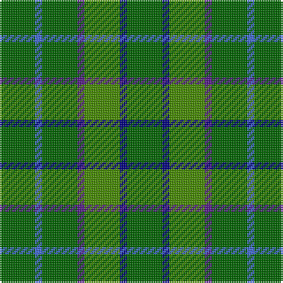

In pattern [GBGBGBG](/patterns/gbgbgbg/).

This was sourced from register-of-tartans.  It is a [7 stripes tartan](/stripes/stripes7/).

Original link https://www.tartanregister.gov.uk/tartanDetails.aspx?ref=10201

## Thread count
G/20 B4 G20 P4 Ga20 DB4 G/20

## Palette
Each colour and its ΔE from the base-6 reference it is a variant of.

| Colour | Shade | Base | ΔE (OKLab) |
|---|---|---|---|
| B | <code style="background-color:#4169E1;">#4169E1</code> `#4169E1` | B <code style="background-color:#2A418A;">#2A418A</code> | 0.17 |
| DB | <code style="background-color:#000080;">#000080</code> `#000080` | B <code style="background-color:#2A418A;">#2A418A</code> | 0.14 |
| G | <code style="background-color:#006400;">#006400</code> `#006400` | G <code style="background-color:#006100;">#006100</code> | 0.01 |
| Ga | <code style="background-color:#458B00;">#458B00</code> `#458B00` | G <code style="background-color:#006100;">#006100</code> | 0.14 |
| P | <code style="background-color:#551A8B;">#551A8B</code> `#551A8B` | B <code style="background-color:#2A418A;">#2A418A</code> | 0.10 |

# Sample pattern

## Nearest tartans

The nearest existing variants by ΔTartan distance.

1. [Battle of the Somme Centenary](/setts/s9/r3g3ra5ga10gb3ga10k4ga24ra3~g604000-ga006818-gb408060-k101010-r888888-raa00000~x2/) — ΔT 1.90
1. [Taylor](/setts/s8/g8k2g13y4g12b22g5ya3~b506878-g006818-k101010-yd0908c-yabc8c00~x2/) — ΔT 1.93
1. [Blackwood (Corporate)](/setts/s7/g5b1ga5ba1g5bb1g5~b1c1c50-ba780078-bb2c2c80-g003820-ga006818~x2/) — ΔT 2.11
1. [Hueg (Hunting) (Personal)](/setts/s10/b17g5b5g17b4g17k2ga2k2g5~b003c64-g006818-ga604000-k101010~x2/) — ΔT 2.12
1. [MacKinnon, hunting](/setts/s7/g1r8g8ra1g8r8w1~g008000-r806050-rac00000-we0e0e0~x4/) — ΔT 2.22
1. [Justus hunting](/setts/s7/b1g4r1g1y1g4b1~b304080-g008000-rc00000-yf0c000~x12/) — ΔT 2.22
1. [Campbell Simpson (Dalgliesh)](/setts/s6/g22k3g3ga16g6k4~g408060-ga006818-k101010~x2/) — ΔT 2.24
1. [O'Neill (Australia)](/setts/s6/r20g40w5g40r20g9~g006818-r98481c-we0e0e0~x2/) — ΔT 2.25
1. [Dewar, Robert Alexander (Personal)](/setts/s9/g15b8k5b8g15y3g15b8k5~b003c64-g007440-k101010-ye8c000~x2/) — ΔT 2.31
1. [Pino Family (Pennsylvania) (Personal)](/setts/s13/g25ga7g25ga7y5g25ga7g25ga7y5r2w2r2~g006400-ga008b00-re3170d-wffffff-y86c67c~x2/) — ΔT 2.31

## Neighbour map

Every grey dot is one of 15726 variants placed by the first two principal components of the ΔTartan feature space (44% of its variance). Red is this tartan; blue dots are its nearest — click one to open its page.

<svg viewBox="0 0 640 380" role="img" style="max-width:100%;height:auto;border:1px solid #e0e0e0;border-radius:4px;display:block" xmlns="http://www.w3.org/2000/svg"><image href="/nn/cloud.v1.png" width="640" height="380"/><a href="/setts/s9/r3g3ra5ga10gb3ga10k4ga24ra3~g604000-ga006818-gb408060-k101010-r888888-raa00000~x2/"><circle cx="375.2" cy="201.5" r="4" fill="#3465a4"><title>Battle of the Somme Centenary</title></circle></a><a href="/setts/s8/g8k2g13y4g12b22g5ya3~b506878-g006818-k101010-yd0908c-yabc8c00~x2/"><circle cx="334.5" cy="227.0" r="4" fill="#3465a4"><title>Taylor</title></circle></a><a href="/setts/s7/g5b1ga5ba1g5bb1g5~b1c1c50-ba780078-bb2c2c80-g003820-ga006818~x2/"><circle cx="388.0" cy="297.4" r="4" fill="#3465a4"><title>Blackwood (Corporate)</title></circle></a><a href="/setts/s10/b17g5b5g17b4g17k2ga2k2g5~b003c64-g006818-ga604000-k101010~x2/"><circle cx="378.6" cy="245.4" r="4" fill="#3465a4"><title>Hueg (Hunting) (Personal)</title></circle></a><a href="/setts/s7/g1r8g8ra1g8r8w1~g008000-r806050-rac00000-we0e0e0~x4/"><circle cx="334.0" cy="259.7" r="4" fill="#3465a4"><title>MacKinnon, hunting</title></circle></a><a href="/setts/s7/b1g4r1g1y1g4b1~b304080-g008000-rc00000-yf0c000~x12/"><circle cx="343.3" cy="264.3" r="4" fill="#3465a4"><title>Justus hunting</title></circle></a><a href="/setts/s6/g22k3g3ga16g6k4~g408060-ga006818-k101010~x2/"><circle cx="371.9" cy="277.9" r="4" fill="#3465a4"><title>Campbell Simpson (Dalgliesh)</title></circle></a><a href="/setts/s6/r20g40w5g40r20g9~g006818-r98481c-we0e0e0~x2/"><circle cx="421.1" cy="291.4" r="4" fill="#3465a4"><title>O'Neill (Australia)</title></circle></a><a href="/setts/s9/g15b8k5b8g15y3g15b8k5~b003c64-g007440-k101010-ye8c000~x2/"><circle cx="248.0" cy="278.7" r="4" fill="#3465a4"><title>Dewar, Robert Alexander (Personal)</title></circle></a><a href="/setts/s13/g25ga7g25ga7y5g25ga7g25ga7y5r2w2r2~g006400-ga008b00-re3170d-wffffff-y86c67c~x2/"><circle cx="419.2" cy="197.9" r="4" fill="#3465a4"><title>Pino Family (Pennsylvania) (Personal)</title></circle></a><circle cx="339.5" cy="277.1" r="5" fill="#c00000"/></svg>

ID: /setts/s7/g5b1ga5ba1g5bb1g5~b000080-ba551a8b-bb4169e1-g006400-ga458b00~x4/
