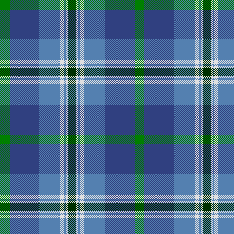

In pattern [GBBWBWG](/stripes/gbbwbwg/).

This was sourced from weddslist.  It is a [7 stripe tartan](/stripes/stripes7/).

Original link http://www.weddslist.com/cgi-bin/tartans/pg.pl?source=sts

## Attestations

This cloth appears in 2 source records; the oldest owns this page.

- undated — Highlands Country Club (weddslist, [record](http://www.weddslist.com/cgi-bin/tartans/pg.pl?source=sts))
- undated — Highlands Country Club Corporate Tartan Tartan Number: 687. Earliest known date: 1984 Weft uses a dark green. See products available Copyright © Blair Urquhart, Comrie, 2015 (house-of-tartan, [record](http://www.house-of-tartan.scotland.net/house/TartanViewjs.asp?colr=Def&tnam=687))

## Thread count
G/20 B60 Ba44 LN8 Ba4 LN4 DG/16

## Palette
Each colour and the base-6 reference it is a variant of.

| Colour | Shade | Base |
|---|---|---|
| B | <code style="background-color:#304080;">#304080</code> `oklch(39.4% 0.109 270.2)` <small>#304080</small> | B <code style="background-color:#2A418A;">#2A418A</code> |
| Ba | <code style="background-color:#5480B0;">#5480B0</code> `oklch(58.8% 0.089 251.5)` <small>#5480B0</small> | B <code style="background-color:#2A418A;">#2A418A</code> |
| DG | <code style="background-color:#003000;">#003000</code> `oklch(26.8% 0.091 142.5)` <small>#003000</small> | G <code style="background-color:#006100;">#006100</code> |
| G | <code style="background-color:#008000;">#008000</code> `oklch(52.0% 0.177 142.5)` <small>#008000</small> | G <code style="background-color:#006100;">#006100</code> |
| LN | <code style="background-color:#E0E0E0;">#E0E0E0</code> `oklch(90.7% 0.000 89.9)` <small>#E0E0E0</small> | W <code style="background-color:#F7F7F7;">#F7F7F7</code> |

# Sample pattern

## Nearest tartans

The nearest existing variants by ΔTartan distance.

1. [Rhode Island, State of](/setts/s7/dt4b28dt11w2dt2g14ly2~x2/) — ΔT 0.81
1. [MacThomas](/setts/s7/g5m3g32k16b32m3b5~x2/) — ΔT 0.85
1. [Afternoon Tea / Earl Grey](/setts/s6/r15t98dt72ly25dt8w15/) — ΔT 0.87
1. [MacCord / McCord (Personal)](/setts/s7/dg6r2db1r3db16g20w2~x2/) — ΔT 0.89
1. [Ednie (Personal)](/setts/s7/b11k4g4m1g4k1r1~x4/) — ΔT 1.01
1. [Icelandair](/setts/s7/db3t24k11db20w2db5lo3~x2/) — ΔT 1.07
1. [Newmill](/setts/s7/r1o5dt3dt11dt3o5lo1~x8/) — ΔT 1.14
1. [MacWilliam (Clan)](/setts/s6/dy2g12k10r1b16r2~x4/) — ΔT 1.14
1. [State Seal of Washington (Fashion)](/setts/s7/b5dy28lb5k20lo5b47lo4~x2/) — ΔT 1.14
1. [DeLoughery (Personal)](/setts/s6/db20k6lo4db3g20w2~x2/) — ΔT 1.16

## Neighbour map

Every grey dot is one of 14299 variants placed by the first two principal components of the ΔTartan feature space (44% of its variance). Red is this tartan; blue dots are its nearest — click one to open its page.

<svg viewBox="0 0 640 380" role="img" style="max-width:100%;height:auto;border:1px solid #e0e0e0;border-radius:4px;display:block" xmlns="http://www.w3.org/2000/svg"><image href="/nn/cloud.v1.png" width="640" height="380"/><a href="/setts/s7/dt4b28dt11w2dt2g14ly2~x2/"><circle cx="246.6" cy="181.4" r="4" fill="#3465a4"><title>Rhode Island, State of</title></circle></a><a href="/setts/s7/g5m3g32k16b32m3b5~x2/"><circle cx="212.2" cy="198.7" r="4" fill="#3465a4"><title>MacThomas</title></circle></a><a href="/setts/s6/r15t98dt72ly25dt8w15/"><circle cx="208.3" cy="186.1" r="4" fill="#3465a4"><title>Afternoon Tea / Earl Grey</title></circle></a><a href="/setts/s7/dg6r2db1r3db16g20w2~x2/"><circle cx="226.6" cy="157.6" r="4" fill="#3465a4"><title>MacCord / McCord (Personal)</title></circle></a><a href="/setts/s7/b11k4g4m1g4k1r1~x4/"><circle cx="213.1" cy="194.5" r="4" fill="#3465a4"><title>Ednie (Personal)</title></circle></a><a href="/setts/s7/db3t24k11db20w2db5lo3~x2/"><circle cx="206.9" cy="187.5" r="4" fill="#3465a4"><title>Icelandair</title></circle></a><a href="/setts/s7/r1o5dt3dt11dt3o5lo1~x8/"><circle cx="206.0" cy="208.4" r="4" fill="#3465a4"><title>Newmill</title></circle></a><a href="/setts/s6/dy2g12k10r1b16r2~x4/"><circle cx="193.5" cy="191.5" r="4" fill="#3465a4"><title>MacWilliam (Clan)</title></circle></a><a href="/setts/s7/b5dy28lb5k20lo5b47lo4~x2/"><circle cx="219.0" cy="176.9" r="4" fill="#3465a4"><title>State Seal of Washington (Fashion)</title></circle></a><a href="/setts/s6/db20k6lo4db3g20w2~x2/"><circle cx="206.8" cy="203.1" r="4" fill="#3465a4"><title>DeLoughery (Personal)</title></circle></a><circle cx="198.8" cy="178.2" r="5" fill="#c00000"/></svg>

ID: /setts/s7/g5db15t11w2t1w1dg4~x4/
