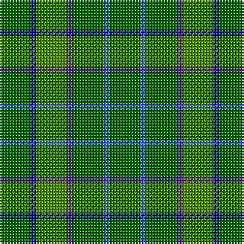

This page is one **sett** — a single exact thread-count. It belongs to the [tartan](/tartans/g5db1g5dp1g5b1g5/)
(the same proportion at any scale), whose colour order is pattern [GBGBGBG](/stripes/gbgbgbg/).

Sourced from register-of-tartans.  It is a [7 stripe tartan](/stripes/stripes7/).

Original link https://www.tartanregister.gov.uk/tartanDetails.aspx?ref=10201

## Register references

External register numbers recorded for this tartan.

- Scottish Register of Tartans: [10201](https://www.tartanregister.gov.uk/tartanDetails.aspx?ref=10201)

## Thread count
G/20 DB4 Ga20 P4 G20 B4 G/20

## Palette

Palette: <strong>Logan (The Scottish Gael, 1831)</strong> <small style="color:#888">(1 of 5 colours)</small>
<table><thead><tr><th>Colour</th><th>Threads</th><th>Shade</th><th>Base</th><th>OKLCh</th></tr></thead><tbody><tr><td>G/</td><td style="text-align:right;font-variant-numeric:tabular-nums">20</td><td><code style="background-color:#006400;">#006400</code> <small style="color:#888">#006400</small></td><td>G <code style="background-color:#006100;">#006100</code></td><td><small style="color:#888">oklch(43.6% 0.148 142.5)</small></td></tr><tr><td>DB</td><td style="text-align:right;font-variant-numeric:tabular-nums">4</td><td><code style="background-color:#000080;">#000080</code> <small style="color:#888">#000080</small></td><td>B <code style="background-color:#2A418A;">#2A418A</code></td><td><small style="color:#888">oklch(27.1% 0.188 264.1)</small></td></tr><tr><td>Ga</td><td style="text-align:right;font-variant-numeric:tabular-nums">20</td><td><code style="background-color:#458B00;">#458B00</code> <small style="color:#888">#458B00</small></td><td>G <code style="background-color:#006100;">#006100</code></td><td><small style="color:#888">oklch(56.8% 0.167 135.4)</small></td></tr><tr><td>P</td><td style="text-align:right;font-variant-numeric:tabular-nums">4</td><td><code style="background-color:#551A8B;">#551A8B</code> <small style="color:#888">#551A8B</small></td><td>B <code style="background-color:#2A418A;">#2A418A</code></td><td><small style="color:#888">oklch(37.8% 0.172 302.2)</small></td></tr><tr><td>G</td><td style="text-align:right;font-variant-numeric:tabular-nums">20</td><td><code style="background-color:#006400;">#006400</code> <small style="color:#888">#006400</small></td><td>G <code style="background-color:#006100;">#006100</code></td><td><small style="color:#888">oklch(43.6% 0.148 142.5)</small></td></tr><tr><td>B</td><td style="text-align:right;font-variant-numeric:tabular-nums">4</td><td><code style="background-color:#4169E1;">#4169E1</code> <small style="color:#888">#4169E1</small></td><td>B <code style="background-color:#2A418A;">#2A418A</code></td><td><small style="color:#888">oklch(56.0% 0.188 266.4)</small></td></tr><tr><td>G/</td><td style="text-align:right;font-variant-numeric:tabular-nums">20</td><td><code style="background-color:#006400;">#006400</code> <small style="color:#888">#006400</small></td><td>G <code style="background-color:#006100;">#006100</code></td><td><small style="color:#888">oklch(43.6% 0.148 142.5)</small></td></tr></tbody></table>

# Sample pattern

## Nearest tartans

The nearest existing variants by ΔTartan distance, with this tartan at the top so the swatches line up against it.

ΔTartan

Tartan

Sett

—

<a href="/ttd/edit/#slug=g5db1g5dp1g5b1g5~x4">Blackwood (Loch Wood)</a> <a class="nn-out" href="/setts/s7/g5db1g5dp1g5b1g5~x4/" title="open its dictionary page">↗</a>

1.90

<a href="/ttd/edit/#slug=r3g24k4g10g3g10r5dy3o3~x2">Battle of the Somme Centenary</a> <a class="nn-out" href="/setts/s9/r3g24k4g10g3g10r5dy3o3~x2/" title="open its dictionary page">↗</a>

1.93

<a href="/ttd/edit/#slug=g8k2g13lr4g12n22g5lo3~x2">Taylor</a> <a class="nn-out" href="/setts/s8/g8k2g13lr4g12n22g5lo3~x2/" title="open its dictionary page">↗</a>

2.12

<a href="/ttd/edit/#slug=dg5db1dg5dp1g5db1dg5~x2">Blackwood (Corporate)</a> <a class="nn-out" href="/setts/s7/dg5db1dg5dp1g5db1dg5~x2/" title="open its dictionary page">↗</a>

2.12

<a href="/ttd/edit/#slug=dt17g5dt5g17dt4g17k2dy2k2g5~x2">Hueg (Hunting) (Personal)</a> <a class="nn-out" href="/setts/s10/dt17g5dt5g17dt4g17k2dy2k2g5~x2/" title="open its dictionary page">↗</a>

2.21

<a href="/ttd/edit/#slug=db1g4r1g1ly1g4db1~x12">Justus hunting</a> <a class="nn-out" href="/setts/s7/db1g4r1g1ly1g4db1~x12/" title="open its dictionary page">↗</a>

2.22

<a href="/ttd/edit/#slug=g1o8g8r1g8o8w1~x4">MacKinnon, hunting</a> <a class="nn-out" href="/setts/s7/g1o8g8r1g8o8w1~x4/" title="open its dictionary page">↗</a>

2.24

<a href="/ttd/edit/#slug=g22k3g3g16g6k4~x2">Campbell Simpson (Dalgliesh)</a> <a class="nn-out" href="/setts/s6/g22k3g3g16g6k4~x2/" title="open its dictionary page">↗</a>

2.26

<a href="/ttd/edit/#slug=o20g40w5g40o20g9~x2">O'Neill (Australia)</a> <a class="nn-out" href="/setts/s6/o20g40w5g40o20g9~x2/" title="open its dictionary page">↗</a>

2.30

<a href="/ttd/edit/#slug=g15dt8k5dt8g15ly3g15dt8k5~x2">Dewar, Robert Alexander (Personal)</a> <a class="nn-out" href="/setts/s9/g15dt8k5dt8g15ly3g15dt8k5~x2/" title="open its dictionary page">↗</a>

2.31

<a href="/ttd/edit/#slug=g25g7g25g7lg5g25g7g25g7lg5r2w2r2~x2">Pino Family (Pennsylvania) (Personal)</a> <a class="nn-out" href="/setts/s13/g25g7g25g7lg5g25g7g25g7lg5r2w2r2~x2/" title="open its dictionary page">↗</a>

## Neighbour map

Every grey dot is one of 14299 variants placed by the first two principal components of the ΔTartan feature space (44% of its variance). Red is this tartan; blue dots are its nearest — click one to open its page.

<svg viewBox="0 0 640 380" role="img" style="max-width:100%;height:auto;border:1px solid #e0e0e0;border-radius:4px;display:block" xmlns="http://www.w3.org/2000/svg"><image href="/nn/cloud.v1.png" width="640" height="380"/><a href="/setts/s9/r3g24k4g10g3g10r5dy3o3~x2/"><circle cx="376.5" cy="208.8" r="4" fill="#3465a4"><title>Battle of the Somme Centenary</title></circle></a><a href="/setts/s8/g8k2g13lr4g12n22g5lo3~x2/"><circle cx="336.1" cy="237.2" r="4" fill="#3465a4"><title>Taylor</title></circle></a><a href="/setts/s7/dg5db1dg5dp1g5db1dg5~x2/"><circle cx="389.4" cy="310.1" r="4" fill="#3465a4"><title>Blackwood (Corporate)</title></circle></a><a href="/setts/s10/dt17g5dt5g17dt4g17k2dy2k2g5~x2/"><circle cx="380.7" cy="256.0" r="4" fill="#3465a4"><title>Hueg (Hunting) (Personal)</title></circle></a><a href="/setts/s7/db1g4r1g1ly1g4db1~x12/"><circle cx="345.1" cy="264.3" r="4" fill="#3465a4"><title>Justus hunting</title></circle></a><a href="/setts/s7/g1o8g8r1g8o8w1~x4/"><circle cx="335.1" cy="268.0" r="4" fill="#3465a4"><title>MacKinnon, hunting</title></circle></a><a href="/setts/s6/g22k3g3g16g6k4~x2/"><circle cx="373.9" cy="285.5" r="4" fill="#3465a4"><title>Campbell Simpson (Dalgliesh)</title></circle></a><a href="/setts/s6/o20g40w5g40o20g9~x2/"><circle cx="421.9" cy="295.0" r="4" fill="#3465a4"><title>O'Neill (Australia)</title></circle></a><a href="/setts/s9/g15dt8k5dt8g15ly3g15dt8k5~x2/"><circle cx="250.8" cy="283.9" r="4" fill="#3465a4"><title>Dewar, Robert Alexander (Personal)</title></circle></a><a href="/setts/s13/g25g7g25g7lg5g25g7g25g7lg5r2w2r2~x2/"><circle cx="420.6" cy="206.5" r="4" fill="#3465a4"><title>Pino Family (Pennsylvania) (Personal)</title></circle></a><circle cx="341.4" cy="285.0" r="5" fill="#c00000"/></svg>

ID: /setts/s7/g5db1g5dp1g5b1g5~x4/
