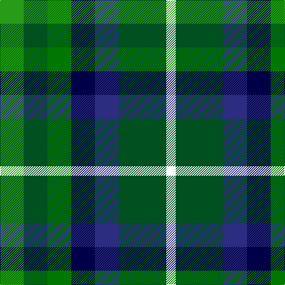

In pattern [GGGBBGW](/patterns/gggbbgw/).

This was sourced from register-of-tartans.  It is a [7 stripes tartan](/stripes/stripes7/).

Original link https://www.tartanregister.gov.uk/tartanDetails.aspx?ref=11151

## Thread count
G/40 Gb40 Ga40 DB40 DBa40 Gb80 W/16

## Palette
Each colour and its ΔE from the base-6 reference it is a variant of.

| Colour | Shade | Base | ΔE (OKLab) |
|---|---|---|---|
| DB | <code style="background-color:#000048;">#000048</code> `#000048` | B <code style="background-color:#2A418A;">#2A418A</code> | 0.22 |
| DBa | <code style="background-color:#2C2C80;">#2C2C80</code> `#2C2C80` | B <code style="background-color:#2A418A;">#2A418A</code> | 0.06 |
| G | <code style="background-color:#289C18;">#289C18</code> `#289C18` | G <code style="background-color:#006100;">#006100</code> | 0.19 |
| Ga | <code style="background-color:#007800;">#007800</code> `#007800` | G <code style="background-color:#006100;">#006100</code> | 0.07 |
| Gb | <code style="background-color:#005020;">#005020</code> `#005020` | G <code style="background-color:#006100;">#006100</code> | 0.07 |
| W | <code style="background-color:#FFFFFF;">#FFFFFF</code> `#FFFFFF` | W <code style="background-color:#F7F7F7;">#F7F7F7</code> | 0.02 |

# Sample pattern

## Nearest tartans

The nearest existing variants by ΔTartan distance.

1. [Pollard (2014)](/setts/s7/g5ga5gb5b5ba5ga10w2x8~b202060-ba2c2c80-g289c18-ga003820-gb006818-wfcfcfc/) — ΔT 0.53
1. [Scottish Parliament](/setts/s7/b8g11k3g11r12ka10y2x2~b304080-g008000-k000000-ka000030-r802040-yf0c000/) — ΔT 1.21
1. [Devon, Original](/setts/s7/g5ga4w1ga4r4gb4y1x4~g808080-ga008000-gb003000-r703000-we0e0e0-yf0c000/) — ΔT 1.55
1. [Huntly Gordon 2000](/setts/s10/b3ba12k11g11y2g11k11ba12b3r2x2~b003c64-ba1474b4-g006818-k101010-rc80000-ye8c000/) — ΔT 1.61
1. [Parliament Trade Tartan Tartan Number: 2477. Earliest known date: 1998 Created to celebrate the referendum result for the re-establishment of a Scottish Parliament as well as to provide a Parliamentary livery tartan. See products available Copyright © Blair Urquhart, Comrie, 2015](/setts/s7/b8g11k3g11r12ba10y2x2~b2c2c80-ba003c64-g006818-k101010-r880000-ye8c000/) — ΔT 1.63
1. [Centeno-Oxford](/setts/s6/g12k10y9b11ya3g9x2~b1c0070-g006818-k101010-ye8c000-yafccc00/) — ΔT 1.67
1. [Scottish Odyssey](/setts/s7/b7ba11k3ba11g11ga22bb3x2~b3850c8-ba2c4084-bb000080-g663300-ga008800-k000000/) — ΔT 1.73
1. [Presbyterian Synod (US) (Corporate)](/setts/s11/b6r2b6y3g6k1g2w2g2k1g6x2~b202060-g006818-k101010-rb03000-wc0c0c0-ye8c000/) — ΔT 1.75
1. [Friebe (2014)](/setts/s5/g15ga18b23w4r8x2~b003c64-g408060-ga003820-rc80000-wfcfcfc/) — ΔT 1.76
1. [Lanarkshire](/setts/s6/g31y4g6k19b18ba9x2~b2c2c80-ba5c8ca8-g006818-k101010-ye8c000/) — ΔT 1.76

## Neighbour map

Every grey dot is one of 15726 variants placed by the first two principal components of the ΔTartan feature space (44% of its variance). Red is this tartan; blue dots are its nearest — click one to open its page.

<svg viewBox="0 0 640 380" role="img" style="max-width:100%;height:auto;border:1px solid #e0e0e0;border-radius:4px;display:block" xmlns="http://www.w3.org/2000/svg"><image href="/nn/cloud.v1.png" width="640" height="380"/><a href="/setts/s7/g5ga5gb5b5ba5ga10w2x8~b202060-ba2c2c80-g289c18-ga003820-gb006818-wfcfcfc/"><circle cx="73.4" cy="248.2" r="4" fill="#3465a4"><title>Pollard (2014)</title></circle></a><a href="/setts/s7/b8g11k3g11r12ka10y2x2~b304080-g008000-k000000-ka000030-r802040-yf0c000/"><circle cx="71.4" cy="224.9" r="4" fill="#3465a4"><title>Scottish Parliament</title></circle></a><a href="/setts/s7/g5ga4w1ga4r4gb4y1x4~g808080-ga008000-gb003000-r703000-we0e0e0-yf0c000/"><circle cx="66.7" cy="237.4" r="4" fill="#3465a4"><title>Devon, Original</title></circle></a><a href="/setts/s10/b3ba12k11g11y2g11k11ba12b3r2x2~b003c64-ba1474b4-g006818-k101010-rc80000-ye8c000/"><circle cx="70.5" cy="207.8" r="4" fill="#3465a4"><title>Huntly Gordon 2000</title></circle></a><a href="/setts/s7/b8g11k3g11r12ba10y2x2~b2c2c80-ba003c64-g006818-k101010-r880000-ye8c000/"><circle cx="112.9" cy="240.2" r="4" fill="#3465a4"><title>Parliament Trade Tartan Tartan Number: 2477. Earliest known date: 1998 Created to celebrate the referendum result for the re-establishment of a Scottish Parliament as well as to provide a Parliamentary livery tartan. See products available Copyright © Blair Urquhart, Comrie, 2015</title></circle></a><a href="/setts/s6/g12k10y9b11ya3g9x2~b1c0070-g006818-k101010-ye8c000-yafccc00/"><circle cx="43.4" cy="275.0" r="4" fill="#3465a4"><title>Centeno-Oxford</title></circle></a><a href="/setts/s7/b7ba11k3ba11g11ga22bb3x2~b3850c8-ba2c4084-bb000080-g663300-ga008800-k000000/"><circle cx="98.5" cy="209.6" r="4" fill="#3465a4"><title>Scottish Odyssey</title></circle></a><a href="/setts/s11/b6r2b6y3g6k1g2w2g2k1g6x2~b202060-g006818-k101010-rb03000-wc0c0c0-ye8c000/"><circle cx="120.2" cy="191.7" r="4" fill="#3465a4"><title>Presbyterian Synod (US) (Corporate)</title></circle></a><a href="/setts/s5/g15ga18b23w4r8x2~b003c64-g408060-ga003820-rc80000-wfcfcfc/"><circle cx="101.2" cy="257.2" r="4" fill="#3465a4"><title>Friebe (2014)</title></circle></a><a href="/setts/s6/g31y4g6k19b18ba9x2~b2c2c80-ba5c8ca8-g006818-k101010-ye8c000/"><circle cx="161.9" cy="228.5" r="4" fill="#3465a4"><title>Lanarkshire</title></circle></a><circle cx="64.2" cy="245.3" r="5" fill="#c00000"/></svg>

ID: /setts/s7/g5ga5gb5b5ba5ga10w2x8~b000048-ba2c2c80-g289c18-ga005020-gb007800-wffffff/
