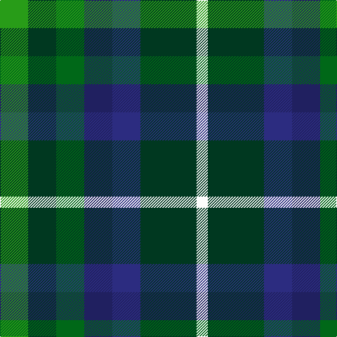

In pattern [GGGBBGW](/patterns/gggbbgw/).

This was sourced from tartans-authority.  It is a [7 stripes tartan](/stripes/stripes7/).

Original link http://www.tartansauthority.com/tartan-ferret/display/11151/

## Thread count
G/40 DG40 Ga40 DBa40 DB40 DG80 W/16

## Palette
Each colour and its ΔE from the base-6 reference it is a variant of.

| Colour | Shade | Base | ΔE (OKLab) |
|---|---|---|---|
| DB | <code style="background-color:#2C2C80;">#2C2C80</code> `#2C2C80` | B <code style="background-color:#2A418A;">#2A418A</code> | 0.06 |
| DBa | <code style="background-color:#202060;">#202060</code> `#202060` | B <code style="background-color:#2A418A;">#2A418A</code> | 0.11 |
| DG | <code style="background-color:#003820;">#003820</code> `#003820` | G <code style="background-color:#006100;">#006100</code> | 0.15 |
| G | <code style="background-color:#289C18;">#289C18</code> `#289C18` | G <code style="background-color:#006100;">#006100</code> | 0.19 |
| Ga | <code style="background-color:#006818;">#006818</code> `#006818` | G <code style="background-color:#006100;">#006100</code> | 0.02 |
| W | <code style="background-color:#FCFCFC;">#FCFCFC</code> `#FCFCFC` | W <code style="background-color:#F7F7F7;">#F7F7F7</code> | 0.01 |

# Sample pattern

## Nearest tartans

The nearest existing variants by ΔTartan distance.

1. [Pollard (2014)](/setts/s7/g5ga5gb5b5ba5ga10w2~b000048-ba2c2c80-g289c18-ga005020-gb007800-wffffff~x8/) — ΔT 0.53
1. [Scottish Parliament](/setts/s7/b8g11k3g11r12ka10y2~b304080-g008000-k000000-ka000030-r802040-yf0c000~x2/) — ΔT 1.10
1. [Parliament Trade Tartan Tartan Number: 2477. Earliest known date: 1998 Created to celebrate the referendum result for the re-establishment of a Scottish Parliament as well as to provide a Parliamentary livery tartan. See products available Copyright © Blair Urquhart, Comrie, 2015](/setts/s7/b8g11k3g11r12ba10y2~b2c2c80-ba003c64-g006818-k101010-r880000-ye8c000~x2/) — ΔT 1.27
1. [Huntly Gordon 2000](/setts/s10/b3ba12k11g11y2g11k11ba12b3r2~b003c64-ba1474b4-g006818-k101010-rc80000-ye8c000~x2/) — ΔT 1.43
1. [Scottish Odyssey](/setts/s7/b7ba11k3ba11g11ga22bb3~b3850c8-ba2c4084-bb000080-g663300-ga008800-k000000~x2/) — ΔT 1.50
1. [Friebe (2014)](/setts/s5/g15ga18b23w4r8~b003c64-g408060-ga003820-rc80000-wfcfcfc~x2/) — ΔT 1.53
1. [Loch Katrine](/setts/s7/b8ba11w3ba11bb12g10r2~b2888c4-ba003c64-bb1c0070-g289c18-r901c38-wfcfcfc~x2/) — ΔT 1.54
1. [New York City](/setts/s7/b2ba3k1ba3r3g4ra1~b1474b4-ba2c2c80-g006818-k101010-r888888-raa00000~x8/) — ΔT 1.57
1. [Wilson's No.217](/setts/s8/b11ba2k10g10y3g10k10ba2~b440044-ba2888c4-g006818-k101010-ye8c000~x2/) — ΔT 1.59
1. [Game Fair](/setts/s7/r3b12k12g12ba2g12w3~b202060-ba1870a4-g003820-k101010-rc8002c-we0e0e0~x2/) — ΔT 1.62

## Neighbour map

Every grey dot is one of 15726 variants placed by the first two principal components of the ΔTartan feature space (44% of its variance). Red is this tartan; blue dots are its nearest — click one to open its page.

<svg viewBox="0 0 640 380" role="img" style="max-width:100%;height:auto;border:1px solid #e0e0e0;border-radius:4px;display:block" xmlns="http://www.w3.org/2000/svg"><image href="/nn/cloud.v1.png" width="640" height="380"/><a href="/setts/s7/g5ga5gb5b5ba5ga10w2~b000048-ba2c2c80-g289c18-ga005020-gb007800-wffffff~x8/"><circle cx="64.2" cy="245.3" r="4" fill="#3465a4"><title>Pollard (2014)</title></circle></a><a href="/setts/s7/b8g11k3g11r12ka10y2~b304080-g008000-k000000-ka000030-r802040-yf0c000~x2/"><circle cx="71.4" cy="224.9" r="4" fill="#3465a4"><title>Scottish Parliament</title></circle></a><a href="/setts/s7/b8g11k3g11r12ba10y2~b2c2c80-ba003c64-g006818-k101010-r880000-ye8c000~x2/"><circle cx="112.9" cy="240.2" r="4" fill="#3465a4"><title>Parliament Trade Tartan Tartan Number: 2477. Earliest known date: 1998 Created to celebrate the referendum result for the re-establishment of a Scottish Parliament as well as to provide a Parliamentary livery tartan. See products available Copyright © Blair Urquhart, Comrie, 2015</title></circle></a><a href="/setts/s10/b3ba12k11g11y2g11k11ba12b3r2~b003c64-ba1474b4-g006818-k101010-rc80000-ye8c000~x2/"><circle cx="70.5" cy="207.8" r="4" fill="#3465a4"><title>Huntly Gordon 2000</title></circle></a><a href="/setts/s7/b7ba11k3ba11g11ga22bb3~b3850c8-ba2c4084-bb000080-g663300-ga008800-k000000~x2/"><circle cx="98.5" cy="209.6" r="4" fill="#3465a4"><title>Scottish Odyssey</title></circle></a><a href="/setts/s5/g15ga18b23w4r8~b003c64-g408060-ga003820-rc80000-wfcfcfc~x2/"><circle cx="101.2" cy="257.2" r="4" fill="#3465a4"><title>Friebe (2014)</title></circle></a><a href="/setts/s7/b8ba11w3ba11bb12g10r2~b2888c4-ba003c64-bb1c0070-g289c18-r901c38-wfcfcfc~x2/"><circle cx="71.1" cy="227.8" r="4" fill="#3465a4"><title>Loch Katrine</title></circle></a><a href="/setts/s7/b2ba3k1ba3r3g4ra1~b1474b4-ba2c2c80-g006818-k101010-r888888-raa00000~x8/"><circle cx="73.3" cy="256.2" r="4" fill="#3465a4"><title>New York City</title></circle></a><a href="/setts/s8/b11ba2k10g10y3g10k10ba2~b440044-ba2888c4-g006818-k101010-ye8c000~x2/"><circle cx="103.2" cy="237.6" r="4" fill="#3465a4"><title>Wilson's No.217</title></circle></a><a href="/setts/s7/r3b12k12g12ba2g12w3~b202060-ba1870a4-g003820-k101010-rc8002c-we0e0e0~x2/"><circle cx="146.9" cy="230.0" r="4" fill="#3465a4"><title>Game Fair</title></circle></a><circle cx="73.4" cy="248.2" r="5" fill="#c00000"/></svg>

ID: /setts/s7/g5ga5gb5b5ba5ga10w2~b202060-ba2c2c80-g289c18-ga003820-gb006818-wfcfcfc~x8/
