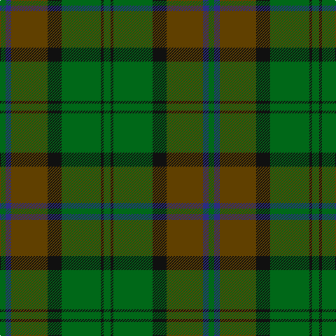

This page is one **sett** — a single exact thread-count. It belongs to the [tartan](/tartans/g5k2g28k10dy26db4g4/)
(the same proportion at any scale), whose colour order is pattern [GBGKGKG](/stripes/gbgkgkg/).

Sourced from house-of-tartan.  It is a [7 stripe tartan](/stripes/stripes7/).

Original link http://www.house-of-tartan.scotland.net/house/TartanViewjs.asp?colr=Def&tnam=776

## Thread count
G/10 K4 G56 K20 T52 DB8 G/8

## Palette

Palette: <strong>Tartan Register</strong>
<table><thead><tr><th>Colour</th><th>Threads</th><th>Shade</th><th>Base</th><th>OKLCh</th></tr></thead><tbody><tr><td>G/</td><td style="text-align:right;font-variant-numeric:tabular-nums">10</td><td><code style="background-color:#006818;">#006818</code> <small style="color:#888">#006818</small></td><td>G <code style="background-color:#006100;">#006100</code></td><td><small style="color:#888">oklch(45.0% 0.142 145.0)</small></td></tr><tr><td>K</td><td style="text-align:right;font-variant-numeric:tabular-nums">4</td><td><code style="background-color:#101010;">#101010</code> <small style="color:#888">#101010</small></td><td>K <code style="background-color:#000000;">#000000</code></td><td><small style="color:#888">oklch(17.3% 0.000 89.9)</small></td></tr><tr><td>G</td><td style="text-align:right;font-variant-numeric:tabular-nums">56</td><td><code style="background-color:#006818;">#006818</code> <small style="color:#888">#006818</small></td><td>G <code style="background-color:#006100;">#006100</code></td><td><small style="color:#888">oklch(45.0% 0.142 145.0)</small></td></tr><tr><td>K</td><td style="text-align:right;font-variant-numeric:tabular-nums">20</td><td><code style="background-color:#101010;">#101010</code> <small style="color:#888">#101010</small></td><td>K <code style="background-color:#000000;">#000000</code></td><td><small style="color:#888">oklch(17.3% 0.000 89.9)</small></td></tr><tr><td>T</td><td style="text-align:right;font-variant-numeric:tabular-nums">52</td><td><code style="background-color:#604000;">#604000</code> <small style="color:#888">#604000</small></td><td>G <code style="background-color:#006100;">#006100</code></td><td><small style="color:#888">oklch(39.8% 0.083 76.8)</small></td></tr><tr><td>DB</td><td style="text-align:right;font-variant-numeric:tabular-nums">8</td><td><code style="background-color:#2C2C80;">#2C2C80</code> <small style="color:#888">#2C2C80</small></td><td>B <code style="background-color:#2A418A;">#2A418A</code></td><td><small style="color:#888">oklch(35.0% 0.138 276.6)</small></td></tr><tr><td>G/</td><td style="text-align:right;font-variant-numeric:tabular-nums">8</td><td><code style="background-color:#006818;">#006818</code> <small style="color:#888">#006818</small></td><td>G <code style="background-color:#006100;">#006100</code></td><td><small style="color:#888">oklch(45.0% 0.142 145.0)</small></td></tr></tbody></table>

# Sample pattern

## Nearest tartans

The nearest existing variants by ΔTartan distance, with this tartan at the top so the swatches line up against it.

ΔTartan

Tartan

Sett

—

<a href="/ttd/edit/#slug=g5k2g28k10dy26db4g4~x2">John Telfar Dunbar/Hunting Tartan Tartan Number: 776. Earliest known date: pre 2003 Check this entry... See products available Copyright © Blair Urquhart, Comrie, 2015</a> <a class="nn-out" href="/setts/s7/g5k2g28k10dy26db4g4~x2/" title="open its dictionary page">↗</a>

1.05

<a href="/ttd/edit/#slug=dy28g2dy4db18g23db2g3lo4~x2">Eastern Western Motor Group, Dalbraith</a> <a class="nn-out" href="/setts/s8/dy28g2dy4db18g23db2g3lo4~x2/" title="open its dictionary page">↗</a>

1.23

<a href="/ttd/edit/#slug=r4dg3dgi39dg40r2lo4~x2">McGeorge (Personal)</a> <a class="nn-out" href="/setts/s6/r4dg3dgi39dg40r2lo4~x2/" title="open its dictionary page">↗</a>

1.28

<a href="/ttd/edit/#slug=dgi3r3dgi31dg18dgi4k22lo3">MacSween Hunting (Lochs, Isle of Lewis) (Personal)</a> <a class="nn-out" href="/setts/s7/dgi3r3dgi31dg18dgi4k22lo3/" title="open its dictionary page">↗</a>

1.29

<a href="/ttd/edit/#slug=db3dy7g2y2g14dy2g2db3~x2">Daks (Loden)</a> <a class="nn-out" href="/setts/s8/db3dy7g2y2g14dy2g2db3~x2/" title="open its dictionary page">↗</a>

1.32

<a href="/ttd/edit/#slug=g24r9g4dg19ly2dg6g7~x2">Doyle</a> <a class="nn-out" href="/setts/s7/g24r9g4dg19ly2dg6g7~x2/" title="open its dictionary page">↗</a>

1.33

<a href="/ttd/edit/#slug=y5do5y5do5y5g24do1db12g6do3~x2">Royal Scottish Agricultural Benevolent Institution</a> <a class="nn-out" href="/setts/s10/y5do5y5do5y5g24do1db12g6do3~x2/" title="open its dictionary page">↗</a>

1.37

<a href="/ttd/edit/#slug=yi12dg2yi2dg2yi2dy8y8dy1~x2">Ancient Universal (Fashion?)</a> <a class="nn-out" href="/setts/s8/yi12dg2yi2dg2yi2dy8y8dy1~x2/" title="open its dictionary page">↗</a>

1.41

<a href="/ttd/edit/#slug=t4dg26gi8t8gi8g3t2~x2">Valley of the Green (The ) Canadian Tartan Tartan Number: 148. Earliest known date: 1968 Specimen from Miss K Sinclair 1968 See products available Copyright © Blair Urquhart, Comrie, 2015</a> <a class="nn-out" href="/setts/s7/t4dg26gi8t8gi8g3t2~x2/" title="open its dictionary page">↗</a>

1.42

<a href="/ttd/edit/#slug=lo5y33dg33r6w2~x2">Symington</a> <a class="nn-out" href="/setts/s5/lo5y33dg33r6w2~x2/" title="open its dictionary page">↗</a>

1.42

<a href="/ttd/edit/#slug=r4g46r10db10dy33db5dy4lo3~x2">State Seal of Minnesota (Fashion)</a> <a class="nn-out" href="/setts/s8/r4g46r10db10dy33db5dy4lo3~x2/" title="open its dictionary page">↗</a>

## Neighbour map

Every grey dot is one of 14359 variants placed by the first two principal components of the ΔTartan feature space (44% of its variance). Red is this tartan; blue dots are its nearest — click one to open its page.

<svg viewBox="0 0 640 380" role="img" style="max-width:100%;height:auto;border:1px solid #e0e0e0;border-radius:4px;display:block" xmlns="http://www.w3.org/2000/svg"><image href="/nn/cloud.v1.png" width="640" height="380"/><a href="/setts/s8/dy28g2dy4db18g23db2g3lo4~x2/"><circle cx="289.5" cy="219.5" r="4" fill="#3465a4"><title>Eastern Western Motor Group, Dalbraith</title></circle></a><a href="/setts/s6/r4dg3dgi39dg40r2lo4~x2/"><circle cx="367.6" cy="210.7" r="4" fill="#3465a4"><title>McGeorge (Personal)</title></circle></a><a href="/setts/s7/dgi3r3dgi31dg18dgi4k22lo3/"><circle cx="277.6" cy="230.1" r="4" fill="#3465a4"><title>MacSween Hunting (Lochs, Isle of Lewis) (Personal)</title></circle></a><a href="/setts/s8/db3dy7g2y2g14dy2g2db3~x2/"><circle cx="329.5" cy="256.6" r="4" fill="#3465a4"><title>Daks (Loden)</title></circle></a><a href="/setts/s7/g24r9g4dg19ly2dg6g7~x2/"><circle cx="303.3" cy="237.8" r="4" fill="#3465a4"><title>Doyle</title></circle></a><a href="/setts/s10/y5do5y5do5y5g24do1db12g6do3~x2/"><circle cx="301.8" cy="197.4" r="4" fill="#3465a4"><title>Royal Scottish Agricultural Benevolent Institution</title></circle></a><a href="/setts/s8/yi12dg2yi2dg2yi2dy8y8dy1~x2/"><circle cx="283.4" cy="227.7" r="4" fill="#3465a4"><title>Ancient Universal (Fashion?)</title></circle></a><a href="/setts/s7/t4dg26gi8t8gi8g3t2~x2/"><circle cx="278.8" cy="224.8" r="4" fill="#3465a4"><title>Valley of the Green (The ) Canadian Tartan Tartan Number: 148. Earliest known date: 1968 Specimen from Miss K Sinclair 1968 See products available Copyright © Blair Urquhart, Comrie, 2015</title></circle></a><a href="/setts/s5/lo5y33dg33r6w2~x2/"><circle cx="305.7" cy="219.5" r="4" fill="#3465a4"><title>Symington</title></circle></a><a href="/setts/s8/r4g46r10db10dy33db5dy4lo3~x2/"><circle cx="289.3" cy="195.3" r="4" fill="#3465a4"><title>State Seal of Minnesota (Fashion)</title></circle></a><circle cx="333.4" cy="234.7" r="5" fill="#c00000"/></svg>

ID: /setts/s7/g5k2g28k10dy26db4g4~x2/
