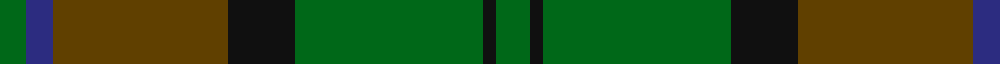

In pattern [GBGKGKG](/patterns/gbgkgkg/).

This was sourced from house-of-tartan.  It is a [7 stripes tartan](/stripes/stripes7/).

Original link http://www.house-of-tartan.scotland.net/house/TartanViewjs.asp?colr=Def&tnam=776

## Thread count
G/8 DB8 T52 K20 G56 K4 G/10

## Palette
Each colour and its ΔE from the base-6 reference it is a variant of.

| Colour | Shade | Base | ΔE (OKLab) |
|---|---|---|---|
| DB | <code style="background-color:#2C2C80;">#2C2C80</code> `#2C2C80` | B <code style="background-color:#2A418A;">#2A418A</code> | 0.06 |
| G | <code style="background-color:#006818;">#006818</code> `#006818` | G <code style="background-color:#006100;">#006100</code> | 0.02 |
| K | <code style="background-color:#101010;">#101010</code> `#101010` | K <code style="background-color:#000000;">#000000</code> | 0.17 |
| T | <code style="background-color:#604000;">#604000</code> `#604000` | G <code style="background-color:#006100;">#006100</code> | 0.14 |

# Sample pattern

## Nearest tartans

The nearest existing variants by ΔTartan distance.

1. [Eastern Western Motor Group, Dalbraith](/setts/s8/g28ga2g4b18ga23b2ga3y4~b202060-g604000-ga006818-ya08858~x2/) — ΔT 1.06
1. [McGeorge (Personal)](/setts/s6/r4g3ga39g40r2y4~g002814-ga005020-rdc0000-yc89600~x2/) — ΔT 1.24
1. [MacSween Hunting (Lochs, Isle of Lewis) (Personal)](/setts/s7/g3r3g31ga18g4k22y3~g004c00-ga003820-k101010-rc80000-ye0a126/) — ΔT 1.27
1. [Daks (Loden)](/setts/s8/b3g7ga2gb2ga14g2ga2b3~b2c2c80-g604000-ga006818-gb808080~x2/) — ΔT 1.29
1. [Doyle](/setts/s7/g24r9g4ga19y2ga6g7~g006818-ga003820-rc80000-ye8c000~x2/) — ΔT 1.33
1. [Royal Scottish Agricultural Benevolent Institution](/setts/s10/g5b5g5b5g5ga24b1ba12ga6b3~b3c2010-ba003478-g845800-ga146400~x2/) — ΔT 1.33
1. [Ancient Universal (Fashion?)](/setts/s8/g12ga2g2ga2g2gb8gc8gb1~g789484-ga003820-gb604000-gc5c6428~x2/) — ΔT 1.37
1. [Valley of the Green (The ) Canadian Tartan Tartan Number: 148. Earliest known date: 1968 Specimen from Miss K Sinclair 1968 See products available Copyright © Blair Urquhart, Comrie, 2015](/setts/s7/b4g26ga8b8ga8gb3b2~b5c8ca8-g003820-ga006818-gb289c18~x2/) — ΔT 1.41
1. [Symington](/setts/s5/y5g33ga33r6w2~g5c6428-ga004c10-rc80000-we0e0e0-ybc8c00~x2/) — ΔT 1.41
1. [State Seal of Minnesota (Fashion)](/setts/s8/r4g46r10b10ga33b5ga4y3~b2c2c80-g006818-ga604000-r880000-ybc8c00~x2/) — ΔT 1.42

## Neighbour map

Every grey dot is one of 15726 variants placed by the first two principal components of the ΔTartan feature space (44% of its variance). Red is this tartan; blue dots are its nearest — click one to open its page.

<svg viewBox="0 0 640 380" role="img" style="max-width:100%;height:auto;border:1px solid #e0e0e0;border-radius:4px;display:block" xmlns="http://www.w3.org/2000/svg"><image href="/nn/cloud.v1.png" width="640" height="380"/><a href="/setts/s8/g28ga2g4b18ga23b2ga3y4~b202060-g604000-ga006818-ya08858~x2/"><circle cx="287.4" cy="208.7" r="4" fill="#3465a4"><title>Eastern Western Motor Group, Dalbraith</title></circle></a><a href="/setts/s6/r4g3ga39g40r2y4~g002814-ga005020-rdc0000-yc89600~x2/"><circle cx="365.5" cy="202.6" r="4" fill="#3465a4"><title>McGeorge (Personal)</title></circle></a><a href="/setts/s7/g3r3g31ga18g4k22y3~g004c00-ga003820-k101010-rc80000-ye0a126/"><circle cx="275.1" cy="219.0" r="4" fill="#3465a4"><title>MacSween Hunting (Lochs, Isle of Lewis) (Personal)</title></circle></a><a href="/setts/s8/b3g7ga2gb2ga14g2ga2b3~b2c2c80-g604000-ga006818-gb808080~x2/"><circle cx="327.7" cy="245.4" r="4" fill="#3465a4"><title>Daks (Loden)</title></circle></a><a href="/setts/s7/g24r9g4ga19y2ga6g7~g006818-ga003820-rc80000-ye8c000~x2/"><circle cx="301.5" cy="231.2" r="4" fill="#3465a4"><title>Doyle</title></circle></a><a href="/setts/s10/g5b5g5b5g5ga24b1ba12ga6b3~b3c2010-ba003478-g845800-ga146400~x2/"><circle cx="299.9" cy="186.2" r="4" fill="#3465a4"><title>Royal Scottish Agricultural Benevolent Institution</title></circle></a><a href="/setts/s8/g12ga2g2ga2g2gb8gc8gb1~g789484-ga003820-gb604000-gc5c6428~x2/"><circle cx="282.1" cy="217.6" r="4" fill="#3465a4"><title>Ancient Universal (Fashion?)</title></circle></a><a href="/setts/s7/b4g26ga8b8ga8gb3b2~b5c8ca8-g003820-ga006818-gb289c18~x2/"><circle cx="275.9" cy="216.2" r="4" fill="#3465a4"><title>Valley of the Green (The ) Canadian Tartan Tartan Number: 148. Earliest known date: 1968 Specimen from Miss K Sinclair 1968 See products available Copyright © Blair Urquhart, Comrie, 2015</title></circle></a><a href="/setts/s5/y5g33ga33r6w2~g5c6428-ga004c10-rc80000-we0e0e0-ybc8c00~x2/"><circle cx="304.4" cy="210.1" r="4" fill="#3465a4"><title>Symington</title></circle></a><a href="/setts/s8/r4g46r10b10ga33b5ga4y3~b2c2c80-g006818-ga604000-r880000-ybc8c00~x2/"><circle cx="287.7" cy="183.4" r="4" fill="#3465a4"><title>State Seal of Minnesota (Fashion)</title></circle></a><circle cx="331.6" cy="224.3" r="5" fill="#c00000"/></svg>

ID: /setts/s7/g5k2g28k10ga26b4g4~b2c2c80-g006818-ga604000-k101010~x2/
