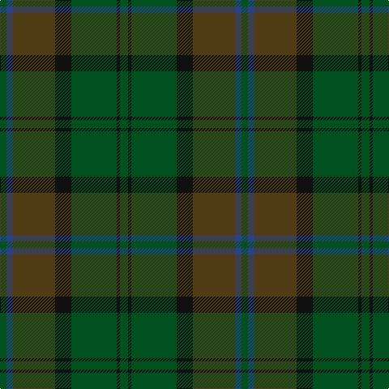

In pattern [GBGKGKG](/patterns/gbgkgkg/).

This was sourced from register-of-tartans.  It is a [7 stripes tartan](/stripes/stripes7/).

Original link https://www.tartanregister.gov.uk/tartanDetails.aspx?ref=1893

## Register references

External register numbers recorded for this tartan.

- Scottish Register of Tartans: [1893](https://www.tartanregister.gov.uk/tartanDetails.aspx?ref=1893)
- Scottish Tartans World Register: 776

## Thread count
G/8 B8 T52 K20 G56 K4 G/10

## Palette
Each colour and its ΔE from the base-6 reference it is a variant of.

| Colour | Shade | Base | ΔE (OKLab) |
|---|---|---|---|
| B | <code style="background-color:#2C4084;">#2C4084</code> `#2C4084` | B <code style="background-color:#2A418A;">#2A418A</code> | 0.01 |
| G | <code style="background-color:#005020;">#005020</code> `#005020` | G <code style="background-color:#006100;">#006100</code> | 0.07 |
| K | <code style="background-color:#101010;">#101010</code> `#101010` | K <code style="background-color:#000000;">#000000</code> | 0.17 |
| T | <code style="background-color:#503C14;">#503C14</code> `#503C14` | G <code style="background-color:#006100;">#006100</code> | 0.14 |

# Sample pattern

## Nearest tartans

The nearest existing variants by ΔTartan distance.

1. [Calais (Fashion)](/setts/s7/g11b4g6ga11b1k1ga4~b306084-g085454-ga604000-k000000~x4/) — ΔT 1.13
1. [MacNaughton Htg](/setts/s9/g1r1ga22gb21g12r11ga22r1g1~g003820-ga145024-gb604000-ra40800~x2/) — ΔT 1.20
1. [Park (Estate Check)](/setts/s6/g4ga18gb6ga6gb24y3~g5c6428-ga003820-gb285800-yb8a040~x2/) — ΔT 1.47
1. [Park Estate](/setts/s6/g4ga18gb6ga6gb24k3~g5c6428-ga003820-gb285800-k000000~x2/) — ΔT 1.48
1. [Galloway District Tartan Tartan Number: 1469. Earliest known date: 1950 In contemporary correspondence Mr Hannay said that the Galloway 'everyday' tartan was 'in four shades of green with yellow and red stripe'. Cree Mills of Newton-Stewart, however, used only two shades in the manufacture on Mr Hannay's behalf. MacGregor Hastie's collection includes this sett with the pale yellow rendered in white and called Galloway Hunting. See products available Copyright © Blair Urquhart, Comrie, 2015](/setts/s11/g20ga2y3ga2g32ga32g2r3g2ga32g12~g003820-ga285800-rc80000-yc4bc68~x2/) — ΔT 1.62
1. [Dempster Family Tartan Tartan Number: 2219. Earliest known date: 2001 Designed by Claire Donaldson of the House of Edgar. See products available Copyright © Blair Urquhart, Comrie, 2015](/setts/s7/b4g2ba16ba10g10b32bb3~b14283c-ba4c0000-bb5c5c5c-g285800~x2/) — ΔT 1.63
1. [Highland Granite](/setts/s10/b8g2b27k10ba4k2ba3k2ba16b2~b343434-ba585858-g7c7c7c-k101010~x2/) — ΔT 1.66
1. [Conlon](/setts/s9/g4b2g17ga2r4ga2g3ga11g2~b2c2c80-g005448-ga003820-r880000~x2/) — ΔT 1.68
1. [MacKinnon Hunting](/setts/s7/g1ga8g8r1g8ga8w1~g005020-ga503c14-rdc0000-we0e0e0~x2/) — ΔT 1.73
1. [Granite City (Fashion)](/setts/s8/k3b3k3b21ba21k3ba3y1~b5c5c5c-ba505050-k101010-ya0a0a0~x2/) — ΔT 1.77

## Neighbour map

Every grey dot is one of 15726 variants placed by the first two principal components of the ΔTartan feature space (44% of its variance). Red is this tartan; blue dots are its nearest — click one to open its page.

<svg viewBox="0 0 640 380" role="img" style="max-width:100%;height:auto;border:1px solid #e0e0e0;border-radius:4px;display:block" xmlns="http://www.w3.org/2000/svg"><image href="/nn/cloud.v1.png" width="640" height="380"/><a href="/setts/s7/g11b4g6ga11b1k1ga4~b306084-g085454-ga604000-k000000~x4/"><circle cx="368.7" cy="274.8" r="4" fill="#3465a4"><title>Calais (Fashion)</title></circle></a><a href="/setts/s9/g1r1ga22gb21g12r11ga22r1g1~g003820-ga145024-gb604000-ra40800~x2/"><circle cx="401.4" cy="224.0" r="4" fill="#3465a4"><title>MacNaughton Htg</title></circle></a><a href="/setts/s6/g4ga18gb6ga6gb24y3~g5c6428-ga003820-gb285800-yb8a040~x2/"><circle cx="376.0" cy="287.4" r="4" fill="#3465a4"><title>Park (Estate Check)</title></circle></a><a href="/setts/s6/g4ga18gb6ga6gb24k3~g5c6428-ga003820-gb285800-k000000~x2/"><circle cx="368.4" cy="286.0" r="4" fill="#3465a4"><title>Park Estate</title></circle></a><a href="/setts/s11/g20ga2y3ga2g32ga32g2r3g2ga32g12~g003820-ga285800-rc80000-yc4bc68~x2/"><circle cx="426.6" cy="224.4" r="4" fill="#3465a4"><title>Galloway District Tartan Tartan Number: 1469. Earliest known date: 1950 In contemporary correspondence Mr Hannay said that the Galloway 'everyday' tartan was 'in four shades of green with yellow and red stripe'. Cree Mills of Newton-Stewart, however, used only two shades in the manufacture on Mr Hannay's behalf. MacGregor Hastie's collection includes this sett with the pale yellow rendered in white and called Galloway Hunting. See products available Copyright © Blair Urquhart, Comrie, 2015</title></circle></a><a href="/setts/s7/b4g2ba16ba10g10b32bb3~b14283c-ba4c0000-bb5c5c5c-g285800~x2/"><circle cx="382.8" cy="237.2" r="4" fill="#3465a4"><title>Dempster Family Tartan Tartan Number: 2219. Earliest known date: 2001 Designed by Claire Donaldson of the House of Edgar. See products available Copyright © Blair Urquhart, Comrie, 2015</title></circle></a><a href="/setts/s10/b8g2b27k10ba4k2ba3k2ba16b2~b343434-ba585858-g7c7c7c-k101010~x2/"><circle cx="384.8" cy="216.8" r="4" fill="#3465a4"><title>Highland Granite</title></circle></a><a href="/setts/s9/g4b2g17ga2r4ga2g3ga11g2~b2c2c80-g005448-ga003820-r880000~x2/"><circle cx="443.1" cy="268.8" r="4" fill="#3465a4"><title>Conlon</title></circle></a><a href="/setts/s7/g1ga8g8r1g8ga8w1~g005020-ga503c14-rdc0000-we0e0e0~x2/"><circle cx="370.5" cy="282.1" r="4" fill="#3465a4"><title>MacKinnon Hunting</title></circle></a><a href="/setts/s8/k3b3k3b21ba21k3ba3y1~b5c5c5c-ba505050-k101010-ya0a0a0~x2/"><circle cx="394.3" cy="208.3" r="4" fill="#3465a4"><title>Granite City (Fashion)</title></circle></a><circle cx="390.9" cy="251.5" r="5" fill="#c00000"/></svg>

ID: /setts/s7/g5k2g28k10ga26b4g4~b2c4084-g005020-ga503c14-k101010~x2/
