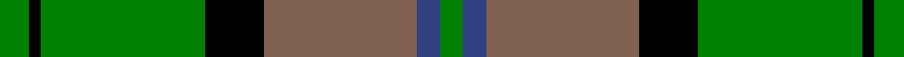

In pattern [GBRKGKG](/stripes/gbrkgkg/).

This was sourced from weddslist.  It is a [7 stripe tartan](/stripes/stripes7/).

Original link http://www.weddslist.com/cgi-bin/tartans/pg.pl?source=sts

## Thread count
G/10 K4 G56 K20 LT52 B8 G/8

## Palette
Each colour and the base-6 reference it is a variant of.

| Colour | Shade | Base |
|---|---|---|
| B | <code style="background-color:#304080;">#304080</code> `oklch(39.4% 0.109 270.2)` <small>#304080</small> | B <code style="background-color:#2A418A;">#2A418A</code> |
| G | <code style="background-color:#008000;">#008000</code> `oklch(52.0% 0.177 142.5)` <small>#008000</small> | G <code style="background-color:#006100;">#006100</code> |
| K | <code style="background-color:#000000;">#000000</code> `oklch(0.0% 0.000 0.0)` <small>#000000</small> | K <code style="background-color:#000000;">#000000</code> |
| LT | <code style="background-color:#806050;">#806050</code> `oklch(51.7% 0.049 47.8)` <small>#806050</small> | R <code style="background-color:#CC0000;">#CC0000</code> |

# Sample pattern

## Nearest tartans

The nearest existing variants by ΔTartan distance.

1. [MacHardy (Clans Originaux)](/setts/s8/g4r4k12w2k12g32r4k3~x2/) — ΔT 0.98
1. [Crantock](/setts/s8/g24p3g3p3g3p7dg20r3~x2/) — ΔT 1.02
1. [Crantock Trade Tartan Tartan Number: 707. Earliest known date: pre 2003 'Poached by Clan Laird from a Yorkshire mill and marketed as 'Crantock''(sic) (Scottish Tartans Society archives.) See products available Copyright © Blair Urquhart, Comrie, 2015](/setts/s8/g24dp3g3dp3g3dp7dg20r3~x2/) — ΔT 1.02
1. [Cork](/setts/s9/g28r12g4db20ly2db3ly2db3g7~x2/) — ΔT 1.04
1. [MacDuck](/setts/s6/k4dg5k2o21g8k2~x2/) — ΔT 1.10
1. [Georgia, State of](/setts/s8/g36k2g2k2g3k12t10r20~x2/) — ΔT 1.18
1. [Cape Breton University](/setts/s10/db4o17db4g4db2g4db4g27db4ly4~x2/) — ΔT 1.19
1. [Valley, of the Green. (The )](/setts/s7/t4dg26g8t8g8g3t2~x2/) — ΔT 1.20
1. [Keppoch](/setts/s7/k5g2k5g2db8g25w4~x2/) — ΔT 1.20
1. [Daks, Muted Loden](/setts/s8/o5g12dg4r4dg27g3dg4o5/) — ΔT 1.22

## Neighbour map

Every grey dot is one of 14299 variants placed by the first two principal components of the ΔTartan feature space (44% of its variance). Red is this tartan; blue dots are its nearest — click one to open its page.

<svg viewBox="0 0 640 380" role="img" style="max-width:100%;height:auto;border:1px solid #e0e0e0;border-radius:4px;display:block" xmlns="http://www.w3.org/2000/svg"><image href="/nn/cloud.v1.png" width="640" height="380"/><a href="/setts/s8/g4r4k12w2k12g32r4k3~x2/"><circle cx="296.8" cy="176.4" r="4" fill="#3465a4"><title>MacHardy (Clans Originaux)</title></circle></a><a href="/setts/s8/g24p3g3p3g3p7dg20r3~x2/"><circle cx="219.9" cy="191.9" r="4" fill="#3465a4"><title>Crantock</title></circle></a><a href="/setts/s8/g24dp3g3dp3g3dp7dg20r3~x2/"><circle cx="227.5" cy="196.1" r="4" fill="#3465a4"><title>Crantock Trade Tartan Tartan Number: 707. Earliest known date: pre 2003 'Poached by Clan Laird from a Yorkshire mill and marketed as 'Crantock''(sic) (Scottish Tartans Society archives.) See products available Copyright © Blair Urquhart, Comrie, 2015</title></circle></a><a href="/setts/s9/g28r12g4db20ly2db3ly2db3g7~x2/"><circle cx="274.5" cy="177.8" r="4" fill="#3465a4"><title>Cork</title></circle></a><a href="/setts/s6/k4dg5k2o21g8k2~x2/"><circle cx="245.2" cy="194.8" r="4" fill="#3465a4"><title>MacDuck</title></circle></a><a href="/setts/s8/g36k2g2k2g3k12t10r20~x2/"><circle cx="273.7" cy="165.5" r="4" fill="#3465a4"><title>Georgia, State of</title></circle></a><a href="/setts/s10/db4o17db4g4db2g4db4g27db4ly4~x2/"><circle cx="251.5" cy="159.3" r="4" fill="#3465a4"><title>Cape Breton University</title></circle></a><a href="/setts/s7/t4dg26g8t8g8g3t2~x2/"><circle cx="252.8" cy="210.6" r="4" fill="#3465a4"><title>Valley, of the Green. (The )</title></circle></a><a href="/setts/s7/k5g2k5g2db8g25w4~x2/"><circle cx="297.4" cy="186.8" r="4" fill="#3465a4"><title>Keppoch</title></circle></a><a href="/setts/s8/o5g12dg4r4dg27g3dg4o5/"><circle cx="292.3" cy="207.5" r="4" fill="#3465a4"><title>Daks, Muted Loden</title></circle></a><circle cx="253.5" cy="190.9" r="5" fill="#c00000"/></svg>

ID: /setts/s7/g5k2g28k10o26db4g4~x2/
