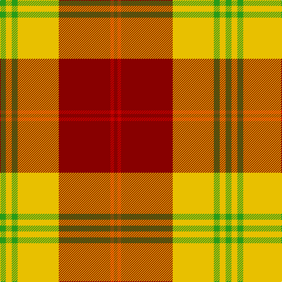

This page is one **sett** — a single exact thread-count. It belongs to the [tartan](/tartans/g5ly5g5ly35r44r3r3/)
(the same proportion at any scale), whose colour order is pattern [GYGYRRR](/stripes/gygyrrr/).

Sourced from tartans-authority.  It is a [7 stripe tartan](/stripes/stripes7/).

Original link http://www.tartansauthority.com/tartan-ferret/display/3966/

3 attestations — the source records this cloth was collapsed from (oldest owns this page)

<ul>
<li>2001 — Fernandes (Personal) (tartans-authority, <a href="http://www.tartansauthority.com/tartan-ferret/display/3966/">record</a>)</li>
<li>undated — Fernandes (Personal) (register-of-tartans, <a href="https://www.tartanregister.gov.uk/tartanDetails.aspx?ref=5028">record</a>)</li>
<li>undated — Fernandes Family Tartan Tartan Number: 3225. Earliest known date: 2001 Designed by Antonio Fernandes See products available Copyright © Blair Urquhart, Comrie, 2015 (house-of-tartan, <a href="http://www.house-of-tartan.scotland.net/house/TartanViewjs.asp?colr=Def&tnam=3225">record</a>)</li>
</ul>

## Register references

External register numbers recorded for this tartan.

- Scottish Register of Tartans: [5028](https://www.tartanregister.gov.uk/tartanDetails.aspx?ref=5028)
- Scottish Tartans Authority (ITI): 3966

## Thread count
G/10 Y10 G10 Y70 DR88 R6 DR/6

## Palette

Palette: <strong>Tartan Register</strong>
<table><thead><tr><th>Colour</th><th>Threads</th><th>Shade</th><th>Base</th><th>OKLCh</th></tr></thead><tbody><tr><td>G/</td><td style="text-align:right;font-variant-numeric:tabular-nums">10</td><td><code style="background-color:#289C18;">#289C18</code> <small style="color:#888">#289C18</small></td><td>G <code style="background-color:#006100;">#006100</code></td><td><small style="color:#888">oklch(60.6% 0.191 141.6)</small></td></tr><tr><td>Y</td><td style="text-align:right;font-variant-numeric:tabular-nums">10</td><td><code style="background-color:#E8C000;">#E8C000</code> <small style="color:#888">#E8C000</small></td><td>Y <code style="background-color:#F2BF00;">#F2BF00</code></td><td><small style="color:#888">oklch(81.9% 0.168 93.7)</small></td></tr><tr><td>G</td><td style="text-align:right;font-variant-numeric:tabular-nums">10</td><td><code style="background-color:#289C18;">#289C18</code> <small style="color:#888">#289C18</small></td><td>G <code style="background-color:#006100;">#006100</code></td><td><small style="color:#888">oklch(60.6% 0.191 141.6)</small></td></tr><tr><td>Y</td><td style="text-align:right;font-variant-numeric:tabular-nums">70</td><td><code style="background-color:#E8C000;">#E8C000</code> <small style="color:#888">#E8C000</small></td><td>Y <code style="background-color:#F2BF00;">#F2BF00</code></td><td><small style="color:#888">oklch(81.9% 0.168 93.7)</small></td></tr><tr><td>DR</td><td style="text-align:right;font-variant-numeric:tabular-nums">88</td><td><code style="background-color:#880000;">#880000</code> <small style="color:#888">#880000</small></td><td>R <code style="background-color:#CC0000;">#CC0000</code></td><td><small style="color:#888">oklch(39.4% 0.162 29.2)</small></td></tr><tr><td>R</td><td style="text-align:right;font-variant-numeric:tabular-nums">6</td><td><code style="background-color:#C80000;">#C80000</code> <small style="color:#888">#C80000</small></td><td>R <code style="background-color:#CC0000;">#CC0000</code></td><td><small style="color:#888">oklch(52.3% 0.215 29.2)</small></td></tr><tr><td>DR/</td><td style="text-align:right;font-variant-numeric:tabular-nums">6</td><td><code style="background-color:#880000;">#880000</code> <small style="color:#888">#880000</small></td><td>R <code style="background-color:#CC0000;">#CC0000</code></td><td><small style="color:#888">oklch(39.4% 0.162 29.2)</small></td></tr></tbody></table>

# Sample pattern

## Nearest tartans

The nearest existing variants by ΔTartan distance, with this tartan at the top so the swatches line up against it.

ΔTartan

Tartan

Sett

—

<a href="/ttd/edit/#slug=g5ly5g5ly35r44r3r3~x2">Fernandes (Personal)</a> <a class="nn-out" href="/setts/s7/g5ly5g5ly35r44r3r3~x2/" title="open its dictionary page">↗</a>

0.45

<a href="/ttd/edit/#slug=o15k1ly2db3o2k1ly15~x4">Scrymgeour Family Tartan Tartan Number: 1627. Earliest known date: 1971 Yellow ochre. A note in STS files says &quot;Not Adopted&quot; with no explanation. The STS research report reads, &quot;The tartan detailed above was displayed at a gathering of Scrymgeours held at Dudhope Castle, Dundee, in 1971 and was later adopted as the official tartan. The sett was designed by Donald C Stewart, author of 'The Setts of the Scottish Tartans' in 1970.&quot; See products available Copyright © Blair Urquhart, Comrie, 2015</a> <a class="nn-out" href="/setts/s7/o15k1ly2db3o2k1ly15~x4/" title="open its dictionary page">↗</a>

0.81

<a href="/ttd/edit/#slug=r15k1ly2db3r2k1ly15~x6">Scrymgeour</a> <a class="nn-out" href="/setts/s7/r15k1ly2db3r2k1ly15~x6/" title="open its dictionary page">↗</a>

0.81

<a href="/ttd/edit/#slug=r15k1ly2db3r2k1ly15~x3">Scrymgeour</a> <a class="nn-out" href="/setts/s7/r15k1ly2db3r2k1ly15~x3/" title="open its dictionary page">↗</a>

0.96

<a href="/ttd/edit/#slug=r46k3ly6db8r6k3ly46">Scrymgeour</a> <a class="nn-out" href="/setts/s7/r46k3ly6db8r6k3ly46/" title="open its dictionary page">↗</a>

1.13

<a href="/ttd/edit/#slug=g18w3ly1r2ly1r3ly1r10~x4">Brisbane (Artefact)</a> <a class="nn-out" href="/setts/s8/g18w3ly1r2ly1r3ly1r10~x4/" title="open its dictionary page">↗</a>

1.17

<a href="/ttd/edit/#slug=k2r4w1r10g12r2w2~x4">Starr (1978) (Name)</a> <a class="nn-out" href="/setts/s7/k2r4w1r10g12r2w2~x4/" title="open its dictionary page">↗</a>

1.34

<a href="/ttd/edit/#slug=g18lb3ly1r2ly1r3ly1r10~x4">Brisbane (Artefact)</a> <a class="nn-out" href="/setts/s8/g18lb3ly1r2ly1r3ly1r10~x4/" title="open its dictionary page">↗</a>

1.36

<a href="/ttd/edit/#slug=db4ly1r12ly2r2ly12r1ly4~x4">Glassary #3</a> <a class="nn-out" href="/setts/s8/db4ly1r12ly2r2ly12r1ly4~x4/" title="open its dictionary page">↗</a>

1.36

<a href="/ttd/edit/#slug=k1g6k1g6r16db1~x2">Denny, hunting</a> <a class="nn-out" href="/setts/s6/k1g6k1g6r16db1~x2/" title="open its dictionary page">↗</a>

1.40

<a href="/ttd/edit/#slug=g1ly1g1w1g10r20ly1~x4">Maver (Buckie)</a> <a class="nn-out" href="/setts/s7/g1ly1g1w1g10r20ly1~x4/" title="open its dictionary page">↗</a>

## Neighbour map

Every grey dot is one of 14299 variants placed by the first two principal components of the ΔTartan feature space (44% of its variance). Red is this tartan; blue dots are its nearest — click one to open its page.

<svg viewBox="0 0 640 380" role="img" style="max-width:100%;height:auto;border:1px solid #e0e0e0;border-radius:4px;display:block" xmlns="http://www.w3.org/2000/svg"><image href="/nn/cloud.v1.png" width="640" height="380"/><a href="/setts/s7/o15k1ly2db3o2k1ly15~x4/"><circle cx="267.6" cy="145.8" r="4" fill="#3465a4"><title>Scrymgeour Family Tartan Tartan Number: 1627. Earliest known date: 1971 Yellow ochre. A note in STS files says &quot;Not Adopted&quot; with no explanation. The STS research report reads, &quot;The tartan detailed above was displayed at a gathering of Scrymgeours held at Dudhope Castle, Dundee, in 1971 and was later adopted as the official tartan. The sett was designed by Donald C Stewart, author of 'The Setts of the Scottish Tartans' in 1970.&quot; See products available Copyright © Blair Urquhart, Comrie, 2015</title></circle></a><a href="/setts/s7/r15k1ly2db3r2k1ly15~x6/"><circle cx="267.0" cy="149.1" r="4" fill="#3465a4"><title>Scrymgeour</title></circle></a><a href="/setts/s7/r15k1ly2db3r2k1ly15~x3/"><circle cx="267.0" cy="149.1" r="4" fill="#3465a4"><title>Scrymgeour</title></circle></a><a href="/setts/s7/r46k3ly6db8r6k3ly46/"><circle cx="262.9" cy="130.3" r="4" fill="#3465a4"><title>Scrymgeour</title></circle></a><a href="/setts/s8/g18w3ly1r2ly1r3ly1r10~x4/"><circle cx="282.8" cy="138.0" r="4" fill="#3465a4"><title>Brisbane (Artefact)</title></circle></a><a href="/setts/s7/k2r4w1r10g12r2w2~x4/"><circle cx="264.8" cy="177.1" r="4" fill="#3465a4"><title>Starr (1978) (Name)</title></circle></a><a href="/setts/s8/g18lb3ly1r2ly1r3ly1r10~x4/"><circle cx="297.8" cy="146.2" r="4" fill="#3465a4"><title>Brisbane (Artefact)</title></circle></a><a href="/setts/s8/db4ly1r12ly2r2ly12r1ly4~x4/"><circle cx="298.1" cy="171.5" r="4" fill="#3465a4"><title>Glassary #3</title></circle></a><a href="/setts/s6/k1g6k1g6r16db1~x2/"><circle cx="323.7" cy="169.3" r="4" fill="#3465a4"><title>Denny, hunting</title></circle></a><a href="/setts/s7/g1ly1g1w1g10r20ly1~x4/"><circle cx="369.6" cy="117.8" r="4" fill="#3465a4"><title>Maver (Buckie)</title></circle></a><circle cx="284.6" cy="143.2" r="5" fill="#c00000"/></svg>

ID: /setts/s7/g5ly5g5ly35r44r3r3~x2/
