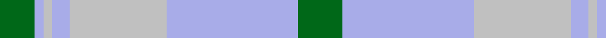

In pattern [GWWWWWG](/patterns/gwwwwwg/).

This was sourced from tartans-authority.  It is a [7 stripes tartan](/stripes/stripes7/).

Original link http://www.tartansauthority.com/tartan-ferret/display/687/

## Thread count
G/16 LP4 N4 LP8 N44 LPa60 G/20

## Palette
Each colour and its ΔE from the base-6 reference it is a variant of.

| Colour | Shade | Base | ΔE (OKLab) |
|---|---|---|---|
| G | <code style="background-color:#006818;">#006818</code> `#006818` | G <code style="background-color:#006100;">#006100</code> | 0.02 |
| LP | <code style="background-color:#A8ACE8;">#A8ACE8</code> `#A8ACE8` | W <code style="background-color:#F7F7F7;">#F7F7F7</code> | 0.23 |
| LPa | <code style="background-color:#A8ACE8;">#A8ACE8</code> `#A8ACE8` | W <code style="background-color:#F7F7F7;">#F7F7F7</code> | 0.23 |
| N | <code style="background-color:#C0C0C0;">#C0C0C0</code> `#C0C0C0` | W <code style="background-color:#F7F7F7;">#F7F7F7</code> | 0.17 |
| Na | <code style="background-color:#C0C0C0;">#C0C0C0</code> `#C0C0C0` | W <code style="background-color:#F7F7F7;">#F7F7F7</code> | 0.17 |

# Sample pattern

## Nearest tartans

The nearest existing variants by ΔTartan distance.

1. [Ailsa, Grey (Fashion)](/setts/s9/r9w9r9b25r1w1r1w1g3~b5c5c5c-g00881c-r888888-we0e0e0~x2/) — ΔT 1.61
1. [Organic](/setts/s9/g25b3g8b13y8ya2yb11g2b3~b9058d8-g669999-yc89800-yaa0a0a0-ybc4bc68~x2/) — ΔT 1.61
1. [Conquergood Family Tartan Tartan Number: 2095. Earliest known date: 1982 Designed to represent Canadian landscape in winter and sandy beaches in summer. Robert Conquergood, born in 1818 in Ormston, in the Parish of Roxburgh, Scotland, emigrated to Ontario, Canada with his father, also Robert, who was born in 1781. The Conquergood family in Canada approved this tartan at their 1990 biennial family reunion held at Kelowna, British Columbia. See products available Copyright © Blair Urquhart, Comrie, 2015](/setts/s8/b2ba2w11ba5r5w2b1ba2~b003c64-ba2888c4-r888888-we0e0e0~x2/) — ΔT 1.61
1. [North American Sheep Breeders Association](/setts/s7/r2w1y17r14w15r2w2~r888888-wf8e8d8-ya08858~x2/) — ΔT 1.62
1. [South Aiken Presby Church (Corporate](/setts/s6/y30g3b2w2b30ya4~b2888c4-g00a424-w98c8e8-yd0b06c-yad87c00~x2/) — ΔT 1.67
1. [Clyde](/setts/s10/w4b2w18r2b5g16r2g2r2g2~b505050-g808080-rc00000-wc0c0c0~x2/) — ΔT 1.71
1. [Alloway Primary (Corporate)](/setts/s8/y18r10w4b1wa30b1w4r10~b2c2c80-r888888-we0e0e0-wa98c8e8-yd8d458~x2/) — ΔT 1.73
1. [Clyde Trade Tartan Tartan Number: 1296. Earliest known date: pre 1992 See Strathclyde District See products available Copyright © Blair Urquhart, Comrie, 2015](/setts/s10/w4b2w18r2b5ra16r2ra2r2ra2~b5c5c5c-rc80000-ra888888-wc0c0c0~x2/) — ΔT 1.74
1. [Bannockbane Grey #2](/setts/s8/r2g2r15g2w10y15g2y2~g604000-r888888-we0e0e0-ya08858~x2/) — ΔT 1.79
1. [Hawaii (District)](/setts/s8/b4r1y1b12ba4g10y1r3~b5c8ca8-ba4c3428-g406054-rc80000-ye8c000~x4/) — ΔT 1.85

## Neighbour map

Every grey dot is one of 15726 variants placed by the first two principal components of the ΔTartan feature space (44% of its variance). Red is this tartan; blue dots are its nearest — click one to open its page.

<svg viewBox="0 0 640 380" role="img" style="max-width:100%;height:auto;border:1px solid #e0e0e0;border-radius:4px;display:block" xmlns="http://www.w3.org/2000/svg"><image href="/nn/cloud.v1.png" width="640" height="380"/><a href="/setts/s9/r9w9r9b25r1w1r1w1g3~b5c5c5c-g00881c-r888888-we0e0e0~x2/"><circle cx="296.0" cy="144.0" r="4" fill="#3465a4"><title>Ailsa, Grey (Fashion)</title></circle></a><a href="/setts/s9/g25b3g8b13y8ya2yb11g2b3~b9058d8-g669999-yc89800-yaa0a0a0-ybc4bc68~x2/"><circle cx="268.5" cy="182.0" r="4" fill="#3465a4"><title>Organic</title></circle></a><a href="/setts/s8/b2ba2w11ba5r5w2b1ba2~b003c64-ba2888c4-r888888-we0e0e0~x2/"><circle cx="205.5" cy="183.8" r="4" fill="#3465a4"><title>Conquergood Family Tartan Tartan Number: 2095. Earliest known date: 1982 Designed to represent Canadian landscape in winter and sandy beaches in summer. Robert Conquergood, born in 1818 in Ormston, in the Parish of Roxburgh, Scotland, emigrated to Ontario, Canada with his father, also Robert, who was born in 1781. The Conquergood family in Canada approved this tartan at their 1990 biennial family reunion held at Kelowna, British Columbia. See products available Copyright © Blair Urquhart, Comrie, 2015</title></circle></a><a href="/setts/s7/r2w1y17r14w15r2w2~r888888-wf8e8d8-ya08858~x2/"><circle cx="274.0" cy="196.9" r="4" fill="#3465a4"><title>North American Sheep Breeders Association</title></circle></a><a href="/setts/s6/y30g3b2w2b30ya4~b2888c4-g00a424-w98c8e8-yd0b06c-yad87c00~x2/"><circle cx="303.5" cy="171.6" r="4" fill="#3465a4"><title>South Aiken Presby Church (Corporate</title></circle></a><a href="/setts/s10/w4b2w18r2b5g16r2g2r2g2~b505050-g808080-rc00000-wc0c0c0~x2/"><circle cx="248.8" cy="175.7" r="4" fill="#3465a4"><title>Clyde</title></circle></a><a href="/setts/s8/y18r10w4b1wa30b1w4r10~b2c2c80-r888888-we0e0e0-wa98c8e8-yd8d458~x2/"><circle cx="257.3" cy="137.4" r="4" fill="#3465a4"><title>Alloway Primary (Corporate)</title></circle></a><a href="/setts/s10/w4b2w18r2b5ra16r2ra2r2ra2~b5c5c5c-rc80000-ra888888-wc0c0c0~x2/"><circle cx="262.5" cy="180.6" r="4" fill="#3465a4"><title>Clyde Trade Tartan Tartan Number: 1296. Earliest known date: pre 1992 See Strathclyde District See products available Copyright © Blair Urquhart, Comrie, 2015</title></circle></a><a href="/setts/s8/r2g2r15g2w10y15g2y2~g604000-r888888-we0e0e0-ya08858~x2/"><circle cx="213.2" cy="207.3" r="4" fill="#3465a4"><title>Bannockbane Grey #2</title></circle></a><a href="/setts/s8/b4r1y1b12ba4g10y1r3~b5c8ca8-ba4c3428-g406054-rc80000-ye8c000~x4/"><circle cx="248.0" cy="183.9" r="4" fill="#3465a4"><title>Hawaii (District)</title></circle></a><circle cx="239.4" cy="185.7" r="5" fill="#c00000"/></svg>

ID: /setts/s7/g5w15wa11w2wa1w1g4~g006818-wa8ace8-wac0c0c0~x4/
