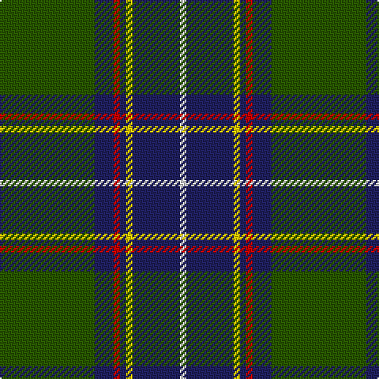

In pattern [GBRBYBW](/patterns/gbrbybw/).

This was sourced from tartans-authority.  It is a [7 stripes tartan](/stripes/stripes7/).

Original link http://www.tartansauthority.com/tartan-ferret/display/3993/

## Thread count
G/60 DB12 R4 DB4 Y4 DB30 LN/4

## Palette
Each colour and its ΔE from the base-6 reference it is a variant of.

| Colour | Shade | Base | ΔE (OKLab) |
|---|---|---|---|
| DB | <code style="background-color:#202060;">#202060</code> `#202060` | B <code style="background-color:#2A418A;">#2A418A</code> | 0.11 |
| G | <code style="background-color:#285800;">#285800</code> `#285800` | G <code style="background-color:#006100;">#006100</code> | 0.03 |
| LN | <code style="background-color:#E0E0E0;">#E0E0E0</code> `#E0E0E0` | W <code style="background-color:#F7F7F7;">#F7F7F7</code> | 0.07 |
| R | <code style="background-color:#C80000;">#C80000</code> `#C80000` | R <code style="background-color:#CC0000;">#CC0000</code> | 0.01 |
| Y | <code style="background-color:#FCCC00;">#FCCC00</code> `#FCCC00` | Y <code style="background-color:#F2BF00;">#F2BF00</code> | 0.04 |

# Sample pattern

## Nearest tartans

The nearest existing variants by ΔTartan distance.

1. [Carmichael Family Tartan Tartan Number: 1078. Earliest known date: 1907 It was the Carmichael of Artherstone who, in 1907, sealed a sample of the Carmichael tartan in the Collection of the Highland Society. This is the first known appearance of the tartan. This sett is sometimes woven in slightly different proportions, most noticable in the black and green stripes. Carmichaels are associated with the Stewarts of Appin and with the MacDougalls (MacMichaels), but all of the name, Carmichael, have the chiefs approval for the wearing of the Carmichael tartan. See products available Copyright © Blair Urquhart, Comrie, 2015](/setts/s6/k6g72b56r4b4y6-b2c2c80-g006818-k101010-rc80000-ye8c000/) — ΔT 0.74
1. [Singh Name Tartan Tartan Number: 2600. Earliest known date: 1999 Created for the use of those with the name Singh. The proposer was Sirdar Iqubal Singh, Lord of Butley See products available Copyright © Blair Urquhart, Comrie, 2015](/setts/s8/b6r6b72g34y4g42w4r6-b2c2c80-g006818-rc80000-we0e0e0-ye8c000/) — ΔT 0.89
1. [Highlands of Durham (Corporate)](/setts/s6/r12b8w4g54b74y4-b1c1c1c-g408060-rc80000-wfcfcfc-ye8c000/) — ΔT 0.89
1. [Vipont (Yellow line)](/setts/s7/r6g28k4b4g28k72y6-b9058d8-g006818-k101010-rc80000-ye8c000/) — ΔT 0.95
1. [Carmichael](/setts/s6/k6g72b56r4b4y6-b304080-g008000-k000000-rc00000-yf0c000/) — ΔT 0.97
1. [Carrick Hunting District Tartan Tartan Number: 721. Earliest known date: 1930 This sample comes from the MacGregor-Hastie collection which forms the basis of the cloth archive of the Scottish Tartans Society. Some of the samples, including this one, were unmarked. One can assume that the sample dates between 1930 and 1950. See products available Copyright © Blair Urquhart, Comrie, 2015](/setts/s8/g26b2g2b2g6ba10k8y4-b780078-ba2c2c80-g006818-k101010-ye8c000/) — ΔT 1.00
1. [Ware/Warr (Name)](/setts/s8/b18w4g60r12ra4r4ra4r12-b2474e8-g003820-rb84c00-ra880000-we0e0e0/) — ΔT 1.02
1. [Todd](/setts/s9/b80g6k6g24w6g6w6g6r6-b14283c-g285800-k101010-rc80000-wfcfcfc/) — ΔT 1.02
1. [Singh](/setts/s8/b6r6b72g34y4g42w4r6-b304080-g008000-rc00000-we0e0e0-yf0c000/) — ΔT 1.02
1. [Coalfields Regeneration Trust, The](/setts/s7/k4r2y2g16k30g4b2-b780078-g408060-k101010-rc8002c-yfccc00/) — ΔT 1.03

## Neighbour map

Every grey dot is one of 15726 variants placed by the first two principal components of the ΔTartan feature space (44% of its variance). Red is this tartan; blue dots are its nearest — click one to open its page.

<svg viewBox="0 0 640 380" role="img" style="max-width:100%;height:auto;border:1px solid #e0e0e0;border-radius:4px;display:block" xmlns="http://www.w3.org/2000/svg"><image href="/nn/cloud.v1.png" width="640" height="380"/><a href="/setts/s6/k6g72b56r4b4y6-b2c2c80-g006818-k101010-rc80000-ye8c000/"><circle cx="308.9" cy="167.6" r="4" fill="#3465a4"><title>Carmichael Family Tartan Tartan Number: 1078. Earliest known date: 1907 It was the Carmichael of Artherstone who, in 1907, sealed a sample of the Carmichael tartan in the Collection of the Highland Society. This is the first known appearance of the tartan. This sett is sometimes woven in slightly different proportions, most noticable in the black and green stripes. Carmichaels are associated with the Stewarts of Appin and with the MacDougalls (MacMichaels), but all of the name, Carmichael, have the chiefs approval for the wearing of the Carmichael tartan. See products available Copyright © Blair Urquhart, Comrie, 2015</title></circle></a><a href="/setts/s8/b6r6b72g34y4g42w4r6-b2c2c80-g006818-rc80000-we0e0e0-ye8c000/"><circle cx="279.2" cy="154.1" r="4" fill="#3465a4"><title>Singh Name Tartan Tartan Number: 2600. Earliest known date: 1999 Created for the use of those with the name Singh. The proposer was Sirdar Iqubal Singh, Lord of Butley See products available Copyright © Blair Urquhart, Comrie, 2015</title></circle></a><a href="/setts/s6/r12b8w4g54b74y4-b1c1c1c-g408060-rc80000-wfcfcfc-ye8c000/"><circle cx="298.5" cy="157.8" r="4" fill="#3465a4"><title>Highlands of Durham (Corporate)</title></circle></a><a href="/setts/s7/r6g28k4b4g28k72y6-b9058d8-g006818-k101010-rc80000-ye8c000/"><circle cx="300.1" cy="158.4" r="4" fill="#3465a4"><title>Vipont (Yellow line)</title></circle></a><a href="/setts/s6/k6g72b56r4b4y6-b304080-g008000-k000000-rc00000-yf0c000/"><circle cx="292.4" cy="160.5" r="4" fill="#3465a4"><title>Carmichael</title></circle></a><a href="/setts/s8/g26b2g2b2g6ba10k8y4-b780078-ba2c2c80-g006818-k101010-ye8c000/"><circle cx="285.7" cy="170.0" r="4" fill="#3465a4"><title>Carrick Hunting District Tartan Tartan Number: 721. Earliest known date: 1930 This sample comes from the MacGregor-Hastie collection which forms the basis of the cloth archive of the Scottish Tartans Society. Some of the samples, including this one, were unmarked. One can assume that the sample dates between 1930 and 1950. See products available Copyright © Blair Urquhart, Comrie, 2015</title></circle></a><a href="/setts/s8/b18w4g60r12ra4r4ra4r12-b2474e8-g003820-rb84c00-ra880000-we0e0e0/"><circle cx="273.4" cy="142.7" r="4" fill="#3465a4"><title>Ware/Warr (Name)</title></circle></a><a href="/setts/s9/b80g6k6g24w6g6w6g6r6-b14283c-g285800-k101010-rc80000-wfcfcfc/"><circle cx="299.9" cy="135.0" r="4" fill="#3465a4"><title>Todd</title></circle></a><a href="/setts/s8/b6r6b72g34y4g42w4r6-b304080-g008000-rc00000-we0e0e0-yf0c000/"><circle cx="277.1" cy="153.0" r="4" fill="#3465a4"><title>Singh</title></circle></a><a href="/setts/s7/k4r2y2g16k30g4b2-b780078-g408060-k101010-rc8002c-yfccc00/"><circle cx="317.0" cy="155.9" r="4" fill="#3465a4"><title>Coalfields Regeneration Trust, The</title></circle></a><circle cx="303.3" cy="161.0" r="5" fill="#c00000"/></svg>

ID: /setts/s7/g60b12r4b4y4b30w4-b202060-g285800-rc80000-we0e0e0-yfccc00/
