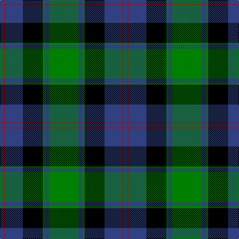

In pattern [BRBKGBG](/patterns/brbkgbg/).

This was sourced from weddslist.  It is a [7 stripes tartan](/stripes/stripes7/).

Original link http://www.weddslist.com/cgi-bin/tartans/pg.pl?source=sts

## Thread count
B/8 R2 B36 K40 G4 B8 G/60

## Palette
Each colour and its ΔE from the base-6 reference it is a variant of.

| Colour | Shade | Base | ΔE (OKLab) |
|---|---|---|---|
| B | <code style="background-color:#304080;">#304080</code> `#304080` | B <code style="background-color:#2C4084;">#2C4084</code> | 0.01 |
| G | <code style="background-color:#008000;">#008000</code> `#008000` | G <code style="background-color:#006400;">#006400</code> | 0.09 |
| K | <code style="background-color:#000000;">#000000</code> `#000000` | K <code style="background-color:#000000;">#000000</code> | 0.00 |
| R | <code style="background-color:#C00000;">#C00000</code> `#C00000` | R <code style="background-color:#C80000;">#C80000</code> | 0.02 |

# Sample pattern

## Nearest tartans

The nearest existing variants by ΔTartan distance.

1. [Common Kilt](/setts/s8/r6k4b50k56g50k4r2b4-b304080-g008000-k000000-rc00000/) — ΔT 0.95
1. [Johnstone / Johnston](/setts/s8/k6b6k6b44g52k4b2y6-b304080-g008000-k000000-yf0c000/) — ΔT 1.03
1. [Colquhoun](/setts/s7/b8k4b32w2k16g48r8-b304080-g008000-k000000-rc00000-we0e0e0/) — ΔT 1.04
1. [MacLaren](/setts/s7/b48k16g16r4g16k2y4-b304080-g008000-k000000-rc00000-yf0c000/) — ΔT 1.17
1. [Sinclair, hunting](/setts/s7/g4r2g60k32w2b32r4-b304080-g008000-k000000-rc00000-we0e0e0/) — ΔT 1.18
1. [Hebridean Old](/setts/s9/b4k4b36ba2k26ba2g32b6k4-b304080-ba8080d0-g008000-k000000/) — ΔT 1.20
1. [Lochaber District](/setts/s8/b2g1b16r1k12g16r1g2-b3c779d-g2d783e-k000000-rc80000/) — ΔT 1.21
1. [Ferguson of Athol](/setts/s7/b48k16g16r4g16k2w4-b304080-g008000-k000000-rc00000-we0e0e0/) — ΔT 1.22
1. [Lochaber](/setts/s8/g12r4g72k80r4b72ba4g8-b304080-ba5480b0-g008000-k000000-rc00000/) — ΔT 1.25
1. [Ogilvie, of Inverquharity](/setts/s8/b56y2b4k52g48k2g4r6-b304080-g008000-k000000-rc00000-yf0c000/) — ΔT 1.25

## Neighbour map

Every grey dot is one of 15726 variants placed by the first two principal components of the ΔTartan feature space (44% of its variance). Red is this tartan; blue dots are its nearest — click one to open its page.

<svg viewBox="0 0 640 380" role="img" style="max-width:100%;height:auto;border:1px solid #e0e0e0;border-radius:4px;display:block" xmlns="http://www.w3.org/2000/svg"><image href="/nn/cloud.v1.png" width="640" height="380"/><a href="/setts/s8/r6k4b50k56g50k4r2b4-b304080-g008000-k000000-rc00000/"><circle cx="219.5" cy="143.9" r="4" fill="#3465a4"><title>Common Kilt</title></circle></a><a href="/setts/s8/k6b6k6b44g52k4b2y6-b304080-g008000-k000000-yf0c000/"><circle cx="262.0" cy="140.4" r="4" fill="#3465a4"><title>Johnstone / Johnston</title></circle></a><a href="/setts/s7/b8k4b32w2k16g48r8-b304080-g008000-k000000-rc00000-we0e0e0/"><circle cx="208.1" cy="146.8" r="4" fill="#3465a4"><title>Colquhoun</title></circle></a><a href="/setts/s7/b48k16g16r4g16k2y4-b304080-g008000-k000000-rc00000-yf0c000/"><circle cx="231.8" cy="145.2" r="4" fill="#3465a4"><title>MacLaren</title></circle></a><a href="/setts/s7/g4r2g60k32w2b32r4-b304080-g008000-k000000-rc00000-we0e0e0/"><circle cx="247.0" cy="129.6" r="4" fill="#3465a4"><title>Sinclair, hunting</title></circle></a><a href="/setts/s9/b4k4b36ba2k26ba2g32b6k4-b304080-ba8080d0-g008000-k000000/"><circle cx="215.3" cy="158.1" r="4" fill="#3465a4"><title>Hebridean Old</title></circle></a><a href="/setts/s8/b2g1b16r1k12g16r1g2-b3c779d-g2d783e-k000000-rc80000/"><circle cx="204.4" cy="164.7" r="4" fill="#3465a4"><title>Lochaber District</title></circle></a><a href="/setts/s7/b48k16g16r4g16k2w4-b304080-g008000-k000000-rc00000-we0e0e0/"><circle cx="230.1" cy="144.6" r="4" fill="#3465a4"><title>Ferguson of Athol</title></circle></a><a href="/setts/s8/g12r4g72k80r4b72ba4g8-b304080-ba5480b0-g008000-k000000-rc00000/"><circle cx="184.0" cy="141.5" r="4" fill="#3465a4"><title>Lochaber</title></circle></a><a href="/setts/s8/b56y2b4k52g48k2g4r6-b304080-g008000-k000000-rc00000-yf0c000/"><circle cx="195.2" cy="126.2" r="4" fill="#3465a4"><title>Ogilvie, of Inverquharity</title></circle></a><circle cx="239.2" cy="158.6" r="5" fill="#c00000"/></svg>

ID: /setts/s7/g60b8g4k40b36r2b8-b304080-g008000-k000000-rc00000/
