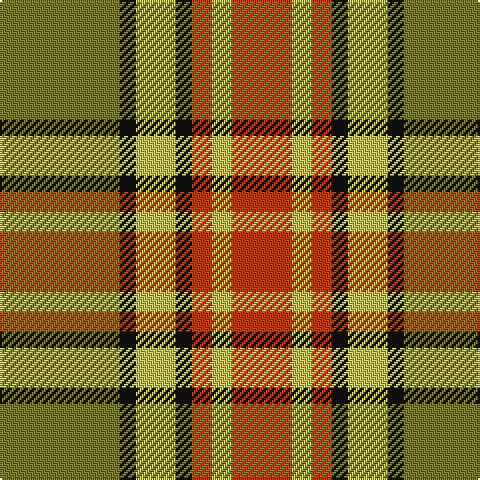

In pattern [GKYKRYR](/patterns/gkykryr/).

This was sourced from register-of-tartans.  It is a [7 stripes tartan](/stripes/stripes7/).

Original link https://www.tartanregister.gov.uk/tartanDetails.aspx?ref=1498

## Thread count
LT/60 K8 LG20 K8 R10 LG10 R/30

## Palette
Each colour and its ΔE from the base-6 reference it is a variant of.

| Colour | Shade | Base | ΔE (OKLab) |
|---|---|---|---|
| K | <code style="background-color:#101010;">#101010</code> `#101010` | K <code style="background-color:#000000;">#000000</code> | 0.17 |
| LG | <code style="background-color:#BDBD65;">#BDBD65</code> `#BDBD65` | Y <code style="background-color:#E8C000;">#E8C000</code> | 0.08 |
| LT | <code style="background-color:#777733;">#777733</code> `#777733` | G <code style="background-color:#006400;">#006400</code> | 0.15 |
| R | <code style="background-color:#B13E0F;">#B13E0F</code> `#B13E0F` | R <code style="background-color:#C80000;">#C80000</code> | 0.06 |

# Sample pattern

ID: /setts/s7/g60k8y20k8r10y10r30-g777733-k101010-rb13e0f-ybdbd65/
