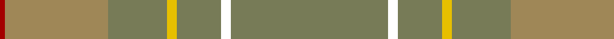

In pattern [GWGYGRR](/patterns/gwgygrr/).

This was sourced from register-of-tartans.  It is a [7 stripes tartan](/stripes/stripes7/).

Original link https://www.tartanregister.gov.uk/tartanDetails.aspx?ref=10732

## Attestations

This cloth appears in 2 source records; the oldest owns this page.

- 01/09/2012 — Weathered Cyclist (register-of-tartans, [record](https://www.tartanregister.gov.uk/tartanDetails.aspx?ref=10732))
- undated — Weathered Cyclist Commemorative Tartan Tartan Number: 10732. Earliest known date: 6 November 2012 Designed for The Tartan Ride, a charity cycling event. Once woven, this tartan is for all to wear, however the design as an entity may not be used without the designer's express permission. The design is the intellectual property of Ali Campbell and is a device of The Tartan Ride. Any use of the design must be authorised by the designer. See products available Copyright © Blair Urquhart, Comrie, 2015 (house-of-tartan, [record](http://www.house-of-tartan.scotland.net/house/TartanViewjs.asp?colr=Def&tnam=10732))

## Thread count
DR/2 LT42 G24 Y4 G18 W4 G/64

## Palette
Each colour and its ΔE from the base-6 reference it is a variant of.

| Colour | Shade | Base | ΔE (OKLab) |
|---|---|---|---|
| DR | <code style="background-color:#A40000;">#A40000</code> `#A40000` | R <code style="background-color:#CC0000;">#CC0000</code> | 0.09 |
| G | <code style="background-color:#777B57;">#777B57</code> `#777B57` | G <code style="background-color:#006100;">#006100</code> | 0.18 |
| LT | <code style="background-color:#9F8757;">#9F8757</code> `#9F8757` | R <code style="background-color:#CC0000;">#CC0000</code> | 0.21 |
| W | <code style="background-color:#FFFFFF;">#FFFFFF</code> `#FFFFFF` | W <code style="background-color:#F7F7F7;">#F7F7F7</code> | 0.02 |
| Y | <code style="background-color:#E7BF00;">#E7BF00</code> `#E7BF00` | Y <code style="background-color:#F2BF00;">#F2BF00</code> | 0.02 |

# Sample pattern

## Nearest tartans

The nearest existing variants by ΔTartan distance.

1. [Tricor (Corporate)](/setts/s7/g92r16ga24gb24g16w4g16-g8c7038-ga604000-gb00643c-r98481c-wc0c0c0/) — ΔT 1.66
1. [McGuigan, Julia (St Monans, Fife) (Personal)](/setts/s4/g18ga104gb30y8-g70714d-ga5a601e-gb4e3d20-ybfab40/) — ΔT 2.37
1. [Orkney Slate (Corporate)](/setts/s8/b8r74w8b42r11ba2r16b4-b5c5c5c-ba780078-r888888-wc0c0c0/) — ΔT 2.46
1. [Weathered Cyclist (Corporate)](/setts/s7/r64w4r18y4r24ya42ra2-ra07c58-rac80000-wfcfcfc-yfccc00-yaa08858/) — ΔT 2.51
1. [Outlander #1](/setts/s6/g104y4b48r6ya52b8-b5c5c5c-g808080-r960000-ye8c000-yaa08858/) — ΔT 2.51
1. [Orkney Slate (Fashion)](/setts/s8/b8r74w8b42r11ba2r16b4-b5c5c5c-ba440044-r888888-wc0c0c0/) — ΔT 2.57
1. [Highland Greenford (Personal)](/setts/s4/g100ga50y4b12-b440044-g5c6428-ga604000-yc4bc68/) — ΔT 2.58
1. [Outlander #1](/setts/s6/r104y4b48ra6ya52b8-b5c5c5c-r888888-raa00000-yfccc00-yaa08858/) — ΔT 2.59
1. [Long Way Down, The (Corporate)](/setts/s11/r110g12ga6w6ga6w6ga20gb10ga10y4ga6-g606000-ga708048-gb707070-r888888-wc0c8cc-yb8b8b8/) — ΔT 2.63
1. [McKerrell of Hillhouse Dress (Clan)](/setts/s4/w8r56b96y6-b5c8ca8-r888888-we0e0e0-ye8c000/) — ΔT 2.68

## Neighbour map

Every grey dot is one of 15726 variants placed by the first two principal components of the ΔTartan feature space (44% of its variance). Red is this tartan; blue dots are its nearest — click one to open its page.

<svg viewBox="0 0 640 380" role="img" style="max-width:100%;height:auto;border:1px solid #e0e0e0;border-radius:4px;display:block" xmlns="http://www.w3.org/2000/svg"><image href="/nn/cloud.v1.png" width="640" height="380"/><a href="/setts/s7/g92r16ga24gb24g16w4g16-g8c7038-ga604000-gb00643c-r98481c-wc0c0c0/"><circle cx="504.7" cy="209.5" r="4" fill="#3465a4"><title>Tricor (Corporate)</title></circle></a><a href="/setts/s4/g18ga104gb30y8-g70714d-ga5a601e-gb4e3d20-ybfab40/"><circle cx="536.8" cy="289.9" r="4" fill="#3465a4"><title>McGuigan, Julia (St Monans, Fife) (Personal)</title></circle></a><a href="/setts/s8/b8r74w8b42r11ba2r16b4-b5c5c5c-ba780078-r888888-wc0c0c0/"><circle cx="527.4" cy="185.9" r="4" fill="#3465a4"><title>Orkney Slate (Corporate)</title></circle></a><a href="/setts/s7/r64w4r18y4r24ya42ra2-ra07c58-rac80000-wfcfcfc-yfccc00-yaa08858/"><circle cx="607.9" cy="231.6" r="4" fill="#3465a4"><title>Weathered Cyclist (Corporate)</title></circle></a><a href="/setts/s6/g104y4b48r6ya52b8-b5c5c5c-g808080-r960000-ye8c000-yaa08858/"><circle cx="420.5" cy="215.9" r="4" fill="#3465a4"><title>Outlander #1</title></circle></a><a href="/setts/s8/b8r74w8b42r11ba2r16b4-b5c5c5c-ba440044-r888888-wc0c0c0/"><circle cx="521.8" cy="183.5" r="4" fill="#3465a4"><title>Orkney Slate (Fashion)</title></circle></a><a href="/setts/s4/g100ga50y4b12-b440044-g5c6428-ga604000-yc4bc68/"><circle cx="504.4" cy="250.5" r="4" fill="#3465a4"><title>Highland Greenford (Personal)</title></circle></a><a href="/setts/s6/r104y4b48ra6ya52b8-b5c5c5c-r888888-raa00000-yfccc00-yaa08858/"><circle cx="405.6" cy="208.0" r="4" fill="#3465a4"><title>Outlander #1</title></circle></a><a href="/setts/s11/r110g12ga6w6ga6w6ga20gb10ga10y4ga6-g606000-ga708048-gb707070-r888888-wc0c8cc-yb8b8b8/"><circle cx="475.0" cy="139.2" r="4" fill="#3465a4"><title>Long Way Down, The (Corporate)</title></circle></a><a href="/setts/s4/w8r56b96y6-b5c8ca8-r888888-we0e0e0-ye8c000/"><circle cx="499.5" cy="279.5" r="4" fill="#3465a4"><title>McKerrell of Hillhouse Dress (Clan)</title></circle></a><circle cx="559.0" cy="211.6" r="5" fill="#c00000"/></svg>

ID: /setts/s7/g64w4g18y4g24r42ra2-g777b57-r9f8757-raa40000-wffffff-ye7bf00/
