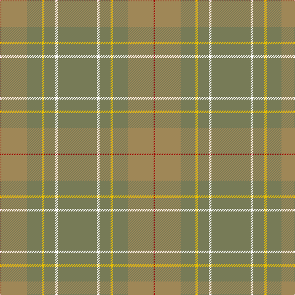

In pattern [GWGYGYR](/patterns/gwgygyr/).

This was sourced from register-of-tartans.  It is a [7 stripes tartan](/stripes/stripes7/).

Original link https://www.tartanregister.gov.uk/tartanDetails.aspx?ref=10732

## Thread count
DR/2 LT42 G24 Y4 G18 W4 G/64

## Palette
Each colour and its ΔE from the base-6 reference it is a variant of.

| Colour | Shade | Base | ΔE (OKLab) |
|---|---|---|---|
| DR | <code style="background-color:#A40000;">#A40000</code> `#A40000` | R <code style="background-color:#C80000;">#C80000</code> | 0.08 |
| G | <code style="background-color:#777B57;">#777B57</code> `#777B57` | G <code style="background-color:#006400;">#006400</code> | 0.17 |
| LT | <code style="background-color:#9F8757;">#9F8757</code> `#9F8757` | Y <code style="background-color:#E8C000;">#E8C000</code> | 0.21 |
| W | <code style="background-color:#FFFFFF;">#FFFFFF</code> `#FFFFFF` | W <code style="background-color:#F4F4F0;">#F4F4F0</code> | 0.03 |
| Y | <code style="background-color:#E7BF00;">#E7BF00</code> `#E7BF00` | Y <code style="background-color:#E8C000;">#E8C000</code> | 0.00 |

# Sample pattern

ID: /setts/s7/g64w4g18y4g24ya42r2-g777b57-ra40000-wffffff-ye7bf00-ya9f8757/
