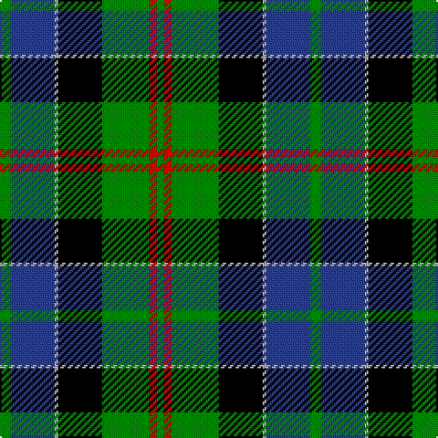

In pattern [GBYKGRG](/patterns/gbykgrg/).

This was sourced from weddslist.  It is a [7 stripes tartan](/stripes/stripes7/).

Original link http://www.weddslist.com/cgi-bin/tartans/pg.pl?source=sts

## Thread count
G/6 B24 N2 K24 G26 R4 G/4

## Palette
Each colour and its ΔE from the base-6 reference it is a variant of.

| Colour | Shade | Base | ΔE (OKLab) |
|---|---|---|---|
| B | <code style="background-color:#304080;">#304080</code> `#304080` | B <code style="background-color:#2A418A;">#2A418A</code> | 0.02 |
| G | <code style="background-color:#008000;">#008000</code> `#008000` | G <code style="background-color:#006100;">#006100</code> | 0.10 |
| K | <code style="background-color:#000000;">#000000</code> `#000000` | K <code style="background-color:#000000;">#000000</code> | 0.00 |
| N | <code style="background-color:#B0B0B0;">#B0B0B0</code> `#B0B0B0` | Y <code style="background-color:#F2BF00;">#F2BF00</code> | 0.18 |
| R | <code style="background-color:#C00000;">#C00000</code> `#C00000` | R <code style="background-color:#CC0000;">#CC0000</code> | 0.03 |

# Sample pattern

## Nearest tartans

The nearest existing variants by ΔTartan distance.

1. [MacFadzean, MacPhedran](/setts/s7/g6b24w2k24g26r4g4-b304080-g008000-k000000-rc00000-we0e0e0/) — ΔT 0.07
1. [MacTaggert](/setts/s7/g18b4g2k12ba12r2ba2-b5480b0-ba304080-g008000-k000000-rc00000/) — ΔT 0.67
1. [MacLeod of Assynt](/setts/s6/r6k4g30k20b40y4-b304080-g008000-k000000-rc00000-yf0c000/) — ΔT 0.76
1. [MacCaskill](/setts/s7/k4r2g30k30b30y2k4-b304080-g008000-k000000-rc00000-yf0c000/) — ΔT 0.79
1. [MacLeod, Macleod of Harris](/setts/s7/r6k4g30k20b40k4y4-b304080-g008000-k000000-rc00000-yf0c000/) — ΔT 0.79
1. [MacThomas](/setts/s7/b6r4b44k22g48w4g6-b304080-g008000-k000000-r900030-wc0a0e0/) — ΔT 0.79
1. [MacPhail, hunting](/setts/s6/r4b46k28g32k4w4-b304080-g008000-k000000-rc00000-we0e0e0/) — ΔT 0.80
1. [Forsyth (1795)](/setts/s6/k8g44y4k32b36r8-b1474b4-g007800-k000000-rc80000-ye8c000/) — ΔT 0.81
1. [Russell, or Mitchell or Hunter or Galbraith](/setts/s6/k4g24k24r2b24w4-b304080-g008000-k000000-rc00000-we0e0e0/) — ΔT 0.81
1. [Forsyth](/setts/s6/k8g44y4k32b36r8-b304080-g008000-k000000-rc00000-yf0c000/) — ΔT 0.82

## Neighbour map

Every grey dot is one of 15726 variants placed by the first two principal components of the ΔTartan feature space (44% of its variance). Red is this tartan; blue dots are its nearest — click one to open its page.

<svg viewBox="0 0 640 380" role="img" style="max-width:100%;height:auto;border:1px solid #e0e0e0;border-radius:4px;display:block" xmlns="http://www.w3.org/2000/svg"><image href="/nn/cloud.v1.png" width="640" height="380"/><a href="/setts/s7/g6b24w2k24g26r4g4-b304080-g008000-k000000-rc00000-we0e0e0/"><circle cx="162.5" cy="177.8" r="4" fill="#3465a4"><title>MacFadzean, MacPhedran</title></circle></a><a href="/setts/s7/g18b4g2k12ba12r2ba2-b5480b0-ba304080-g008000-k000000-rc00000/"><circle cx="140.5" cy="191.0" r="4" fill="#3465a4"><title>MacTaggert</title></circle></a><a href="/setts/s6/r6k4g30k20b40y4-b304080-g008000-k000000-rc00000-yf0c000/"><circle cx="150.1" cy="192.0" r="4" fill="#3465a4"><title>MacLeod of Assynt</title></circle></a><a href="/setts/s7/k4r2g30k30b30y2k4-b304080-g008000-k000000-rc00000-yf0c000/"><circle cx="173.4" cy="165.8" r="4" fill="#3465a4"><title>MacCaskill</title></circle></a><a href="/setts/s7/r6k4g30k20b40k4y4-b304080-g008000-k000000-rc00000-yf0c000/"><circle cx="146.9" cy="178.3" r="4" fill="#3465a4"><title>MacLeod, Macleod of Harris</title></circle></a><a href="/setts/s7/b6r4b44k22g48w4g6-b304080-g008000-k000000-r900030-wc0a0e0/"><circle cx="190.7" cy="174.2" r="4" fill="#3465a4"><title>MacThomas</title></circle></a><a href="/setts/s6/r4b46k28g32k4w4-b304080-g008000-k000000-rc00000-we0e0e0/"><circle cx="162.8" cy="185.0" r="4" fill="#3465a4"><title>MacPhail, hunting</title></circle></a><a href="/setts/s6/k8g44y4k32b36r8-b1474b4-g007800-k000000-rc80000-ye8c000/"><circle cx="116.9" cy="194.4" r="4" fill="#3465a4"><title>Forsyth (1795)</title></circle></a><a href="/setts/s6/k4g24k24r2b24w4-b304080-g008000-k000000-rc00000-we0e0e0/"><circle cx="132.3" cy="189.4" r="4" fill="#3465a4"><title>Russell, or Mitchell or Hunter or Galbraith</title></circle></a><a href="/setts/s6/k8g44y4k32b36r8-b304080-g008000-k000000-rc00000-yf0c000/"><circle cx="123.2" cy="196.1" r="4" fill="#3465a4"><title>Forsyth</title></circle></a><circle cx="164.5" cy="178.8" r="5" fill="#c00000"/></svg>

ID: /setts/s7/g6b24y2k24g26r4g4-b304080-g008000-k000000-rc00000-yb0b0b0/
