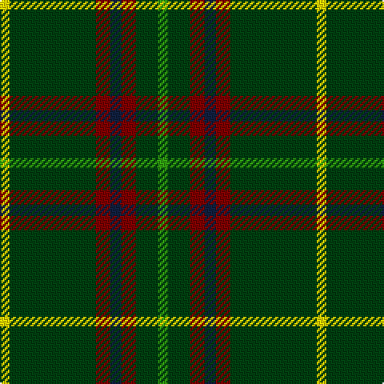

In pattern [GGRBRGY](/stripes/ggrbrgy/).

This was sourced from weddslist.  It is a [7 stripe tartan](/stripes/stripes7/).

Original link http://www.weddslist.com/cgi-bin/tartans/pg.pl?source=sts

## Thread count
Y/6 DG54 DR9 DB7 DR9 DG14 G/6

## Palette
Each colour and the base-6 reference it is a variant of.

| Colour | Shade | Base |
|---|---|---|
| DB | <code style="background-color:#102040;">#102040</code> `oklch(24.9% 0.065 262.6)` <small>#102040</small> | B <code style="background-color:#2A418A;">#2A418A</code> |
| DG | <code style="background-color:#004010;">#004010</code> `oklch(32.3% 0.098 146.3)` <small>#004010</small> | G <code style="background-color:#006100;">#006100</code> |
| DR | <code style="background-color:#800000;">#800000</code> `oklch(37.7% 0.155 29.2)` <small>#800000</small> | R <code style="background-color:#CC0000;">#CC0000</code> |
| G | <code style="background-color:#30A010;">#30A010</code> `oklch(61.9% 0.195 140.5)` <small>#30A010</small> | G <code style="background-color:#006100;">#006100</code> |
| Y | <code style="background-color:#FFE000;">#FFE000</code> `oklch(90.5% 0.188 99.1)` <small>#FFE000</small> | Y <code style="background-color:#F2BF00;">#F2BF00</code> |

# Sample pattern

## Nearest tartans

The nearest existing variants by ΔTartan distance.

1. [Tulloch Homes](/setts/s7/g6g14r9dt7r9g54ly6/) — ΔT 1.09
1. [St Johns County Sheriff Office (Cor)](/setts/s5/r17db7lo8g58k6~x2/) — ΔT 1.11
1. [Paton (Personal)](/setts/s7/r3g20k20g20lo2g2lo2~x2/) — ΔT 1.19
1. [Ronald, Clan (Clan)](/setts/s11/db2r1g10r1k6g12r2g1r1g3w2~x4/) — ΔT 1.25
1. [Marshall Field](/setts/s8/g10db1w1db1ly1db6g8r1~x8/) — ΔT 1.27
1. [Arkansas](/setts/s7/dg3w1dg12r6dg3k3g2~x4/) — ΔT 1.37
1. [Selvon-Bruce (Personal)](/setts/s7/k3g2k3g18r2db2lo1~x4/) — ΔT 1.40
1. [Hynde (Sir John)](/setts/s11/g28r2g28r7lb2r7lb2r7k5dp4lb2~x2/) — ΔT 1.40
1. [St Johns County's Sheriff's Office](/setts/s5/r17db7lo8dg58k6~x2/) — ΔT 1.41
1. [William & Mary GALA (Corporate)](/setts/s11/k3db10dg25ly2dg2ly3dg2ly2dg25db10w3~x2/) — ΔT 1.43

## Neighbour map

Every grey dot is one of 14299 variants placed by the first two principal components of the ΔTartan feature space (44% of its variance). Red is this tartan; blue dots are its nearest — click one to open its page.

<svg viewBox="0 0 640 380" role="img" style="max-width:100%;height:auto;border:1px solid #e0e0e0;border-radius:4px;display:block" xmlns="http://www.w3.org/2000/svg"><image href="/nn/cloud.v1.png" width="640" height="380"/><a href="/setts/s7/g6g14r9dt7r9g54ly6/"><circle cx="357.1" cy="192.1" r="4" fill="#3465a4"><title>Tulloch Homes</title></circle></a><a href="/setts/s5/r17db7lo8g58k6~x2/"><circle cx="325.7" cy="200.2" r="4" fill="#3465a4"><title>St Johns County Sheriff Office (Cor)</title></circle></a><a href="/setts/s7/r3g20k20g20lo2g2lo2~x2/"><circle cx="347.8" cy="221.4" r="4" fill="#3465a4"><title>Paton (Personal)</title></circle></a><a href="/setts/s11/db2r1g10r1k6g12r2g1r1g3w2~x4/"><circle cx="323.8" cy="160.8" r="4" fill="#3465a4"><title>Ronald, Clan (Clan)</title></circle></a><a href="/setts/s8/g10db1w1db1ly1db6g8r1~x8/"><circle cx="326.4" cy="186.3" r="4" fill="#3465a4"><title>Marshall Field</title></circle></a><a href="/setts/s7/dg3w1dg12r6dg3k3g2~x4/"><circle cx="295.0" cy="190.5" r="4" fill="#3465a4"><title>Arkansas</title></circle></a><a href="/setts/s7/k3g2k3g18r2db2lo1~x4/"><circle cx="379.4" cy="154.9" r="4" fill="#3465a4"><title>Selvon-Bruce (Personal)</title></circle></a><a href="/setts/s11/g28r2g28r7lb2r7lb2r7k5dp4lb2~x2/"><circle cx="336.1" cy="153.6" r="4" fill="#3465a4"><title>Hynde (Sir John)</title></circle></a><a href="/setts/s5/r17db7lo8dg58k6~x2/"><circle cx="317.4" cy="197.5" r="4" fill="#3465a4"><title>St Johns County's Sheriff's Office</title></circle></a><a href="/setts/s11/k3db10dg25ly2dg2ly3dg2ly2dg25db10w3~x2/"><circle cx="323.8" cy="153.2" r="4" fill="#3465a4"><title>William &amp; Mary GALA (Corporate)</title></circle></a><circle cx="352.6" cy="193.5" r="5" fill="#c00000"/></svg>

ID: /setts/s7/g6dg14r9dt7r9dg54ly6/
