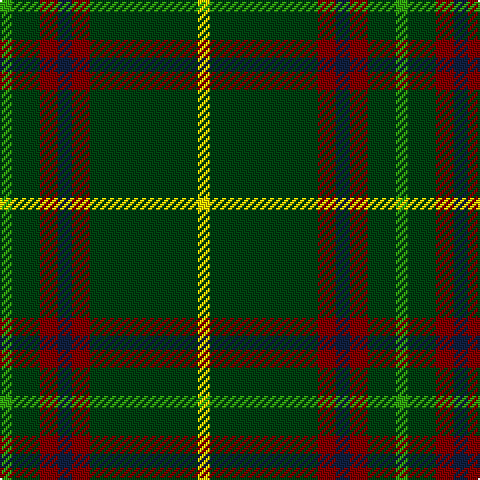

In pattern [GGRBRGY](/patterns/ggrbrgy/).

This was sourced from weddslist.  It is a [7 stripes tartan](/stripes/stripes7/).

Original link http://www.weddslist.com/cgi-bin/tartans/pg.pl?source=sts

## Thread count
G/6 DG14 DR9 DB7 DR9 DG54 Y/6

## Palette
Each colour and its ΔE from the base-6 reference it is a variant of.

| Colour | Shade | Base | ΔE (OKLab) |
|---|---|---|---|
| DB | <code style="background-color:#102040;">#102040</code> `#102040` | B <code style="background-color:#2A418A;">#2A418A</code> | 0.16 |
| DG | <code style="background-color:#004010;">#004010</code> `#004010` | G <code style="background-color:#006100;">#006100</code> | 0.11 |
| DR | <code style="background-color:#800000;">#800000</code> `#800000` | R <code style="background-color:#CC0000;">#CC0000</code> | 0.17 |
| G | <code style="background-color:#30A010;">#30A010</code> `#30A010` | G <code style="background-color:#006100;">#006100</code> | 0.20 |
| Y | <code style="background-color:#FFE000;">#FFE000</code> `#FFE000` | Y <code style="background-color:#F2BF00;">#F2BF00</code> | 0.09 |

# Sample pattern

## Nearest tartans

The nearest existing variants by ΔTartan distance.

1. [Tulloch Homes](/setts/s7/g6ga14r9b7r9ga54y6~b14283c-g289c18-ga006818-rc80000-ye8c000/) — ΔT 1.08
1. [St Johns County Sheriff Office (Cor)](/setts/s5/r17b7y8g58k6~b1c0070-g006818-k101010-rc80000-ybc8c00~x2/) — ΔT 1.11
1. [Paton (Personal)](/setts/s7/r3g20k20g20y2g2y2~g006818-k101010-r880000-yd09800~x2/) — ΔT 1.18
1. [Ronald, Clan (Clan)](/setts/s11/b2r1g10r1k6g12r2g1r1g3w2~b2c2c80-g006818-k101010-rc80000-we0e0e0~x4/) — ΔT 1.26
1. [Marshall Field](/setts/s8/g10b1w1b1y1b6g8r1~b2c2c80-g006818-rc80000-wfcfcfc-ye8c000~x8/) — ΔT 1.27
1. [Arkansas](/setts/s7/g3w1g12r6g3k3ga2~g004010-ga008000-k000000-rc00020-we0e0e0~x4/) — ΔT 1.37
1. [MacKintosh Hunting Clan Tartan Tartan Number: 544. Earliest known date: 1951 This sett appears in D.C. Stewarts book, The Setts of the Scottish Tartans, with slightly different proportions. The Lyon Court Book No. 1 records the sett in relation to the narrowest stripe. ie Y 1, Vt (Vert meaning green) 10 1/2, Bu 5, etc. The rendering illustrated here multiplies the Lyon count by two. Commercially manufactured cloth may vary from these proportions. D.C. Stewart calls the sett "a modern arrangement". See products available Copyright © Blair Urquhart, Comrie, 2015](/setts/s7/b1r3g11r2b5g11y1~b2c2c80-g006818-rc80000-ye8c000~x2/) — ΔT 1.39
1. [Selvon-Bruce (Personal)](/setts/s7/k3g2k3g18r2b2y1~b1c1c50-g288028-k101010-r880000-ybc8c00~x4/) — ΔT 1.39
1. [Sevlon Bruce Personal Tartan Tartan Number: 7566. Earliest known date: 2008 The tartan has been designed to celebrate the wedding of Nathalie Selvon and Alex Bruce, to mark the beginning of a new family. The colours blend the histories of our two families. The red and green are from the Ancient Bruce and the yellow and blue are consistent with the flag of Mauritius, the country where the Selvon family trace their roots. See products available Copyright © Blair Urquhart, Comrie, 2015](/setts/s7/k3g2k3g18r2b2y1~b1c1c50-g006818-k101010-r880000-ybc8c00~x4/) — ΔT 1.39
1. [Hynde (Sir John)](/setts/s11/g28r2g28r7w2r7w2r7k5b4w2~b6c0070-g006818-k101010-r880000-wc0c0c0~x2/) — ΔT 1.41

## Neighbour map

Every grey dot is one of 15726 variants placed by the first two principal components of the ΔTartan feature space (44% of its variance). Red is this tartan; blue dots are its nearest — click one to open its page.

<svg viewBox="0 0 640 380" role="img" style="max-width:100%;height:auto;border:1px solid #e0e0e0;border-radius:4px;display:block" xmlns="http://www.w3.org/2000/svg"><image href="/nn/cloud.v1.png" width="640" height="380"/><a href="/setts/s7/g6ga14r9b7r9ga54y6~b14283c-g289c18-ga006818-rc80000-ye8c000/"><circle cx="355.5" cy="190.7" r="4" fill="#3465a4"><title>Tulloch Homes</title></circle></a><a href="/setts/s5/r17b7y8g58k6~b1c0070-g006818-k101010-rc80000-ybc8c00~x2/"><circle cx="323.9" cy="199.6" r="4" fill="#3465a4"><title>St Johns County Sheriff Office (Cor)</title></circle></a><a href="/setts/s7/r3g20k20g20y2g2y2~g006818-k101010-r880000-yd09800~x2/"><circle cx="345.4" cy="220.2" r="4" fill="#3465a4"><title>Paton (Personal)</title></circle></a><a href="/setts/s11/b2r1g10r1k6g12r2g1r1g3w2~b2c2c80-g006818-k101010-rc80000-we0e0e0~x4/"><circle cx="321.5" cy="160.3" r="4" fill="#3465a4"><title>Ronald, Clan (Clan)</title></circle></a><a href="/setts/s8/g10b1w1b1y1b6g8r1~b2c2c80-g006818-rc80000-wfcfcfc-ye8c000~x8/"><circle cx="323.8" cy="185.4" r="4" fill="#3465a4"><title>Marshall Field</title></circle></a><a href="/setts/s7/g3w1g12r6g3k3ga2~g004010-ga008000-k000000-rc00020-we0e0e0~x4/"><circle cx="292.9" cy="191.4" r="4" fill="#3465a4"><title>Arkansas</title></circle></a><a href="/setts/s7/b1r3g11r2b5g11y1~b2c2c80-g006818-rc80000-ye8c000~x2/"><circle cx="367.5" cy="218.3" r="4" fill="#3465a4"><title>MacKintosh Hunting Clan Tartan Tartan Number: 544. Earliest known date: 1951 This sett appears in D.C. Stewarts book, The Setts of the Scottish Tartans, with slightly different proportions. The Lyon Court Book No. 1 records the sett in relation to the narrowest stripe. ie Y 1, Vt (Vert meaning green) 10 1/2, Bu 5, etc. The rendering illustrated here multiplies the Lyon count by two. Commercially manufactured cloth may vary from these proportions. D.C. Stewart calls the sett &quot;a modern arrangement&quot;. See products available Copyright © Blair Urquhart, Comrie, 2015</title></circle></a><a href="/setts/s7/k3g2k3g18r2b2y1~b1c1c50-g288028-k101010-r880000-ybc8c00~x4/"><circle cx="377.0" cy="154.2" r="4" fill="#3465a4"><title>Selvon-Bruce (Personal)</title></circle></a><a href="/setts/s7/k3g2k3g18r2b2y1~b1c1c50-g006818-k101010-r880000-ybc8c00~x4/"><circle cx="400.8" cy="165.8" r="4" fill="#3465a4"><title>Sevlon Bruce Personal Tartan Tartan Number: 7566. Earliest known date: 2008 The tartan has been designed to celebrate the wedding of Nathalie Selvon and Alex Bruce, to mark the beginning of a new family. The colours blend the histories of our two families. The red and green are from the Ancient Bruce and the yellow and blue are consistent with the flag of Mauritius, the country where the Selvon family trace their roots. See products available Copyright © Blair Urquhart, Comrie, 2015</title></circle></a><a href="/setts/s11/g28r2g28r7w2r7w2r7k5b4w2~b6c0070-g006818-k101010-r880000-wc0c0c0~x2/"><circle cx="334.4" cy="151.3" r="4" fill="#3465a4"><title>Hynde (Sir John)</title></circle></a><circle cx="350.5" cy="192.5" r="5" fill="#c00000"/></svg>

ID: /setts/s7/g6ga14r9b7r9ga54y6~b102040-g30a010-ga004010-r800000-yffe000/
