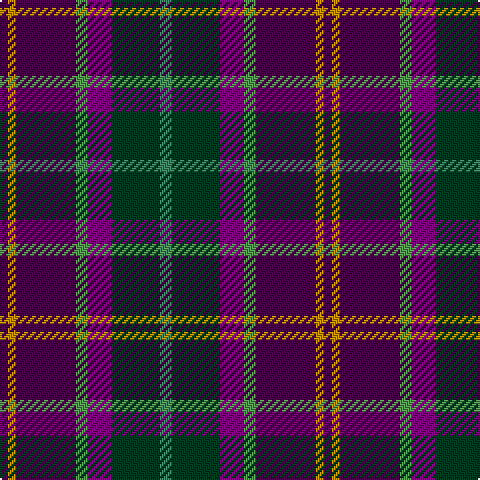

In pattern [BYBGBGG](/patterns/bybgbgg/).

This was sourced from tartans-authority.  It is a [7 stripes tartan](/stripes/stripes7/).

Original link http://www.tartansauthority.com/tartan-ferret/display/10068/

## Thread count
DP/4 DY4 DP30 LG6 P12 DG24 G/6

## Palette
Each colour and its ΔE from the base-6 reference it is a variant of.

| Colour | Shade | Base | ΔE (OKLab) |
|---|---|---|---|
| DG | <code style="background-color:#003820;">#003820</code> `#003820` | G <code style="background-color:#006400;">#006400</code> | 0.16 |
| DP | <code style="background-color:#440044;">#440044</code> `#440044` | B <code style="background-color:#2C4084;">#2C4084</code> | 0.17 |
| DY | <code style="background-color:#BC8C00;">#BC8C00</code> `#BC8C00` | Y <code style="background-color:#E8C000;">#E8C000</code> | 0.16 |
| G | <code style="background-color:#408060;">#408060</code> `#408060` | G <code style="background-color:#006400;">#006400</code> | 0.13 |
| LG | <code style="background-color:#549450;">#549450</code> `#549450` | G <code style="background-color:#006400;">#006400</code> | 0.17 |
| P | <code style="background-color:#780078;">#780078</code> `#780078` | B <code style="background-color:#2C4084;">#2C4084</code> | 0.16 |

# Sample pattern

## Nearest tartans

The nearest existing variants by ΔTartan distance.

1. [Galway County, Crest Range](/setts/s9/b20ba10bb30k6bb30k10r50k6w8-b505050-ba2c4084-bb141e46-k101010-r960000-we0e0e0/) — ΔT 0.81
1. [State Seal of Arizona (Fashion)](/setts/s10/g8b42y20b10y8r8ba20g12ba60w8-b441800-ba2c2c80-g006818-r880000-we8ccb8-ya08858/) — ΔT 1.09
1. [Ancient Atlantic (Fashion)](/setts/s6/w6b34ba32bb4g34y4-b1c0070-ba441800-bb14283c-g003820-wc0c0c0-yd09800/) — ΔT 1.18
1. [Galway County Crest (Fashion)](/setts/s9/r20b10ba30k6ba30k10ra50k6w8-b2888c4-ba2c2c80-k101010-r888888-ra880000-we0e0e0/) — ΔT 1.23
1. [Yates (Personal)](/setts/s8/k58r6b48ba12k16w8ba16ra12-b003c64-ba5c5c5c-k101010-rc80000-ra888888-we0e0e0/) — ΔT 1.24
1. [Scotch House 2000 Antique](/setts/s8/b44r6b4r6b4k34g36ga8-b2c2c80-g604000-ga006818-k101010-rc80000/) — ΔT 1.24
1. [Gracey (2013)](/setts/s7/r6b16g40k40ba34k6y6-b780078-ba202060-g006818-k101010-rc80050-y48a4c0/) — ΔT 1.25
1. [McLion (Corporate)](/setts/s9/w4b24g4b4g4b4ba16r20y4-b2c2c80-ba1c0070-g006818-r901c38-we0e0e0-yd87c00/) — ΔT 1.25
1. [State Seal of Michigan (Fashion)](/setts/s6/r8b54y12ba38bb76w8-b441800-ba5c5c5c-bb1474b4-r880000-we8ccb8-ya08858/) — ΔT 1.27
1. [Blairmore House](/setts/s8/b68w8b8r8b8ba48bb64y12-b003478-ba3c2010-bb0c5454-r8c0000-wffffff-yc88c00/) — ΔT 1.28

## Neighbour map

Every grey dot is one of 15726 variants placed by the first two principal components of the ΔTartan feature space (44% of its variance). Red is this tartan; blue dots are its nearest — click one to open its page.

<svg viewBox="0 0 640 380" role="img" style="max-width:100%;height:auto;border:1px solid #e0e0e0;border-radius:4px;display:block" xmlns="http://www.w3.org/2000/svg"><image href="/nn/cloud.v1.png" width="640" height="380"/><a href="/setts/s9/b20ba10bb30k6bb30k10r50k6w8-b505050-ba2c4084-bb141e46-k101010-r960000-we0e0e0/"><circle cx="138.1" cy="180.7" r="4" fill="#3465a4"><title>Galway County, Crest Range</title></circle></a><a href="/setts/s10/g8b42y20b10y8r8ba20g12ba60w8-b441800-ba2c2c80-g006818-r880000-we8ccb8-ya08858/"><circle cx="155.2" cy="168.8" r="4" fill="#3465a4"><title>State Seal of Arizona (Fashion)</title></circle></a><a href="/setts/s6/w6b34ba32bb4g34y4-b1c0070-ba441800-bb14283c-g003820-wc0c0c0-yd09800/"><circle cx="138.3" cy="208.2" r="4" fill="#3465a4"><title>Ancient Atlantic (Fashion)</title></circle></a><a href="/setts/s9/r20b10ba30k6ba30k10ra50k6w8-b2888c4-ba2c2c80-k101010-r888888-ra880000-we0e0e0/"><circle cx="120.4" cy="170.6" r="4" fill="#3465a4"><title>Galway County Crest (Fashion)</title></circle></a><a href="/setts/s8/k58r6b48ba12k16w8ba16ra12-b003c64-ba5c5c5c-k101010-rc80000-ra888888-we0e0e0/"><circle cx="170.0" cy="175.0" r="4" fill="#3465a4"><title>Yates (Personal)</title></circle></a><a href="/setts/s8/b44r6b4r6b4k34g36ga8-b2c2c80-g604000-ga006818-k101010-rc80000/"><circle cx="208.7" cy="191.8" r="4" fill="#3465a4"><title>Scotch House 2000 Antique</title></circle></a><a href="/setts/s7/r6b16g40k40ba34k6y6-b780078-ba202060-g006818-k101010-rc80050-y48a4c0/"><circle cx="106.5" cy="208.0" r="4" fill="#3465a4"><title>Gracey (2013)</title></circle></a><a href="/setts/s9/w4b24g4b4g4b4ba16r20y4-b2c2c80-ba1c0070-g006818-r901c38-we0e0e0-yd87c00/"><circle cx="133.2" cy="182.0" r="4" fill="#3465a4"><title>McLion (Corporate)</title></circle></a><a href="/setts/s6/r8b54y12ba38bb76w8-b441800-ba5c5c5c-bb1474b4-r880000-we8ccb8-ya08858/"><circle cx="169.7" cy="191.4" r="4" fill="#3465a4"><title>State Seal of Michigan (Fashion)</title></circle></a><a href="/setts/s8/b68w8b8r8b8ba48bb64y12-b003478-ba3c2010-bb0c5454-r8c0000-wffffff-yc88c00/"><circle cx="171.5" cy="183.8" r="4" fill="#3465a4"><title>Blairmore House</title></circle></a><circle cx="171.5" cy="196.9" r="5" fill="#c00000"/></svg>

ID: /setts/s7/g6ga24b12gb6ba30y4ba4-b780078-ba440044-g408060-ga003820-gb549450-ybc8c00/
