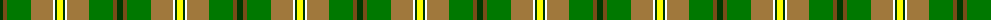

In pattern [GGGRWGY](/patterns/gggrwgy/).

This was sourced from register-of-tartans.  It is a [7 stripes tartan](/stripes/stripes7/).

Original link https://www.tartanregister.gov.uk/tartanDetails.aspx?ref=334

## Thread count
G/6 T4 Ga24 LT22 W2 G2 Y/6

## Palette
Each colour and its ΔE from the base-6 reference it is a variant of.

| Colour | Shade | Base | ΔE (OKLab) |
|---|---|---|---|
| G | <code style="background-color:#003800;">#003800</code> `#003800` | G <code style="background-color:#006400;">#006400</code> | 0.15 |
| Ga | <code style="background-color:#007800;">#007800</code> `#007800` | G <code style="background-color:#006400;">#006400</code> | 0.06 |
| LT | <code style="background-color:#A0783C;">#A0783C</code> `#A0783C` | R <code style="background-color:#C80000;">#C80000</code> | 0.18 |
| T | <code style="background-color:#784C18;">#784C18</code> `#784C18` | G <code style="background-color:#006400;">#006400</code> | 0.16 |
| W | <code style="background-color:#FFFFFF;">#FFFFFF</code> `#FFFFFF` | W <code style="background-color:#F4F4F0;">#F4F4F0</code> | 0.03 |
| Y | <code style="background-color:#FCFC00;">#FCFC00</code> `#FCFC00` | Y <code style="background-color:#E8C000;">#E8C000</code> | 0.16 |

# Sample pattern

ID: /setts/s7/g6ga4gb24r22w2g2y6-g003800-ga784c18-gb007800-ra0783c-wffffff-yfcfc00/
